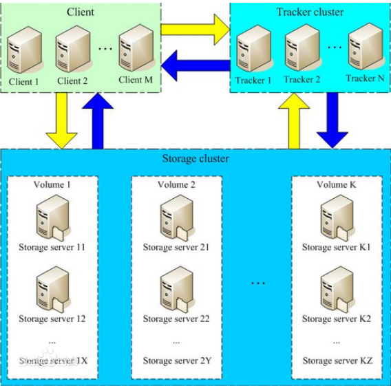
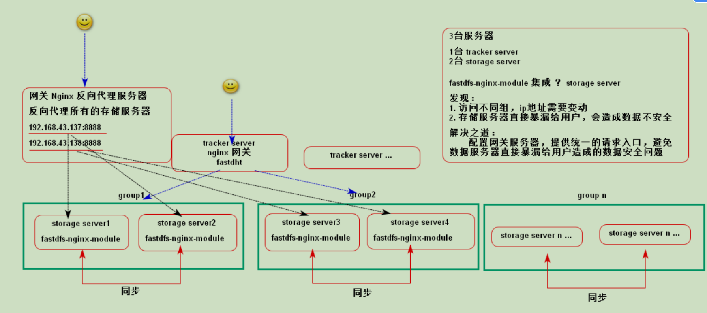
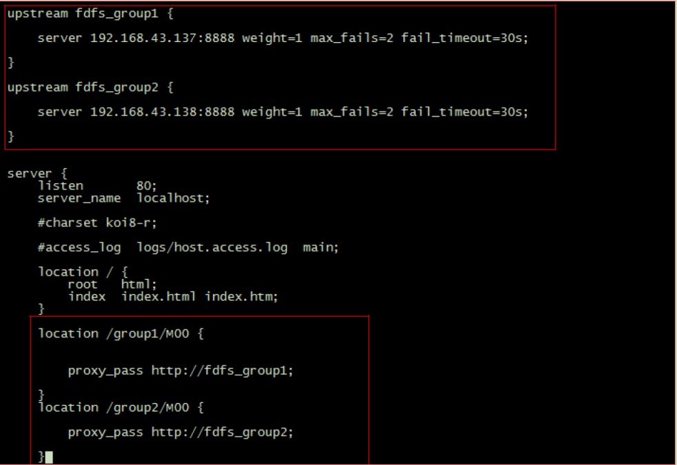

# FastDFS

## FastDFS简介

​	Fast 名字

​	D distributed 分布式

​	FS file system 文件系统

​	FasfDFS是高性能的分布式文件系统，主要功能包括文件的存储、同步和访问（上传和下载），适用于以文件为主题的网络站点（如图片分享和视频分享），适用文件大小：4KB--500MB。FastDFS是C语言实现的。

​	FastDFS有三个角色：

​	**Tracker**（跟踪器 调度服务器）：起到调度和文件访问的负载均衡；

​	**Storage**（存储器 存储服务器）：文件和文件属性的存储，直接利用OS的文件系统调用管理文件；

​	**Client**（客户端）：作为业务请求的发起方，通过专有接口，使用TCP/IP协议与Tracker或存储节点进行交互。

​	跟踪器和存储节点中的服务器均可以随时增加或下线而不会影响线上服务，即支持水平扩展。

​	Storage通过**卷（volume）**或**组（group）**为单位进行组织，一个group包括多台storage服务器，同一group数据互相备份，存储容量以group中最小的storage为准。

​	架构图：

​	说明：

​		1.client向tracker请求文件，

​		2.tracker返回一台可用的storage给client，

​		3.client直接和storage进行通讯获取文件



## 集群搭建

1.克隆虚拟机

```bash
修改IP地址
vi /etc/sysconfig/network-scripts/ifcfg-eth0  
修改主机名
vi /etc/sysconfig/network
删除mac地址
rm -rf /etc/udev/rules.d/70-persistent-net.rules
```

2.安装

```bash
安装基本环境

yum install gcc-c++ perl-devel pcre-devel openssl-devel zlib-devel wget

下载
wget https://github.com/happyfish100/fastdfs/archive/V5.11.tar.gz

wget https://github.com/happyfish100/libfastcommon/archive/V1.0.36.tar.gz

编译安装
tar -zxvf V1.0.36.tar.gz

cd libfastcommon-1.0.36/

./make.sh  &&   ./make.sh install

tar -zxvf V5.11.tar.gz

cd ..

cd fastdfs-5.11/

./make.sh && ./make.sh install

注意：在使用&&，请记住是两个&&，单个&会导致编译失败，如果出现这种情况可以使用make clean清除后在重新编译
```

3.配置

```bash
在上述操作完成后，在etc/fdfs中会出现几个配置文件，需要修改其后缀名

cd /etc/fdfs

cp tracker.conf.sample tracker.conf

cp storage.conf.sample storage.conf

cp client.conf.sample client.conf

```

修改配置文件：tracker.conf

```bash
base_path=/data/fastdfs/tracker

base_path这里手动指定一个文件夹，这里指的是存储文件元数据
需要手动创建文件夹

mkdir -p  /data/fastdfs/tracker
```

修改配置文件：stroage.conf

```shell
base_path=/data/fastdfs/storage   
store_path0=/data/fastdfs/storage/store
tracker_server=192.168.134.160:22122

base_path是存储数据基本文件夹，包括日志等
store_path0是真正存放的文件的文件夹
tracker_server是指追踪服务器的ip地址，默认端口为22122

mkdir -p /data/fastdfs/tracker
mkdir -p /data/fastdfs/storage/store
```

修改配置文件：clinet.conf

```shell
base_path=/tmp
tracker_server=192.168.134.50:22122
```

5.启动

```shell
fdfs_trackerd /etc/fdfs/tracker.conf start
fdfs_storaged /etc/fdfs/storage.conf start
```

6.测试

```shell
# 监控指令
fdfs_monitor /etc/fdfs/client.conf

# 上传文件
fdfs_upload_file /etc/fdfs/client.conf /root/1.png

# 下载文件
fdfs_download_file /etc/fdfs/client.conf
group1/M00/00/00/wKgriFr0YmeAI_lcABr-dch7j3Q658.png /root/2.png
5
#删除文件
fdfs_delete_file  /etc/fdfs/client.conf group1/M00/00/00/wKiGoFxzYyeAGJ0MAAAc3T8QekU.sample

```

## JAVA API

#### 1.添加依赖

```xml
<dependency>
  <groupId>net.oschina.zcx7878</groupId>
  <artifactId>fastdfs-client-java</artifactId>
  <version>1.27.0.0</version>
</dependency>
```

#### 2.java代码

##### 配置文件

```
tracker_server = 192.168.221.131:22122
```

##### 源代码

```java
package com.heng;

import org.csource.common.MyException;
import org.csource.common.NameValuePair;
import org.csource.fastdfs.*;
import org.junit.Before;
import org.junit.Test;

import java.io.FileOutputStream;
import java.io.IOException;

public class Main {
    StorageClient client = null;
    @Before
    public void before() throws IOException, MyException {
        //加载配置文件
        ClientGlobal.init("src/fdfs_client.conf");
        //新建跟踪器
        TrackerClient trackerClient = new TrackerClient();
        //获取跟踪服务
        TrackerServer connection = trackerClient.getConnection();
        //获取存储器
        client = new StorageClient(connection,null);
    }
    @Test
    public void testUpload() throws IOException, MyException {
        client.upload_file("F:\\刘恒-个人简历.docx","docx",new NameValuePair[]{
                new NameValuePair("author","lh")
        });
    }
    @Test
    public void testDownload() throws IOException, MyException {
        byte[] group1s = client.download_file("group1",
                "00/00/wKjdg1x0UCmAXEuYAABB4Q6kFWA63.docx");
        FileOutputStream fileOutputStream = new FileOutputStream("F:\\a.docx");
        fileOutputStream.write(group1s);
        fileOutputStream.close();
    }
    @Test
    public void testGetFileInfo() throws IOException, MyException {
        FileInfo file_info = client.get_file_info("group1",
                "M00/00/00/wKjdg1x0UCmAXEuYAABB4Q6kFWA63.docx");
        System.out.println("文件大小：" + file_info.getFileSize());
        System.out.println("创建时间：" + file_info.getCreateTimestamp());
        System.out.println("来源IP地址：" + file_info.getSourceIpAddr());
    }
    @Test
    public void testMetadata() throws IOException, MyException {
        NameValuePair[] valuePairs = client.get_metadata("group1",
                "M00/00/00/wKjdg1x0UCmAXEuYAABB4Q6kFWA63.docx");
        for (NameValuePair valuePair : valuePairs) {
            System.out.println(valuePair.getName() + ":" + valuePair.getValue());
        }
    }
    @Test
    public void testDelete() throws IOException, MyException {
        client.delete_file("group1",
                "00/00/wKjdg1x0UCmAXEuYAABB4Q6kFWA63.docx");
    }
}
```

## 与SpringBoot整合

### 1.创建SpringBoot模板

创建一个SpringBoot项目即可

### 2.添加依赖

```xml
<dependency>
    <groupId>com.github.tobato</groupId>
    <artifactId>fastdfs-client</artifactId>
    <version>1.26.5</version>
</dependency>

<dependency>
<groupId>com.alibaba</groupId>
	<artifactId>fastjson</artifactId>
	<version>1.2.47</version>
</dependency>
```

### 3.配置入口类

```java
package com.heng.test;

import com.alibaba.fastjson.serializer.SerializerFeature;
import com.alibaba.fastjson.support.config.FastJsonConfig;
import com.alibaba.fastjson.support.spring.FastJsonHttpMessageConverter;
import org.springframework.boot.SpringApplication;
import org.springframework.boot.autoconfigure.SpringBootApplication;
import org.springframework.boot.autoconfigure.web.HttpMessageConverters;
import org.springframework.context.annotation.Bean;
import org.springframework.http.converter.HttpMessageConverter;

@SpringBootApplication
public class TestApplication {

    public static void main(String[] args) {
        SpringApplication.run(TestApplication.class, args);
    }
    @Bean
    public HttpMessageConverters fastjsonHttpMessageConverter(){
        FastJsonHttpMessageConverter messageConverter = new FastJsonHttpMessageConverter();
        //添加fastjson的配置信息 比如 ：是否要格式化返回的json数据
        FastJsonConfig fastJsonConfig = new FastJsonConfig();

        fastJsonConfig.setSerializerFeatures(SerializerFeature.PrettyFormat);

        //在转换器中添加配置信息
        messageConverter.setFastJsonConfig(fastJsonConfig);

        HttpMessageConverter<?> converter = messageConverter;

        return new HttpMessageConverters(converter);

    }

}
```

### 4.配置配置文件

```properties
fdfs.so-timeout=1501
fdfs.connect-timeout=601
fdfs.thumb-image.width=150
fdfs.thumb-image.height=150
fdfs.tracker-list=192.168.221.132:22122
```

### 5.测试代码

```java
package com.heng.test;

import com.github.tobato.fastdfs.domain.fdfs.StorePath;
import com.github.tobato.fastdfs.domain.proto.storage.DownloadByteArray;
import com.github.tobato.fastdfs.service.FastFileStorageClient;
import org.junit.Test;
import org.junit.runner.RunWith;
import org.springframework.beans.factory.annotation.Autowired;
import org.springframework.boot.test.context.SpringBootTest;
import org.springframework.test.context.junit4.SpringRunner;

import java.io.*;

@RunWith(SpringRunner.class)
@SpringBootTest
public class TestApplicationTests {
    @Autowired
    private FastFileStorageClient client;
    @Test
    public void testUpload() throws FileNotFoundException {
        File file = new File("C:\\Users\\DreamHeng\\Desktop\\a.jpg");
        FileInputStream inputStream = new FileInputStream(file);
        StorePath storePath = client.uploadFile(inputStream, file.length(), "jpg", null);
        System.out.println(storePath.getGroup() + " : " + storePath.getPath());
    }

    @Test
    public void testDownload() throws IOException {
        byte[] bytes = client.downloadFile("group1", "M00/00/01/wKjdhVx0uiSAOrugAAG0Sn2IrWo214.jpg", new DownloadByteArray());
        FileOutputStream outputStream = new FileOutputStream("C:\\Users\\DreamHeng\\Desktop\\b.jpg");
        outputStream.write(bytes);
        outputStream.close();
    }
}
```

## 集成fastdfs-nginx-module

### 1.原因

- 为分布式文件系统提供http服务支持
- 解决复制延迟问题（重定向到文件存储的源存储服务器取文件）

### 2.环境搭建

```
#fastdfs版本大于等于5.11
#上传fastdfs-nginx-module 和 nginx-1.11.1.tar.gz
```

### 3.解压安装fastdfs-nginx-module

```shell
tar -zxvf nginx-1.11.1.tar.gz
cd nginx-1.11.1
./configure --add-module=/usr/local/src/fastdfs-nginx-module/src/ --prefix=/usr/local/nginx
make && make install
```

### 4.复制配置文件

```shell
cp /usr/local/src/fastdfs-nginx-module/src/mod_fastdfs.conf /etc/fdfs
cd /usr/local
cp fastdfs-5.11/conf/http.conf /etc/fdfs
cp fastdfs-5.11/conf/mime.types /etc/fdfs

```

### 5.修改配置文件

```shell
vi /usr/local/nginx/conf/nginx.conf
```


```conf
server {
listen 8888; ## 该端口为storage.conf中的http.server_port相同
server_name localhost;
location ~/group[0-9]/ {
ngx_fastdfs_module;
}
error_page 500 502 503 504 /50x.html;
location = /50x.html {
root html;
}
}
```


```shell
vi /etc/fdfs/mod_fastdfs.conf
```


```conf
tracker_server=192.168.128.141:22122
url_have_group_name = true
group_name=group1
# 当前需要提供web支持的存储服务器的文件存储目录
store_path0=/data/fastdfs/storage/store
```


### 6.启动

**启动nginx服务器**

```shell
./nginx -c /usr/local/nginx/conf/nginx.conf
```

**启动FastDFS服务**

```shell
fdfs_trackerd /etc/fdfs/tracker.conf start
fdfs_storaged /etc/fdfs/storage.conf start
```

### 7.测试

访问以下

```
测试链接规范：
协议：//域名（主机名/IP）：端口/文件组/文件名
http://nginxserver:8888/groupname/filename
http://192.168.134.50:8888/group1/M00/00/00/wKiGMlxlOS2AR4wnAAaZKjlbdDE408.pdf
```


## 集成FastDHT

### 去重原理

​	一般的去重是存储每个上传文件的md5值，当下次有新文件存入的时候和以前已经存储过的md5值进行对比，如果值相同就代表文件已经被上传过，可以将后上传文件的链接直接引入当前用户的文件库中，避免存储空间的浪费，也节省了用户的时间。（参照百度网盘/QQ/微信）

​	FastDFS本身支持文件排重处理机制（fdfd_crc32效率高于md5），但需要FastDHT作为文件hash的索引存储。

FastDHT是同一作者的开源key-value数据库，FastDFS的storage server每次上传文件均计算文件的hash值，然后从FastDHT服务器上进行查找对比，如果没有返回，则写入hash，并将文件保存，如果有返回，则建立一个新的文件链接（软链接），不保存文件。

### 实现功能

#### 1.环境搭建

##### 安装基本的类库环境BerkeleyDB

```shell
tar -zxvf db-4.7.25.tar.gz
cd db-4.7.25
cd build_unix/
./../dist/configure
make && make install

如果错误就make clean清除重新操作
```

##### 安装FastDHT

```
tar -zxvf Fa./make.shstDHT_v2.01.tar.gz
cd FastDHT
./make.sh
./make.sh install
```

安装结束后会在/etc目录下产生fdht文件夹

```
/etc/fdht/
├── fdht_client.conf
├── fdhtd.conf
└── fdht_servers.conf
```

##### 配置fdhtd.conf（etc下）

```
base_path=/data/fastdht
mkdir /data/fastdht
```

##### 配置fdht_servers.conf（etc下）

```
group_count = 1
group0 = 192.168.145.150:114
```

##### 配置storage.conf（etc下）

```
check_file_duplicate=1
keep_alive=1
#include /etc/fdht/fdht_servers.conf
```

#### 2.启动

```shell
/usr/local/bin/fdhtd /etc/fdht/fdhtd.conf start
/usr/local/bin/fdfs_trackerd /etc/fdfs/tracker.conf restart
/usr/local/bin/fdfs_storaged /etc/fdfs/storage.conf restart
```

#### 3.测试

上传同一文件，只会出现一份


## FastDFS分布式文件系统集群环境搭建

准备三台虚拟机

```
192.168.134.161 tracker server
192.168.134.162 storage server group1
192.168.134.163 storage server group2
```

### 1.不集成任何插件

#### 配置tracker server

与上方的相同，配置一样

#### 配置storage server

分别打开两个节点中etc下的storage.conf

```conf
# 修改卷名
# 192.168.134.52 group1
# 192.168.134.53 group2
group_name=group1
base_path=/home/fastdfs/datastorage/
store_path0=/home/fastdfs/datastorage/store
tracker_server=192.168.134.161:22122


group_name=group2
base_path=/home/fastdfs/datastorage/
store_path0=/home/fastdfs/datastorage/store
tracker_server=192.168.134.161:22122
```

```
base_path和store_path0是可以自定义的
上下两段配置文件分别是配置两台Stroage Server的

上述配置完成之后就可以直接在两台StroageServer中启动stroage

此时通过监控命令就可以看见两台Stroageserver在运行（你必须先配置client配置文件将trackerserver地址更新
（更新为现在tarackerserver）后才能使用监控命令）
监控命令：fdfs_monitor /etc/fdfs/client.conf
```

### 2.集成nginx

此操作在上述单节点集成nginx基础上进行

#### 修改StroageServer 中etc下mod_fastdfs.conf文件

```conf
FastDFS02

tracker_server=192.168.43.161:22122
url_have_group_name = true
group_name=group1
# 当前需要提供web支持的存储服务器的文件存储目录
#此目录随意指定
store_path0=/home/fastdfs/datastorage/store


FastDFS03

tracker_server=192.168.43.161:22122
url_have_group_name = true
group_name=group2
# 当前需要提供web支持的存储服务器的文件存储目录
store_path0=/home/fastdfs/datastorage/store
```

#### 启动nginx

分别启动两台storage server的nginx

```
./nginx -c /home/nginx/conf/nginx.conf
```

#### 测试

​	分别通过两个storage server的nginx访问两个的storage

#### 新的问题

​	1.访问不同组，IP地址需要变动

​	2.存储服务器直接暴露给用户，不安全

#### 解决方法

​	配置网关服务器（Nginx），提供统一的请求入口，避免数据服务器直接暴露给用户造成的数据安全问题



#### 搭建网关服务器Nginx

删除之前的nginx

##### 搭建环境

```shell
tar -zxvf nginx-1.11.1.tar.gz
cd nginx-1.11.1
./configure --prefix=/usr/local/nginx
make && make install
```

##### 修改网关服务器Nginx的配置文件



```shell
vi /usr/local/nginx/conf/nginx.conf

upstream fdfs_group1{
	server 192.168.134.162:8888 weight=1 max_fails=2 fail_timeout=30s;
}
upstream fdfs_group2{
	server 192.168.134.163:8888 weight=1 max_fails=2 fail_timeout=30s;
}
---------------------------------------------------------------------------------------
location /group1/M00 {
	proxy_pass http://fdfs_group1;
}
location /group2/M00 {
	proxy_pass http://fdfs_group2;
}
```

##### 启动tracker server的nginx

### 3.集成DHT

#### 在trackerserver中安装dht服务

#### 修改存储服务器的配置文件fdht_servers.conf（etc下）

```conf
group_count = 1
group0 = 192.168.134.51:11411
两台机器更该为相同的配置
```

#### 编辑两台机器的storage.conf（etc下）

```conf
check_file_duplicate=1
keep_alive=1
#include /etc/fdht/fdht_servers.conf
```

#### 启动服务

```shell
fdhtd /etc/fdht/fdhtd.conf start
fdfs_trackerd /home/fastdfs/fastdfs-5.11/conf/tracker.conf restart
fdfs_storaged /home/fastdfs/fastdfs-5.11/conf/storage.conf restart
```

