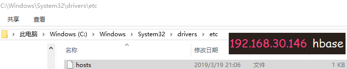

## HBase

> HBase是一种构建在HDFS之上的分布式、面向列的存储系统。在需要实时读写、随机访问超大规模数据集时，可
> 以使用HBase。

## 0.前言

### 特点

- 大：一个表可以有上亿行，上百万列
- 面向列：面向列表（簇）的存储和权限控制，列（簇）独立检索。
- 结构稀疏：对于为空（NULL）的列，并不占用存储空间，因此，表可以设计的非常稀疏。
- 无模式：每一行都有一个可以排序的主键和任意多的列，列可以根据需要动态增加，同一张表中不同的行可以有截然不同的列。
- 数据多版本：每个单元中的数据可以有多个版本，默认情况下，版本号自动分配，版本号就是单元格插入时的时间戳。
- 数据类型单一：HBase中的数据都是字符串，没有类型。

### 名词解释

- Row Key: 与 NoSQL 数据库一样，Row Key 是用来检索记录的主键
- Column Family: 列簇，列的集合。列族是表的 Schema 的一部分（而列不是），必须在使用表之前定义。
- Timestamp: 时间戳。HBase 中通过 Row 和 Columns 确定的一个存储单元称为 Cell。每个 Cell 都保存着同一份数据的多个版本。 版本通过时间戳来索引，时间戳的类型是 64 位整型。时间戳可以由HBase（在数据写入时自动）赋值， 此时时间戳是精确到毫秒的当前系统时间。时间戳也 可以由客户显示赋值。如果应用程序要避免数据版本冲突，就必须自己生成具有唯一性的时间戳。每个 Cell 中，不同版本的数据按照时间倒序排序，即最新的数据排在最前面。
- Cell: 单元格，由 {row key，column(=< family> + < label>)，version} 唯一确定的单元。Cell 中的数据是没有类型的，全部是字节码形式存储。

### 和关系数据库的区别

- 数据库类型：HBase中的数据类型都是字符串类型（string）
- 数据操作：HBase只有普通的增删改查等操作，没有表之间的关联查询
- 存储模式：HBase是基于列式存储模式，而RDBMS是基于行式存储的
- 应用场景：HBase适合存储大量数据，查询效率极高

## 1.环境搭建

### 准备

- `HDFS`正常运行

- `ZooKeeper`正常运行

  ~~~shell
  [root@hadoop zookeeper-3.4.10]# jps
  4858 QuorumPeerMain
  3571 SecondaryNameNode
  3324 DataNode
  3213 NameNode
  4921 Jps
  ~~~

### 安装HBase

~~~shell
tar -zxf hbase-1.2.4-bin.tar.gz -C /usr/
~~~

### 修改配置信息

- 修改配置文件`/usr/hbase-1.2.4/conf/hbase-site.xml`

  ~~~xml
  <property>
    <name>hbase.rootdir</name>
    <value>hdfs://hadoop:9000/hbase</value>
  </property>
  <property>
    <name>hbase.cluster.distributed</name>
    <value>true</value>
  </property>
  <property>
    <name>hbase.zookeeper.quorum</name>
    <value>hadoop</value>
  </property>
  <property>
    <name>hbase.zookeeper.property.clientPort</name>
    <value>2181</value>
  </property>
  ~~~

- 修改配置文件`/usr/hbase-1.2.4/conf/regionservers`

  ~~~
  hadoop
  ~~~

- 配置环境变量`vi .bashrc`

  ~~~properties
  HBASE_MANAGES_ZK=false
  HBASE_HOME=/usr/hbase-1.2.4
  HADOOP_HOME=/usr/hadoop-2.6.0
  JAVA_HOME=/usr/java/latest
  CLASSPATH=.
  PATH=$PATH:$JAVA_HOME/bin:$HADOOP_HOME/bin:$HADOOP_HOME/sbin::$HBASE_HOME/bin
  export JAVA_HOME
  export CLASSPATH
  export PATH
  export HADOOP_HOME
  export HBASE_HOME
  export HBASE_MANAGES_ZK
  ~~~

  更新环境配置`source .bashrc`

### 启动HBase

~~~shell
[root@hadoop ~]# start-hbase.sh
~~~

~~~shell
[root@hadoop ~]# jps
4858 QuorumPeerMain
10231 HRegionServer  # 负责实际表数据的读写操作
3571 SecondaryNameNode
10365 Jps
3324 DataNode
10096 HMaster # 类似namenode管理表相关元数据、管理ResgionServer
3213 NameNode
~~~

在浏览器中查看相关信息

> http://ip:16010

## 2.HBase Shell操作

### 连接HBaeh

~~~shell
[root@hadoop ~]# hbase shell
~~~

### 系统相关命令

~~~shell
# 查看状态
hbase(main):001:0> status 
1 active master, 0 backup masters, 1 servers, 0 dead, 2.0000 average load
~~~

~~~shell
# 帮助命令
hbase(main):010:0> help
~~~

### NameSpace操作

~~~shell
# 查看namespace列表
hbase(main):002:0> list_namespace
NAMESPACE
default
hbase
~~~

~~~shell
# 创建namespace
hbase(main):004:0> create_namespace 'baizhi'
0 row(s) in 0.0820 seconds
# 查看列表
hbase(main):006:0* list_namespace
NAMESPACE
baizhi
default
hbase
~~~

~~~shell
# 查看namespace中的表
hbase(main):007:0> list_namespace_tables 'baizhi'
TABLE
0 row(s) in 0.0520 seconds
~~~

~~~shell
# 删除namespace
hbase(main):009:0> drop_namespace 'baizhi'
0 row(s) in 0.0660 seconds
~~~

> ==注意：HBase不允许删除有表的数据库==

### Table操作

- 创建表

  ~~~shell
  # 方式一 创建表 cf1/cf2: 列簇(管理多个列)
  hbase(main):011:0> create 't_user','cf1','cf2'
  # 方式二 创建表 
  # VERSIONS=>3 表示HBase支持存储3个VERSIONS的版本列数据，VERSIONS版本号默认为1
  # TTL表示存活的时间
  hbase(main):014:0> create 'baizhi:tt_user',{NAME=>'cf1',VERSIONS=>3},{NAME=>'cf2',VERSIONS=>3,TTL=>3600}
  ~~~

- 查看表详情

  ~~~shell
  hbase(main):018:0> describe 'baizhi:tt_user'
  ~~~

- 删除表

  ~~~shell
  # 必须将表设置为不可用状态才能删除
  hbase(main):022:0> disable 't_user'
  hbase(main):023:0> drop 't_user'
  ~~~

- 查看所有表

  ~~~shell
  hbase(main):030:0> list
  ~~~

- 修改表

  ~~~shell
  # 方式1
  hbase(main):039:0> alter 'baizhi:tt_user',{NAME=>'cf2',TTL=>1800}
  # 方式2
  hbase> alter 't1', NAME => 'f1', VERSIONS => 5
  ~~~

### 数据相关操作

- 存值

  > 语法：`put 'ns1:t1', 'r1', 'c1', 'value'`

  ~~~shell
  hbase(main):042:0> put 'baizhi:tt_user',1,'cf1:name','zs'
  ~~~

- 取值

  > 语法：`get 'ns1:t1', 'r1'`

  ~~~shell
  # 1：rowKey
  hbase(main):001:0> get 'baizhi:tt_user',1
  
  # 查看10个版本的信息
  get 'baizhi:tt_user',1,{COLUMN=>'cf1',VERSIONS=>10}
  ~~~

- 浏览表

  ~~~shell
  # 显示表中所有记录
  hbase(main):029:0* scan 'baizhi:tt_user'
  ~~~

- 删除

  ~~~shell
  # 删除一行记录中的某一列
  hbase(main):041:0> delete 'baizhi:tt_user',1,'cf1:name'
  ~~~

Java 


## Java API

> ==修改Windows主机的ip地址映射，添加虚拟机的服务地址和主机名==
>
> 

### maven依赖

~~~xml
<dependency>
    <groupId>org.apache.hbase</groupId>
    <artifactId>hbase-client</artifactId>
    <version>1.2.4</version>
</dependency>

<dependency>
    <groupId>org.apache.hbase</groupId>
    <artifactId>hbase-common</artifactId>
    <version>1.2.4</version>
</dependency>

<dependency>
    <groupId>org.apache.hbase</groupId>
    <artifactId>hbase-protocol</artifactId>
    <version>1.2.4</version>
</dependency>

<dependency>
    <groupId>org.apache.hbase</groupId>
    <artifactId>hbase-server</artifactId>
    <version>1.2.4</version>
</dependency>

<dependency>
    <groupId>junit</groupId>
    <artifactId>junit</artifactId>
    <version>4.12</version>
    <scope>test</scope>
</dependency>

<dependency>
    <groupId>log4j</groupId>
    <artifactId>log4j</artifactId>
    <version>1.2.17</version>
</dependency>
~~~

### 代码测试

```java
package com.heng;

import org.apache.hadoop.conf.Configuration;
import org.apache.hadoop.hbase.*;
import org.apache.hadoop.hbase.client.*;
import org.apache.hadoop.hbase.filter.Filter;
import org.apache.hadoop.hbase.filter.PrefixFilter;
import org.apache.hadoop.hbase.util.Bytes;
import org.junit.After;
import org.junit.Before;
import org.junit.Test;

import java.io.IOException;

/**
 * @author DreamHeng
 * @date 2019/3/19
 */
public class HbaseDemo {
    private Connection connection = null;
    private Admin admin = null;

    @Before
    public void before() throws IOException {
        Configuration configuration = HBaseConfiguration.create();
        //HBase的服务信息是注册在ZK之上的，所以需要通过ZK获取HBase服务信息，从而建立连接
        configuration.set("hbase.zookeeper.quorum","192.168.221.136");
        connection = ConnectionFactory.createConnection(configuration);
        admin = connection.getAdmin();
    }

    /**
     * 创建namespace
     * 名字为“baizhi”,描述信息为“author:lh”
     * @throws IOException
     */
    @Test
    public void testCreateNamespace() throws IOException {
        NamespaceDescriptor namespaceDescriptor = NamespaceDescriptor.create("baizhi").addConfiguration("author", "lh").build();
        admin.createNamespace(namespaceDescriptor);
    }

    /**
     * 删除baizhi
     * @throws IOException
     */
    @Test
    public void testDropNamespace() throws IOException {
        admin.deleteNamespace("baizhi");
    }

    /**
     * 修改namespace，删除、添加描述信息
     * @throws IOException
     */
    @Test
    public void testAlterNamespace() throws IOException {
        //NamespaceDescriptor namespaceDescriptor = NamespaceDescriptor.create("baizhi").removeConfiguration("author").build();
        NamespaceDescriptor namespaceDescriptor = NamespaceDescriptor.create("baizhi").addConfiguration("author", "lh").build();
        admin.modifyNamespace(namespaceDescriptor);
    }

    /**
     * 获取所有namespace的描述信息
     * @throws IOException
     */
    @Test
    public void testGetNamespaceDescriptors() throws IOException {
        NamespaceDescriptor[] descriptors = admin.listNamespaceDescriptors();
        for (NamespaceDescriptor descriptor : descriptors) {
            System.out.println(descriptor);
        }
    }

    /**
     * 创建表
     * @throws IOException
     */
    @Test
    public void testCreateTable() throws IOException {
        //在baizhi下新建表对象t1
        HTableDescriptor table = new HTableDescriptor("baizhi:t1");
        //新建列簇
        HColumnDescriptor cf1 = new HColumnDescriptor("cf1");
        //最多维护版本数为3
        cf1.setMaxVersions(3);
        HColumnDescriptor cf2 = new HColumnDescriptor("cf2");
        //TTL，生存时间
        cf2.setTimeToLive(60);

        table.addFamily(cf1);
        table.addFamily(cf2);

        admin.createTable(table);
    }

    /**
     * 存值
     * @throws IOException
     */
    @Test
    public void testPutData() throws IOException {
        //利用反射获取表
        Table table = connection.getTable(TableName.valueOf("baizhi:t1"));

        //存单个
        /*//创建一个rowKey：r1
        Put put = new Put("r1".getBytes());
        //往r1存数据
        put.addColumn("cf1".getBytes(),"name".getBytes(),"heng".getBytes())
                .addColumn("cf2".getBytes(),"name".getBytes(),"meng".getBytes());
        //存
        table.put(put);*/

        //批量存多行数据
        for (int i = 0; i < 1000; i++) {
            String rowKey = "row";
            if(i < 10){
                rowKey += ":00" + i;
            }else if(i<100){
                rowKey += ":0" + i;
            }else {
                rowKey += ":" + i;
            }
            Put put = new Put(rowKey.getBytes());
            put.addColumn("cf1".getBytes(),"name".getBytes(),("lh"+i).getBytes());
            put.addColumn("cf2".getBytes(),"name".getBytes(),("lm"+i).getBytes());
            table.put(put);
        }

        //关闭表连接
        table.close();
    }

    /**
     * 修改数据
     */
    @Test
    public void testUpdateData() throws IOException {
        Table table = connection.getTable(TableName.valueOf("baizhi:t1"));
        Put put = new Put("row:001".getBytes());
        put.addColumn("cf1".getBytes(),"name".getBytes(),"hhhhh111222".getBytes());
        table.put(put);
        table.close();
    }

    @Test
    public void testQuery() throws IOException {
        Table table = connection.getTable(TableName.valueOf("baizhi:t1"));

        //取单个值
        /*Get get = new Get("r1".getBytes());
        get.addColumn("cf1".getBytes(),"name".getBytes());
        Result result = table.get(get);
        byte[] value = result.getValue("cf1".getBytes(), "name".getBytes());
        System.out.println(Bytes.toString(value));*/

        //取所有值
        Scan scan = new Scan();
        scan.addFamily("cf1".getBytes());
        //设置起始rowKey
        scan.setStartRow("row:001".getBytes());
        //设置结束rowKey(不包括)
        scan.setStopRow("row:100".getBytes());
        ResultScanner resultScanner = table.getScanner(scan);
        for (Result result : resultScanner) {
            String row = Bytes.toString(result.getRow());
            String value = Bytes.toString(result.getValue("cf1".getBytes(), "name".getBytes()));
            System.out.println(row + ":" + value);
        }

        table.close();
    }

    /**
     * 根据条件查询值
     */
    @Test
    public void testQueryByThing() throws IOException {
        Table table = connection.getTable(TableName.valueOf("baizhi:t1"));
        Scan scan = new Scan();
        //构建前缀过滤器
        Filter filter = new PrefixFilter("row".getBytes());
        scan.setFilter(filter);
        ResultScanner scanner = table.getScanner(scan);

        for (Result result : scanner) {
            System.out.println(Bytes.toString(result.getRow()) + ":" + Bytes.toString(result.getValue("cf1".getBytes(),"name".getBytes())));
        }

        table.close();
    }

    @After
    public void after() throws IOException {
        if(admin != null){
            admin.close();
        }
        if (connection != null){
            connection.close();
        }
    }
}

```

