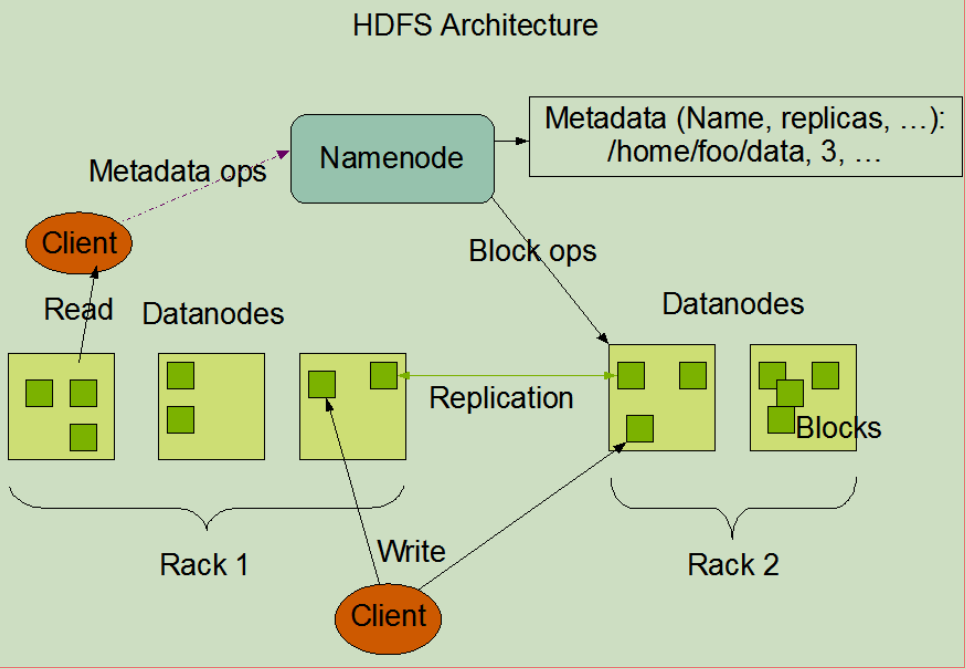
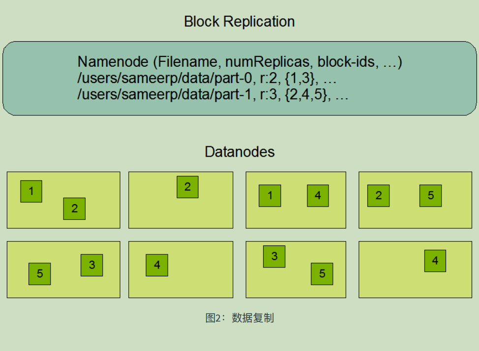
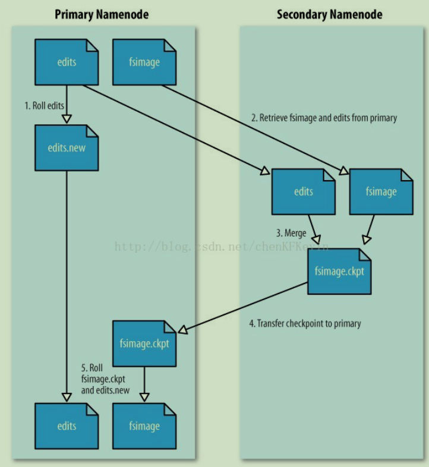

# Hadoop

## 1.概述

### 简介

​	Apache Hadoop（http://hadoop.apache.org/）是⼀款框架，允许使⽤简单的编程模型跨计算机集群分布式处理⼤型数据集。Hadoop开源免费，具备稳定可靠、可扩展、分布式计算等特性。

### 体系架构

- Hadoop Distributed File System (HDFS™): A distributed file system that provides high-throughput

  access to application data.

- Hadoop YARN: A framework for job scheduling and cluster resource management.

- Hadoop MapReduce: A YARN-based system for parallel（并⾏） processing of large data sets.

## 2.环境搭建

### 伪分布式

#### 准备工作

JDK，SSH

> NOTE
> SSH（Secure Shell） : ⼀种加密的⽹络传输协议，提供免密远程登录系统功能。Hadoop通过
> SSH执⾏指令远程管理Hadoop集群。

##### 配置JDK环境变量

```shell
[root@node1 ~]# rpm -ivh jdk-8u191-linux-x64.rpm
[root@node1 ~]# vi .bashrc
JAVA_HOME=/usr/java/latest
CLASSPATH=.
PATH=$PATH:$JAVA_HOME/bin
export JAVA_HOME
export CLASSPATH
export PATH
[root@node1 ~]# source .bashrc
```

##### 配置主机名和IP映射关系

```shell
[root@node1 ~]# vi /etc/hosts
127.0.0.1 localhost localhost.localdomain localhost4 localhost4.localdomain4
::1 localhost localhost.localdomain localhost6 localhost6.localdomain6
192.168.186.128 hadoop
```

##### 关闭防火墙

```shell
[root@localhost ~]# systemctl stop firewalld
[root@localhost ~]# systemctl disable firewalld
```

##### 配置主机SSH免密码登录

```shell
[root@node1 ~]# ssh-keygen -t rsa -P '' -f ~/.ssh/id_rsa
[root@node1 ~]# cat ~/.ssh/id_rsa.pub >> ~/.ssh/authorized_keys
[root@node1 ~]# chmod 0600 ~/.ssh/authorized_keys
```

##### 安装Hadoop并且配置HADOOP_HOME环境变量

```shell
[root@centos ~]# tar -zxf hadoop-2.6.0_x64.tar.gz -C /usr/
[root@centos ~]# yum install -y tree
[root@centos ~]# tree -L 1 /usr/hadoop-2.6.0/
/usr/hadoop-2.6.0/
 !"" bin -- 基础指令 hadoop、hdfs指令
 !"" etc -- 配置⽬录(重要)
 !"" include
 !"" lib
 !"" libexec
 !"" LICENSE.txt
 !"" NOTICE.txt
 !"" README.txt
 !"" sbin -- 系统命令 start|stop-dfs|yarn.sh|hadoop-daemon.sh
 #"" share -- hadoop依赖jar⽂件
7 directories, 3 files
[root@centos ~]# vi .bashrc
HADOOP_HOME=/usr/hadoop-2.6.0
JAVA_HOME=/usr/java/latest
CLASSPATH=.
PATH=$PATH:$JAVA_HOME/bin:$HADOOP_HOME/bin:$HADOOP_HOME/sbin
export JAVA_HOME
export CLASSPATH
export PATH
export HADOOP_HOME
[root@centos ~]# source .bashrc
[root@centos ~]# hadoop classpath
/usr/hadoop-2.6.0/etc/hadoop:/usr/hadoop-
2.6.0/share/hadoop/common/lib/*:/usr/hadoop-
2.6.0/share/hadoop/common/*:/usr/hadoop-2.6.0/share/hadoop/hdfs:/usr/hadoop-
2.6.0/share/hadoop/hdfs/lib/*:/usr/hadoop-2.6.0/share/hadoop/hdfs/*:/usr/hadoop-
2.6.0/share/hadoop/yarn/lib/*:/usr/hadoop-2.6.0/share/hadoop/yarn/*:/usr/hadoop-
后续课程中Hbase、Hive、Spark On Yarn都需要识别系统的HADOOP_HOME
修改 etc/hadoop/core-site.xml
修改 etc/hadoop/hdfs-site.xml
修改 etc/hadoop/slaves
格式化namenode
namenode格式化只需要在初次使⽤hadoop的时候执⾏，以后⽆需每次启动执⾏
启动hdfs
2.6.0/share/hadoop/mapreduce/lib/*:/usr/hadoop-
2.6.0/share/hadoop/mapreduce/*:/usr/hadoop-
2.6.0/contrib/capacity-scheduler/*.jar
```

> 后续课程中Hbase、Hive、Spark On Yarn都需要识别系统的HADOOP_HOME

##### 修改 etc/hadoop/core-site.xml（hadoop下）

```shell
<property>
	 <name>fs.defaultFS</name>
 	<value>hdfs://node1:9000</value>
</property>
<property>
 	<name>hadoop.tmp.dir</name>
 	<value>/usr/hadoop-2.6.0/hadoop-${user.name}</value>
</property>
```

##### 修改 etc/hadoop/hdfs-site.xml

```shell
<property>
 	<name>dfs.replication</name>
	 <value>1</value>
</property>
```

##### 修改 etc/hadoop/slaves

```shell
hadoop
```

##### 格式化namenode

```shell
[root@centos ~]# hdfs namenode -format
18/09/10 12:12:49 INFO namenode.NNConf: Maximum size of an xattr: 16384
18/09/10 12:12:49 INFO namenode.FSImage: Allocated new BlockPoolId: BP-
1855312329-
192.168.128.128-1536552769089
18/09/10 12:12:49 INFO common.Storage: Storage directory /usr/hadoop-
2.6.0/hadoop-root/dfs/name
has been successfully formatted.
18/09/10 12:12:49 INFO namenode.NNStorageRetentionManager: Going to retain 1
images with txid >=0
```

> namenode格式化只需要在初次使⽤hadoop的时候执⾏，以后⽆需每次启动执⾏

##### 启动hdfs

```shell
[root@centos ~]# start-dfs.sh
Starting namenodes on [centos]
centos: starting namenode, logging to /usr/hadoop-2.6.0/logs/hadoop-root￾namenode-centos.out
centos: starting datanode, logging to /usr/hadoop-2.6.0/logs/hadoop-rootdatanode-centos.out
Starting secondary namenodes [0.0.0.0]
The authenticity of host '0.0.0.0 (0.0.0.0)' can't be established.
RSA key fingerprint is 35:a8:db:4d:51:51:75:15:15:57:49:a8:3d:25:88:fa.
Are you sure you want to continue connecting (yes/no)? yes
0.0.0.0: Warning: Permanently added '0.0.0.0' (RSA) to the list of known hosts.
0.0.0.0: starting secondarynamenode, logging to /usr/hadoop-2.6.0/logs/hadooprootsecondarynamenode-centos.out
[root@centos ~]# jps
2151 Jps
2049 SecondaryNameNode
1915 DataNode
1809 NameNode
```

⽤户可以访问http://ip:50070访问namenode的web-ui

## 3.HDFS

​	HDFS是Hadoop的分布式⽂件系统（Hadoop Distributed File System ），类似于其它的分布式⽂件。HDFS⽀持⾼度容错，可以部署在廉价的硬件设备上，特别适宜于⼤型的数据集的分布式存储。

### 架构篇

​	HDFS采⽤master/slave架构。⼀个HDFS集群是由⼀个Namenode和⼀定数⽬的Datanodes组成。
Namenode是⼀个中⼼服务器，负责管理⽂件系统的名字空间(namespace)以及客户端对⽂件的访问。
集群中的Datanode⼀般是⼀个节点⼀个，负责管理它所在节点上的存储。HDFS暴露了⽂件系统的名字
空间，⽤户能够以⽂件的形式在上⾯存储数据。从内部看，⼀个⽂件其实被分成⼀个或多个数据块，
这些块存储在⼀组Datanode上。Namenode执⾏⽂件系统的名字空间操作，⽐如打开、关闭、重命名
⽂件或⽬录。它也负责确定数据块到具体Datanode节点的映射。Datanode负责处理⽂件系统客户端的
读写请求。在Namenode的统⼀调度下进⾏数据块的创建、删除和复制。

**Namenode :** 存储系统元数据、namespace、管理datanode、接受datanode状态汇报 Datanode: 存储块
数据，响应客户端的块的读写，接收namenode的块管理指令 Block: HDFS存储数据的基本单位，默认
值是128MB，实际块⼤⼩0~128MB Rack: 机架，对datanode所在主机的物理标识，标识主机的位置，
优化存储和计算





### HDFS常见问题

#### 1.为什么HDFS不擅长小文件的存储？

| 文件               | NameNode占用  | DataNode占用 |
| ------------------ | ------------- | ------------ |
| 1个1GB大小的文件   | 1个元数据     | 1GB          |
| 10000个文件总共1GB | 10000个元数据 | 1GB          |

1. 小文件过多，会过多占用NameNode的内存，并浪费block
2. HDFS适用于高吞吐量，而不适用于低时间延迟的访问。如果存储小文件，那么寻道时间大于数据读写时间，不符合HDFS的设计初衷。

#### 2.NameNode和SecondaryNameNode的区别

​	NameNode主要维护两个文件，一个是fsimage，一个是editlog

1) fsimage保存了最新的元数据检查点，包含了整个HDFS⽂件系统的所有⽬录和⽂件的信息。
对于⽂件来说包括了数据块描述信息、修改时间、访问时间等；对于⽬录来说包括修改时间、
访问权限控制信息(⽬录所属⽤户，所在组)等。
2) editlog主要是在NameNode已经启动情况下对HDFS进⾏的各种更新操作进⾏记录，HDFS客户
端执⾏所有的写操作都会被记录到editlog中。

> SecondaryName实际上是辅助NameNode工作的，可以周期性合并fsimage和edits log文件，可以加速NameNode数据的恢复效率



### 常用指令

1.格式化⼀个新的分布式⽂件系统

```
 bin/hdfs namenode -format
```

2.启动 NameNode 守护进程和 DataNode 守护进程

```
sbin/start-dfs.sh
```

Hadoop 守护进程的⽇志写⼊到 $HADOOP_LOG_DIR ⽬录（默认是 $HADOOP_HOME/logs ）

3.浏览 NameNode 的⽹络接⼝

```
NameNode - http://ip地址:50070/
```

4.常⽤的shell指令

```shell
# 帮助
hdfs dfs -help
# 创建⽬录
hdfs dfs -mkdir -p path
# 展示指令⽬录内容清单
hdfs dfs -ls path
# ⽂件上传
hdfs dfs -put localsrc dst
# ⽂件下载
hdfs dfs -get src localdst
# ⽂件删除
hdfs dfs -rm src
# 查看内容
hdfs dfs -cat path
hdfs dfs -tail path
# 权限相关
hdfs dfs -chgrp [-R] GROUP PATH...
hdfs dfs -chmod [-R] <MODE[,MODE]... | OCTALMODE> PATH
hdfs dfs -chown [-R] [OWNER][:[GROUP]] PATH
# 操作相关
bin/hdfs dfs -mv src dstsrc
bin/hdfs dfs -cp src dstsrc
```

### JAVA客户端

#### 配置（windows开发环境）

- 解压hadoop安装包
- 配置HADOOP_HOME环境变量
- 拷⻉winutil.exe和hadoop.dll⽂件到hadoop的安装bin⽬录下
- 配置主机名和IP的映射关系
- 重启开发⼯具

#### maven依赖

```pom
<dependency>
	<groupId>org.apache.hadoop</groupId>
	<artifactId>hadoop-common</artifactId>
	<version>2.6.0</version>
</dependency>
<dependency>
	<groupId>org.apache.hadoop</groupId>
	<artifactId>hadoop-hdfs</artifactId>
	<version>2.6.0</version>
</dependency>
```

#### 关闭HDFS权限检查

修改hdfs-site.xml

```
<property>
 	<name>dfs.permissions.enabled</name>
 	<value>false</value>
</property>
```

或者指定虚拟机参数

```
-DHADOOP_USER_NAME=root
```

#### 代码

```java
package hdfstest;

import org.apache.hadoop.conf.Configuration;
import org.apache.hadoop.fs.*;
import org.apache.hadoop.fs.permission.FsAction;
import org.apache.hadoop.fs.permission.FsPermission;
import org.apache.hadoop.io.IOUtils;
import org.junit.Before;
import org.junit.Test;

import java.io.FileInputStream;
import java.io.IOException;
import java.net.URI;
import java.net.URISyntaxException;

/**
 * @author DreamHeng
 * @date 2019/3/13
 */
public class HDFSDemo {

    private FileSystem fileSystem = null;
    private Configuration configuration = null;
    @Before
    public void before() throws URISyntaxException, IOException {
        configuration = new Configuration();
        //设置冗余次数为1
        configuration.set("dfs.replication","1");
        //获取hdfs地址
        URI uri = new URI("hdfs://hadoop:9000");
        fileSystem = FileSystem.get(uri,configuration);
    }
    @Test
    public void testhdfs() throws IOException {
        //创建一个文件夹
        fileSystem.mkdirs(new Path("/movie1"));
        
        //上传文件
        fileSystem.copyFromLocalFile(new Path("F:\\1.avi"),new Path("/movie1"));
        
        //下载文件
        fileSystem.copyToLocalFile(new Path("/movie1/1.avi"),new Path("F:\\2.avi"));
        
        //删除文件
        boolean b = fileSystem.delete(new Path("/movie1"), true);
        System.out.println(b);
        
        //展示文件清单
        RemoteIterator<LocatedFileStatus> iterator = fileSystem.listFiles(new Path("/"), true);
        while (iterator.hasNext()){
            LocatedFileStatus next = iterator.next();
            System.out.println(next.getPath().toString());
        }
        
        //追加文件
        FSDataOutputStream outputStream = fileSystem.append(new Path("/jdk-8u181-linux-x64.rpm"));
        FileInputStream inputStream = new FileInputStream("F:\\a.docx");
        IOUtils.copyBytes(inputStream,outputStream,configuration);
        
        //权限操作
        fileSystem.setPermission(new Path("/movie/1.avi"),
                new FsPermission(FsAction.ALL,FsAction.READ_WRITE,FsAction.READ));

    }
}

```

