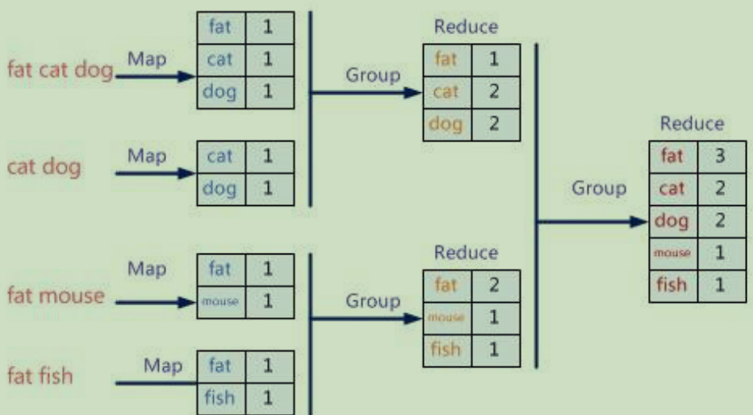
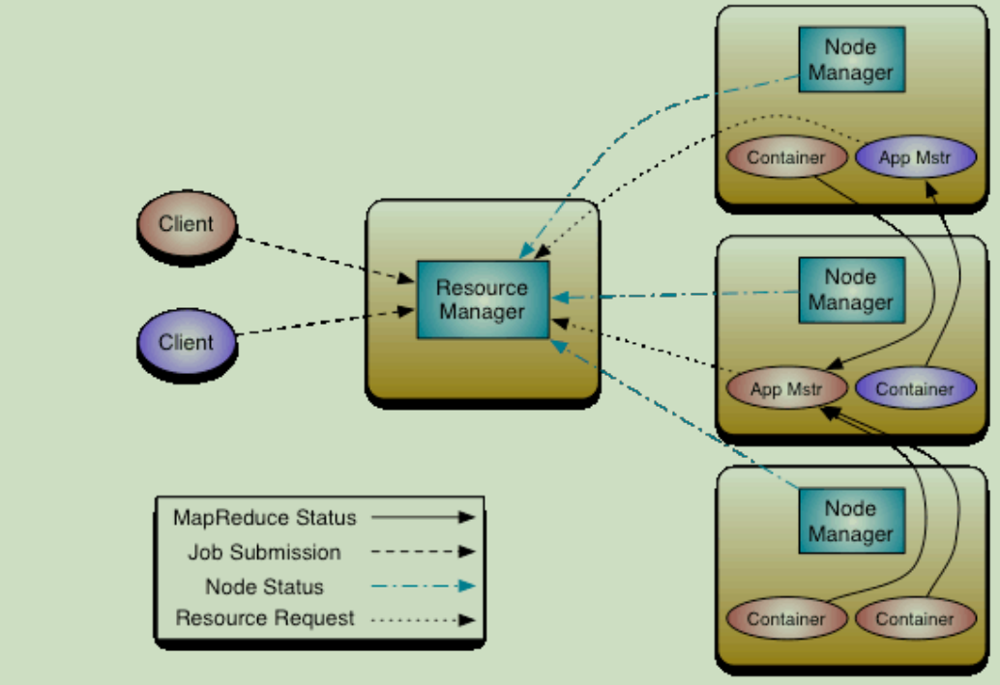
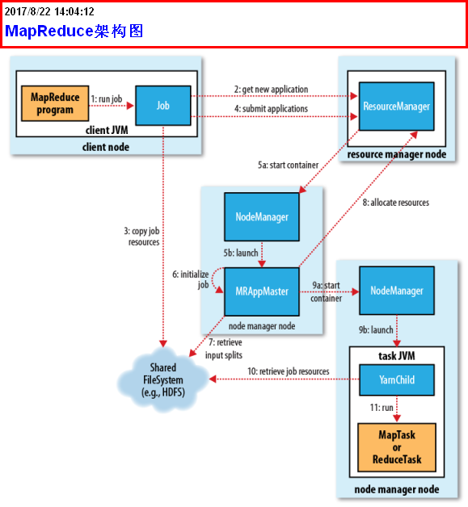

# Hadoop

## MapReduce

### 1.什么是MapReduce

​	Hadoop MapReduce是⼀个软件框架，基于该框架能够容易地编写应⽤程序，这些应⽤程序能够运⾏在由上千个商⽤机器组成的⼤集群上，并以⼀种可靠的，具有容错能⼒的⽅式并⾏地处理上TB级别的海量数据集。这个定义⾥⾯有着这些关键词:

> ⼀是软件框架，⼆是并⾏处理，三是可靠且容错，四是⼤规模集群，五是海量数据集。

​	MapReduce擅长处理大数据，它为什么具有这种能力呢？这可以从它的设计思想发觉。

​	MapReduce的思想是“分而治之”。

- Mapper负责“分”，即把复杂的任务分解成若干个“简单的小任务”处理。“简单的任务”包含三层含义：
  - 数据或者计算规模相对原任务要大大缩小
  - 就近计算原则，即任务会分配到存放着所需数据的节点上进行计算
  - 这些小任务可以并行计算，彼此没有依赖关系

- Reducer负责对Map阶段的结果进行汇总

> ⼀个⽐较形象的语⾔解释MapReduce ：　　
> 统计图书馆中的所有书。你数1号书架，我数2号书架。这就是“Map”。我们⼈越多，数书就更快。
> 现在我们到⼀起，把所有⼈的统计数加在⼀起。这就是“Reduce”。



### 2.什么是Yarn

​	Apache Hadoop YARN （Yet Another Resource Negotiator，另⼀种资源协调者）是⼀种新的 Hadoop 资源管理器，它是⼀个通⽤资源管理系统，可为上层应⽤提供统⼀的资源管理和调度，它的引⼊为集群在利⽤率、资源统⼀管理和数据共享等⽅⾯带来了巨⼤好处。



- ResourceManager是在系统中的所有应⽤程序之间仲裁资源的最终权限。

- NodeManager是每台机器框架代理，负责容器，监视其资源使⽤情况（CPU，内存，磁盘，⽹

  络）并将其报告给ResourceManager / Scheduler。

- App Master :应⽤的Master负责任务计算过程中的任务监控、故障转移，每个Job只有⼀个。

- Container：表示⼀个计算进程

### 3.架构篇



mapreduce工作流程：

1.run job

2.get new application

3.copy job resouce

4.submit job

5.init container

6.init mrappmaster

7.retrieve input splits

8.allocate resource

9.init container（计算容器）

10.retrieve job resource（接受任务资源 代码 配置 数据）

11.run map任务或者reduce任务

12.result

### 4.搭建

在hadoop搭建成功的基础上配置

4.1修改`etc/hadoop/mapred-site.xml`

```bash
[root@node1 hadoop-2.6.0]# mv etc/hadoop/mapred-site.xml.template
etc/hadoop/mapred-site.xml
```

```xml
<property>
	<name>mapreduce.framework.name</name>
	<value>yarn</value>
</property>
```

4.2修改`etc/hadoop/yarn-site.xml`

```bash
<property>
	<name>yarn.nodemanager.aux-services</name>
	<value>mapreduce_shuffle</value>
</property>
<property>
	<name>yarn.resourcemanager.hostname</name>
	<value>node1</value>    //修改为节点主机名
</property>
```

4.3启动服务

```bash
[root@node1 hadoop-2.6.0]# start-yarn.sh
```

### 5.开发篇

#### 添加maven依赖

```xml
<dependency>
	<groupId>org.apache.hadoop</groupId>
	<artifactId>hadoop-common</artifactId>
 	<version>2.6.0</version>
</dependency>
<dependency>
 	<groupId>org.apache.hadoop</groupId>
 	<artifactId>hadoop-hdfs</artifactId>
 	<version>2.6.0</version>
</dependency>
<dependency>
 	<groupId>org.apache.hadoop</groupId>
 	<artifactId>hadoop-mapreduce-client-common</artifactId>
 	<version>2.6.0</version>
</dependency>
<dependency>
 	<groupId>org.apache.hadoop</groupId>
 	<artifactId>hadoop-mapreduce-client-core</artifactId>
 	<version>2.6.0</version>
</dependency>
<dependency>
 	<groupId>org.apache.hadoop</groupId>
 	<artifactId>hadoop-mapreduce-client-jobclient</artifactId>
 	<version>2.6.0</version>
</dependency>
```

#### 代码（简单的）

##### Mapper

```java
import org.apache.hadoop.io.IntWritable;
import org.apache.hadoop.io.LongWritable;
import org.apache.hadoop.io.Text;
import org.apache.hadoop.mapreduce.Mapper;

import java.io.IOException;

/**
 *
 * map的主要功能是把大任务分成小任务
 * 解析出来数据
 * @author DreamHeng
 * @date 2019/3/14
 */
public class MyMapper extends Mapper<LongWritable, Text,Text, IntWritable> {
    @Override
    protected void map(LongWritable key, Text value, Context context) throws IOException, InterruptedException {
        //把一行数据切割成字符串数组，分隔符为空格
        String[] str = value.toString().split(" ");
        //写入每个字符串的数量1
        for (String s : str) {
            context.write(new Text(s),new IntWritable(1));
        }
    }
}

```

##### Reducer

```java
import org.apache.hadoop.io.IntWritable;
import org.apache.hadoop.io.Text;
import org.apache.hadoop.mapreduce.Reducer;

import java.io.IOException;

/**
 * @author DreamHeng
 * @date 2019/3/14
 */
public class MyReducer extends Reducer<Text, IntWritable,Text,IntWritable> {
    /**
     * 整合map端传送过来的数据
     * @param key map端输出的key
     * @param values map输出的value集合
     * @param context
     * @throws IOException
     * @throws InterruptedException
     */
    @Override
    protected void reduce(Text key, Iterable<IntWritable> values, Context context) throws IOException, InterruptedException {
        int sum = 0;
        for (IntWritable value : values) {
            sum += value.get();
        }
        System.out.println("-----------");
        context.write(key,new IntWritable(sum));
    }
}

```

##### MR程序

```java
import org.apache.hadoop.conf.Configuration;
import org.apache.hadoop.fs.Path;
import org.apache.hadoop.io.IntWritable;
import org.apache.hadoop.io.Text;
import org.apache.hadoop.mapreduce.Job;
import org.apache.hadoop.mapreduce.lib.input.TextInputFormat;
import org.apache.hadoop.mapreduce.lib.output.TextOutputFormat;

import java.io.IOException;

/**
 *
 * 初始化MR程序
 * @author DreamHeng
 * @date 2019/3/14
 */
public class InitMR1 {
    public static void main(String[] args) throws IOException, InterruptedException, ClassNotFoundException {
        //初始化MR任务对象
        Configuration configuration = new Configuration();
        Job job = Job.getInstance(configuration,"count");
        //设置MR程序启动入口
        job.setJarByClass(InitMR1.class);

        //2.设置数据的输入类型和输出类型
        job.setInputFormatClass(TextInputFormat.class);
        job.setOutputFormatClass(TextOutputFormat.class);

        //3.设置数据来源以及计算后数据输出地址
        TextInputFormat.addInputPath(job,new Path("f:\\test.txt"));
        TextOutputFormat.setOutputPath(job,new Path("hdfs://hadoop:9000/result12"));


        //4.设置keyOut，valueOut数据类型
        //map输出
        job.setMapOutputKeyClass(Text.class);
        job.setMapOutputValueClass(IntWritable.class);
        //reduce输出
        job.setOutputKeyClass(Text.class);
        job.setOutputValueClass(IntWritable.class);

        //5.其它
        //设置初始化MR程序的Map任务的实现类和Reduce任务的实现类
        job.setMapperClass(MyMapper.class);
        job.setReducerClass(MyReducer.class);

        //6.提交MR程序
        job.waitForCompletion(true);

    }
}

```

#### 自定义文件类型

##### 自定义类型MyWritable

```java
package com.heng;

import org.apache.hadoop.io.Writable;

import java.io.DataInput;
import java.io.DataOutput;
import java.io.IOException;

/**
 * @author DreamHeng
 * @date 2019/3/14
 */
public class MyWritable implements Writable {

    private Long upFlow;
    private Long downFlow;

    public Long getUpFlow() {
        return upFlow;
    }

    public void setUpFlow(Long upFlow) {
        this.upFlow = upFlow;
    }

    public Long getDownFlow() {
        return downFlow;
    }

    public void setDownFlow(Long downFlow) {
        this.downFlow = downFlow;
    }

    public MyWritable(Long upFlow, Long downFlow) {
        this.upFlow = upFlow;
        this.downFlow = downFlow;
    }

    public MyWritable() {
    }

    @Override
    public void write(DataOutput dataOutput) throws IOException {
        dataOutput.writeLong(upFlow);
        dataOutput.writeLong(downFlow);
    }

    @Override
    public void readFields(DataInput dataInput) throws IOException {
        this.downFlow = dataInput.readLong();
        this.upFlow = dataInput.readLong();

    }
}

```

##### Mapper

```java
package com.heng;

import org.apache.hadoop.io.LongWritable;
import org.apache.hadoop.io.Text;
import org.apache.hadoop.mapreduce.Mapper;

import java.io.IOException;

/**
 * @author DreamHeng
 * @date 2019/3/14
 */
public class MyMapper extends Mapper<LongWritable, Text,Text,MyWritable> {
    @Override
    protected void map(LongWritable key, Text value, Context context) throws IOException, InterruptedException {
        String[] str = value.toString().split(" ");
        String phone = str[0];
        Long up = Long.parseLong(str[2]);
        Long down = Long.parseLong(str[3]);
        context.write(new Text(phone),new MyWritable(up,down));
    }
}

```

##### Reducer

```java
package com.heng;

import org.apache.hadoop.io.Text;
import org.apache.hadoop.mapreduce.Reducer;

import java.io.IOException;

/**
 * @author DreamHeng
 * @date 2019/3/14
 */
public class MyReducer extends Reducer<Text,MyWritable,Text,Text> {
    @Override
    protected void reduce(Text key, Iterable<MyWritable> values, Context context) throws IOException, InterruptedException {
        Long sumFlow = 0L;
        Long sumUp = 0L;
        Long sumDown = 0L;
        for (MyWritable value : values) {
            sumUp += value.getUpFlow();
            sumDown += value.getDownFlow();
        }
        sumFlow = sumUp + sumDown;
        context.write(key,new Text("总流量："+sumFlow +"|上行流量之和："+sumUp+"|下行流量之和："+sumDown));
    }
}

```

##### MR程序

```java
package com.heng;

import org.apache.hadoop.conf.Configuration;
import org.apache.hadoop.fs.Path;
import org.apache.hadoop.io.Text;
import org.apache.hadoop.mapreduce.Job;
import org.apache.hadoop.mapreduce.lib.input.TextInputFormat;
import org.apache.hadoop.mapreduce.lib.output.TextOutputFormat;

import java.io.IOException;

/**
 * @author DreamHeng
 * @date 2019/3/14
 */
public class InitMR {
    public static void main(String[] args) throws IOException, ClassNotFoundException, InterruptedException {
        Configuration configuration = new Configuration();
        Job job = Job.getInstance(configuration,"test");
        job.setJarByClass(InitMR.class);
        job.setInputFormatClass(TextInputFormat.class);
        job.setOutputFormatClass(TextOutputFormat.class);
        TextInputFormat.addInputPath(job,new Path("hdfs://hadoop:9000/test.txt"));
        TextOutputFormat.setOutputPath(job,new Path("hdfs://hadoop:9000/r2"));
        job.setMapOutputKeyClass(Text.class);
        job.setMapOutputValueClass(MyWritable.class);
        job.setOutputKeyClass(Text.class);
        job.setOutputValueClass(Text.class);
        job.setMapperClass(MyMapper.class);
        job.setReducerClass(MyReducer.class);
        job.waitForCompletion(true);
    }
}

```

#### 测试（MR程序的运行方式）

1. hadoop jar（生产环境中使用此方式）
    ​	开发MR程序 ---> 打jar包 ---> yarn集群运行
2. 开发环境
    本地环境（本机windows操作系统的hadoop环境）+本地数据（计算数据和计算结果都来自于本地文件系统）
    ​	  注意：修改Hadoop源码底层错误 将278行修改为return true
    本地环境（本机windows操作系统的hadoop环境） + 远程数据（HDFS）
    ​	  注意：权限错误 添加虚拟机参数 HADOOP_USER_NAME
    远程环境 + 远程数据

### 6.mapreduce的一些优化手段

#### 数据清洗

采集日志数据（点击、浏览、购买行为）--> HDFS --> 数据降噪处理 （有价值数据）-->数据格式一致化转换（符合算法需要大数据格式 userid,itemid,score）--> 算法分析Mahout--> 推荐数据（userid itemid recommand）-->业务干预（清洗、过滤） --> RDBMS --> 可视化，推荐

##### 利用正则抽取原始数据中有价值数据

测试网站：https://regex101.com

##### 代码

```java
package com.baizhi.mr;
import org.apache.hadoop.conf.Configuration;
import org.apache.hadoop.fs.FileSystem;
import org.apache.hadoop.fs.Path;
import org.apache.hadoop.io.IntWritable;
import org.apache.hadoop.io.LongWritable;
import org.apache.hadoop.io.NullWritable;
import org.apache.hadoop.io.Text;
import org.apache.hadoop.mapreduce.Job;
import org.apache.hadoop.mapreduce.Mapper;
import org.apache.hadoop.mapreduce.lib.input.TextInputFormat;
import org.apache.hadoop.mapreduce.lib.output.TextOutputFormat;
import java.io.IOException;
import java.net.URI;
import java.net.URISyntaxException;
import java.util.regex.Matcher;
import java.util.regex.Pattern;
/**
* 数据清洗
*/
public class MyQXMRJob {
	static String regex = "(\\d{1,3}\\.\\d{1,3}\\.\\d{1,3}\\.\\d{1,3}).*\\[(.*)\\]\\s\"
							(\\w*)\\s(.*)\\s\\w*\\/\\d\\.\\d\"\\s\\d{3}\\s\\d{1,}";
	public static class MyMapper extends Mapper<LongWritable, Text, Text, NullWritable> {
		/**
		* @param key
		* @param value 一行原始数据
		* @param context
		* @throws IOException
		* @throws InterruptedException
		*/
		@Override
		protected void map(LongWritable key, Text value, Context context) throws IOException,
	InterruptedException {
			Pattern pattern = Pattern.compile(regex, Pattern.MULTILINE);
			Matcher matcher = pattern.matcher(value.toString());
			while(matcher.find()){
				String ip = matcher.group(1);
				String date = matcher.group(2);
				String method = matcher.group(3);
				String resource = matcher.group(4);
				String str = ip + " " + date + " " + method + " " + resource;
				context.write(new Text(str), null);
			}
		}
	}
	public static void main(String[] args) throws URISyntaxException, IOException,
ClassNotFoundException, InterruptedException {
		//1. 数据来源于hdfs
		Configuration configuration = new Configuration();
		URI uri = new URI("hdfs://hadoop:9000");
		FileSystem fileSystem = FileSystem.get(uri, configuration);
		//2. 初始化MR作业的任务对象
		Job job = Job.getInstance(configuration, "qing xi");
		job.setJarByClass(MyQXMRJob.class);
		//3. 设置mr作业的数据输入输出格式
		// inputFormat对象 决定MR作业的map函数如何做数据的分割，如何读取分割后的内容
		job.setInputFormatClass(TextInputFormat.class); // 基于文本输入格式对象
		// inputFormat对象 决定MR作业的reduce函数如何将统计汇总的结果输出到指定的path
		job.setOutputFormatClass(TextOutputFormat.class); //基于文本输出格式对象
		//4. 指定数据输入和计算结果输出的path
		TextInputFormat.addInputPath(job, new Path("file:///f:\\abc.log"));
		// 注意：mr计算结果输出path必须不存在
		TextOutputFormat.setOutputPath(job, new Path("file:///f:\\result6"));
		//5. 指定mr作业的map函数和reduce函数
		job.setMapperClass(MyMapper.class);
		// 注意： 数据清洗需要设置reducer的数量为0
		job.setNumReduceTasks(0);
		//6. 指定map和reduce函数的key out和value out类型
		job.setMapOutputKeyClass(Text.class);
		job.setMapOutputValueClass(NullWritable.class);
		//7. 执行mr作业
		job.waitForCompletion(true);
	}
}
```


#### Combiner（不通用）

> 减少溢写文件大小，减少后续key的排序数量

​	在Map端发生溢写的时候或者是合并溢写文件的时候，对Map端的输出结果执行Reduce逻辑，但是这种执行后的 结果格式必须不改变原有Map端输出的格式类型，并且该预处理的结果不影响ReduceShuffle以及Reducer逻辑。

```java
job.setCombinerClass(AccessReducer.class);
```

- Combiner输入k-v和输出k-v类型必须一致
- V的值，必须具备可迭代计算特点


#### Map端GZIP压缩

```java
conf.setBoolean("mapreduce.map.output.compress", true);
conf.setClass("mapreduce.map.output.compress.codec",GzipCodec.class,CompressionCodec.class);
```


### 7.深入源码

#### MR运行细节

##### InputFormat    输入格式

​	数据的输入格式：1.决定数据集如何进行切割；2.决定如何读取切割后的数据

```java
// 获取切片信息方法 将数据集进行逻辑切割（不会破坏源数据集）（逻辑切割即记录初始位置和结束位置）
		public abstract List<InputSplit> getSplits(JobContext var1) throws IOException, InterruptedException;
			a. long splitSize = this.computeSplitSize(blockSize, minSize, maxSize);
			   结论：splitSize=数据块默认大小（128MB）
			   
			b. 
			   // length 数据集的总大小  1GB
			   // 结束条件 bytesRemaining/128MB > 1.1
			   // 迭代条件 bytesRemaining = 1024MB-128MB = 896MB
			   // 终止条件 数据集的剩余大小小于140.8MB
			   for(bytesRemaining = length; (double)bytesRemaining / (double)splitSize > 1.1D; bytesRemaining -= splitSize) {
					blkIndex = this.getBlockIndex(blkLocations, length - bytesRemaining);
					splits.add(this.makeSplit(path, length - bytesRemaining, splitSize, blkLocations[blkIndex].getHosts(), blkLocations[blkIndex].getCachedHosts()));
			   }
			   
			   // 数据集的剩余容量小于等于140.8（128*1.1） 放入到一个数据切片中
			   if (bytesRemaining != 0L) {
					blkIndex = this.getBlockIndex(blkLocations, length - bytesRemaining);
					splits.add(this.makeSplit(path, length - bytesRemaining, bytesRemaining, blkLocations[blkIndex].getHosts(), blkLocations[blkIndex].getCachedHosts()));
			   }
		
		结论：
			1. TextInputFormat extends FileInputFormat
			2. TextInputFormat和FileInputFormat数据切片规则一致，因为getSplits是在后者中实现的
			3. 计算数据切片
				if 数据集的剩余容量/数据切片的大小 > 1.1D 创建一个数据切片（128MB）
				else 将剩余的数据集放到一个数据切片中 （剩余大小）
			4. 注意：数据切片实际上是逻辑切割（start,end） 并不是物理切割
			5. 一个数据切片对应一个Map应用程序
			
		// 创建记录读取器 读取一个数据切片中数据
		public abstract RecordReader<K, V> createRecordReader(InputSplit var1, TaskAttemptContext var2) throws IOException, InterruptedException;
			// 按行读取数据切片数据的记录读取器
			a. return new LineRecordReader(recordDelimiterBytes);
		结论：
			1. InputFormat决定Map应用程序keyIn、valueIn的数据类型
			2. InputFormat决定了如何读取数据切片中的数据
			3. TextInputFormat---> LineRecordReader ---> key：LongWritable value：Text
```

​	

##### OutputFormat    输出格式


##### MapTask（真正运行map应用程序的任务类）

// 运行新版本的Map程序方法
​	runNewMapper ()
​		// 调用自定义的Map应用程序run方法，
​		// 通过RecordReader读取数据切片中的数据(getCurrentKey(),getCurrentValue())
​		// 背后实际上调用的是覆盖父类中的map(映射方法)map方法内
​		// 调用context.write(key,value)，背后实际上调用的是RecordWrite中的write方法
​		mapper.run(mapperContext);


## 正则表达式

### 常用规范


### java中String类对于正则的支持

