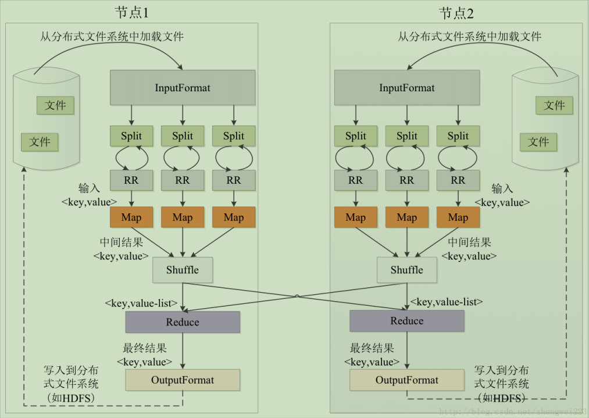
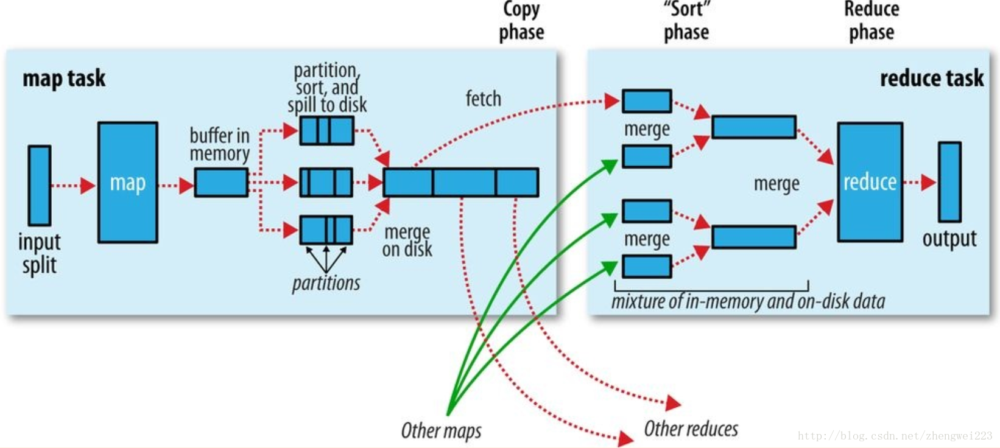
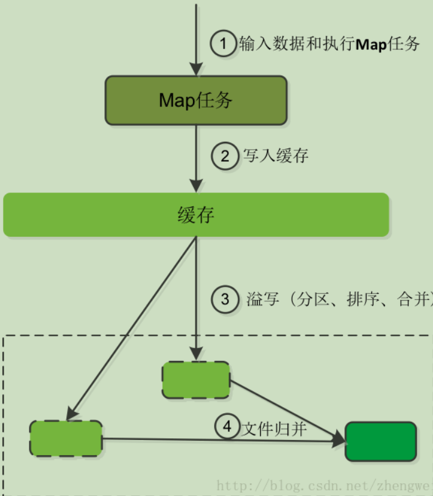
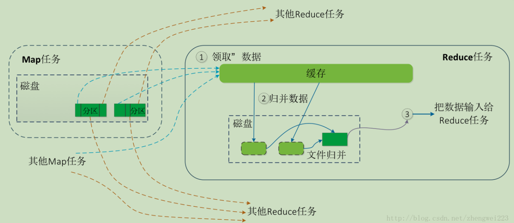

# Hadoop

## Shuffle

### 1.Map Reduce Shuffle

#### 架构篇

##### MapReduce过程

- MapReduce框架使用InputFormat模块做Map前的预处理，比如验证输入的格式是否符合输入定义；然后，将输入文件切分为逻辑上的多个InputSplit，InputSplit是MapReduce对文件进行处理和运算的输入单位，只是一个逻辑概念，每个InputSplit并没有对文件进行实际切割，只是记录了要处理的数据的位置和长度。
- 因为InputSplit是逻辑切分而非物理切分，所以还需通过RecordReader根据InputSplit中的信息来处理InputSplit中的具体记录，加载数据并转换为适合Map任务读取的键值对，输入给Map任务。
- Map任务会根据用户自定义的映射规则，输出一系列的 <key,value> 作为中间结果。
- 为了让Reduce可以并行处理Map的结果，需要对Map的输出进行一定的分区（partition）、排序（sort）、合并（combine）、归并（merge）等操作，得到<key,value>形式的中间结果，再交给对应的Reduce进行处理，这个过程称为shuffle。从无序的<key,value>到有序的<key,value-list>，这个过程用Shuffle来称呼是非常形象。
- Reduce以一系列 <key,value-list> 中间结果为输入，执行用户定义的逻辑，输出结果给OutputFormat模块。
- OutpFormat模块会验证输出目录是否已经存在以及输出结果类型是否符合配置文件中的配置类型，如果都满足，就输出Reduce的结果到分布式文件系统。

#### Shuffle详解

**Shuffle，是指对Map输出结果进行分区、排序、合并等处理并交给Reduce的过程。分为Map端的操作和Reduce端的操作。**

##### Shuffle过程

	1.横跨Map任务和Reduce任务
	2.map端映射结果存放到内存缓冲区（Buffer）,缓冲区数据达到溢写条件（0.8*100MB）,进行溢写操作，
		分区（key.hashCode()%numReduceTask = 余数）
		排序（Sort 保证分区内KV有序）,
		合并（可选 减少最终的kv输出 但是V必须得可以进行合并操作）
		最终产生多个小的溢写文件，在MapTask运行结束之前会将小的溢写文件合并为大的溢写文件（有多个分区数据构成）
	3. reduce端
		获取分区数据（fetch 取mapTask物理节点中下载自己需要计算的分区数据）
		合并（从多个map任务获取的相同分区数据进行合并 排序）
		KVIterator reduce任务程序输入（key,value-list）
	4. outputFormat指定的存储系统

##### map端shuffle过程

- 数据分片
- map输出结果写入内存
- 缓存达到阈值，溢写到磁盘文件
- 归并成大文件（生成key和对应的value-list）

​	

​	Map的输出结果首先被缓存到内存，当缓存区容量到达80%（缓冲区默认100MB），就启动溢写操作。当启动
溢写操作时，首先需要把缓存中的数据进行分区，然后对每个分区的数据进行排序和合并（combine），之后再写入磁盘文件。每次溢写操作会生成一个新的磁盘文件，随着Map任务的执行，磁盘中就会生成多个溢写文件。在Map任务全部结束之前，这些溢写文件会被归并成一个大的磁盘文件，然后通知相应的Reduce任务来领取属于自己处理的数据。

##### reduce端shuffle过程

- 领取数据
- 归并数据
- 数据输入给Reduce任务

​	

​	Reduce任务从Map端的不同Map机器领回属于自己处理的那部分数据，然后对数据进行归并后交给Reduce处理。
