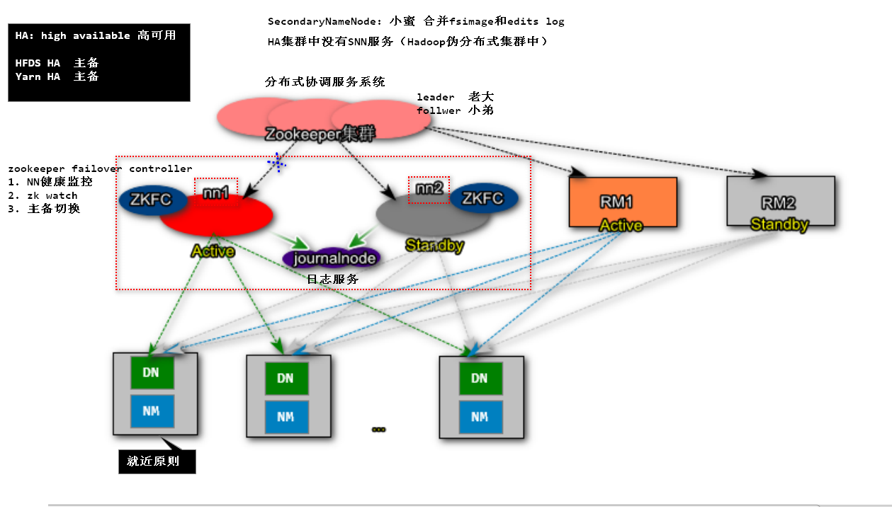
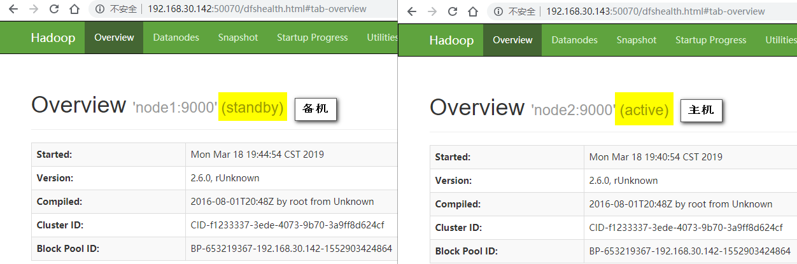
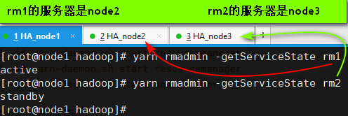

## Hadoop HA高可用集群

## 一、架构图

## 二、节点信息

|                          | node1  (192.168.30.141) | node2  (192.168.30.142) | node3  (192.168.30.143) |
| ------------------------ | :---------------------: | :---------------------: | :---------------------: |
## 三、搭建集群

### 0.基础配置

- 修改主机名

  ~~~shell
  vi /etc/hostname
  
  node1
  ~~~

- 主机名和Ip映射关系

  ~~~shell
  vi /etc/hosts
  ~~~

  ~~~properties
  127.0.0.1   localhost localhost.localdomain localhost4 localhost4.localdomain4
  ::1         localhost localhost.localdomain localhost6 localhost6.localdomain6
  192.168.30.142  node1
  192.168.30.143  node2
  192.168.30.144  node3
  ~~~

- 关闭防火墙

  ~~~shell
  systemctl stop firewalld
  systemctl disable firewalld
  ~~~

- SSH免密登录

  ~~~shell
  # 三个节点都要配置
  [root@nodeX ~]# ssh-keygen -t rsa
  [root@nodeX ~]# ssh-copy-id node1
  [root@nodeX ~]# ssh-copy-id node2
  [root@nodeX ~]# ssh-copy-id node3
  ~~~

- 同步时钟

  ~~~shell
  [root@nodeX ~]# date -s '2018-12-1 20:06:00'
  2018年 12月 01日 星期六 20:06:00 CST
  [root@nodeX ~]# clock -w
  [root@nodeX ~]# date
  2018年 12月 01日 星期六 20:06:09 CST
  ~~~

### 1.安装JDK

~~~shell
[root@nodeX ~]# rpm -ivh jdk-8u181-linux-x64.rpm

[root@nodeX ~]# vi .bashrc
JAVA_HOME=/usr/java/latest
CLASSPATH=.
PATH=$PATH:$JAVA_HOME/bin
export JAVA_HOME
export CLASSPATH
export PATH

[root@nodeX ~]# source .bashr
~~~

### 2.安装ZooKeeper集群

- 安装

  ~~~shell
  tar -zxf zookeeper-3.4.6.tar.gz -C /usr/
  ~~~

- 修改配置文件

  ~~~shell
  vi /usr/zookeeper-3.4.6/conf/zoo.cfg
  ~~~

  ~~~properties
  tickTime=2000
  dataDir=/root/zkdata
  clientPort=2181
  initLimit=5
  syncLimit=2
  server.1=node1:2887:3887
  server.2=node2:2887:3887
  server.3=node3:2887:3887
  ~~~

  ~~~shell
  [root@nodeX ~]# mkdir /root/zkdata
  [root@node1 ~]# vi /root/zkdata/myid
  1
  [root@node2 ~]# vi /root/zkdata/myid
  2
  [root@node3 ~]# vi /root/zkdata/myid
  3
  ~~~

- 启动

  ~~~shell
  [root@nodeX zookeeper-3.4.6]# ./bin/zkServer.sh start zoo.cfg
  JMX enabled by default
  Using config: /usr/zookeeper-3.4.6/bin/../conf/zoo.cfg
  Starting zookeeper ... STARTED
  
  [root@nodeX zookeeper-3.4.6]# ./bin/zkServer.sh status zoo.cfg
  ~~~

### 3.安装配置Hadoop

- 安装Hadoop

  ~~~shell
  [root@nodeX ~]# tar -zxf hadoop-2.6.0_x64.tar.gz -C /usr/
  ~~~

- 配置环境变量

  ~~~shell
  [root@nodeX ~]# vi .bashrc
  HADOOP_HOME=/usr/hadoop-2.6.0
  JAVA_HOME=/usr/java/latest
  CLASSPATH=.
  PATH=$PATH:$JAVA_HOME/bin:$HADOOP_HOME/bin:$HADOOP_HOME/sbin
  export JAVA_HOME
  export CLASSPATH
  export PATH
  export HADOOP_HOME
  
  [root@nodeX ~]# source .bashrc
  ~~~

- 修改`/usr/hadoop-2.6.0/etc/hadoop/core-site.xml`配置文件

  ~~~xml
  <property>
      <name>fs.defaultFS</name>
      <value>hdfs://mycluster</value>
  </property>
  <property>
      <name>hadoop.tmp.dir</name>
      <value>/usr/hadoop-2.6.0/hadoop-${user.name}</value>
  </property>
  <property>
      <name>fs.trash.interval</name>
      <value>30</value>
  </property>
  <property>
      <name>net.topology.script.file.name</name>
      <value>/usr/hadoop-2.6.0/etc/hadoop/rack.sh</value>
  </property>
  ~~~

  > 创建机架脚本文件,该脚本可以根据IP判断机器所处的物理位置

  ~~~shell
  [root@nodeX ~]# vi /usr/hadoop-2.6.0/etc/hadoop/rack.sh
  while [ $# -gt 0 ] ; do
  	nodeArg=$1
      exec</usr/hadoop-2.6.0/etc/hadoop/topology.data
      result=""
      while read line ; do
          ar=( $line )
          if [ "${ar[0]}" = "$nodeArg" ] ; then
         	 	result="${ar[1]}"
          fi
      done
      shift
      if [ -z "$result" ] ; then
      	echo -n "/default-rack"
      else
      	echo -n "$result "
      fi
  done
  ~~~

  修改权限

  ~~~shell
  [root@nodeX ~]# chmod u+x /usr/hadoop-2.6.0/etc/hadoop/rack.sh
  ~~~

  创建topology.data

  ~~~shell
  [root@nodeX ~]# vi /usr/hadoop-2.6.0/etc/hadoop/topology.data
  192.168.23.137 /rack1
  192.168.23.138 /rack1
  192.168.23.139 /rack2
  ~~~

  测试rack.sh文件

  ~~~shell
  [root@nodeX ~]# /usr/hadoop-2.6.0/etc/hadoop/rack.sh 192.168.23.137
  /rack1
  ~~~

- 修改`/usr/hadoop-2.6.0/etc/hadoop/hdfs-site.xml`配置文件

  ~~~xml
  <property>
      <name>dfs.replication</name>
      <value>3</value>
  </property>
  <property>
      <name>dfs.ha.automatic-failover.enabled</name>
      <value>true</value>
  </property>
  <property>
      <name>ha.zookeeper.quorum</name>
      <value>node1:2181,node2:2181,node3:2181</value>
  </property>
  <property>
      <name>dfs.nameservices</name>
      <value>mycluster</value>
  </property>
  <property>
      <name>dfs.ha.namenodes.mycluster</name>
      <value>nn1,nn2</value>
  </property>
  <property>
      <name>dfs.namenode.rpc-address.mycluster.nn1</name>
      <value>node1:9000</value>
  </property>
  <property>
      <name>dfs.namenode.rpc-address.mycluster.nn2</name>
      <value>node2:9000</value>
  </property>
  <property>
      <name>dfs.namenode.shared.edits.dir</name>
      <value>qjournal://node1:8485;node2:8485;node3:8485/mycluster</value>
  </property>
  <property>
      <name>dfs.client.failover.proxy.provider.mycluster</name>
      <value>org.apache.hadoop.hdfs.server.namenode.ha.ConfiguredFailoverProxyProvider</value>
  </property>
  <property>
      <name>dfs.ha.fencing.methods</name>
      <value>sshfence</value>
  </property>
  <property>
      <name>dfs.ha.fencing.ssh.private-key-files</name>
      <value>/root/.ssh/id_rsa</value>
  </property>
  ~~~

- 修改`/usr/hadoop-2.6.0/etc/hadoop/slaves`文件

  ~~~properties
  node1
  node2
  node3
  ~~~

### 4.启动HDFS测试

- 启动服务

  ~~~shell
  [root@nodeX ~]# hadoop-daemon.sh start journalnode //日志服务
  
  [root@node1 ~]# hdfs namenode -format // 第一次启动时格式化
  [root@node1 ~]# hadoop-daemon.sh start namenode
  
  [root@node2 ~]# hdfs namenode -bootstrapStandby // （下载active的namenode元数据）第一次启动时执行
  [root@node2 ~]# hadoop-daemon.sh start namenode
  
  [root@node1|2 ~]# hdfs zkfc -formatZK // （可以在node1或者node2任意一台注册namenode信息）第一次启动时执行
  
  [root@node1 ~]# hadoop-daemon.sh start zkfc (哨兵)
  [root@node2 ~]# hadoop-daemon.sh start zkfc (哨兵)
  
  [root@nodeX ~]# hadoop-daemon.sh start datanode
  ~~~

- 测试集群

  

  当主机服务出现故障时，备机会变成主机

  当使用`kill -9 pid`结束服务时，`CentOS7 minimal` 不会真的结束进程，需要安装`psmisc`应用

  ~~~shell
  yum install -y psmisc
  ~~~

### 5.安装配置Yarn集群

- 修改配置文件`/usr/hadoop-2.6.0/etc/hadoop/mapred-site.xml`

  ~~~xml
  <property>
      <name>mapreduce.framework.name</name>
      <value>yarn</value>
  </property>
  ~~~

- 修改配置文件`/usr/hadoop-2.6.0/etc/hadoop/yarn-site.xml`

  ~~~xml
  <property>
      <name>yarn.nodemanager.aux-services</name>
      <value>mapreduce_shuffle</value>
  </property>
  <property>
      <name>yarn.resourcemanager.ha.enabled</name>
      <value>true</value>
  </property>
  <property>
      <name>yarn.resourcemanager.cluster-id</name>
      <value>cluster1</value>
  </property>
  <property>
      <name>yarn.resourcemanager.ha.rm-ids</name>
      <value>rm1,rm2</value>
  </property>
  <property>
      <name>yarn.resourcemanager.hostname.rm1</name>
      <value>node2</value>
  </property>
  <property>
      <name>yarn.resourcemanager.hostname.rm2</name>
      <value>node3</value>
  </property>
  <property>
      <name>yarn.resourcemanager.zk-address</name>
      <value>node1:2181,node2:2181,node3:2181</value>
  </property>
  ~~~

- 启动yarn

  ~~~shell
  [root@node2 ~]# yarn-daemon.sh start resourcemanager
  [root@node3 ~]# yarn-daemon.sh start resourcemanager
  
  # 启动nodemanager
  [root@nodeX ~]# yarn-daemon.sh start nodemanager
  ~~~

- 查看`ResourceManager HA(高可用集群)`状态

  ~~~shell
  [root@node1 ~]# yarn rmadmin -getServiceState rm1
  active
  [root@node1 ~]# yarn rmadmin -getServiceState rm2
  standby
  ~~~

- 测试集群

  

  当` yarn-daemon.sh stop resourcemanager`结束主机的`ResourceManager`时，备机会变成主机