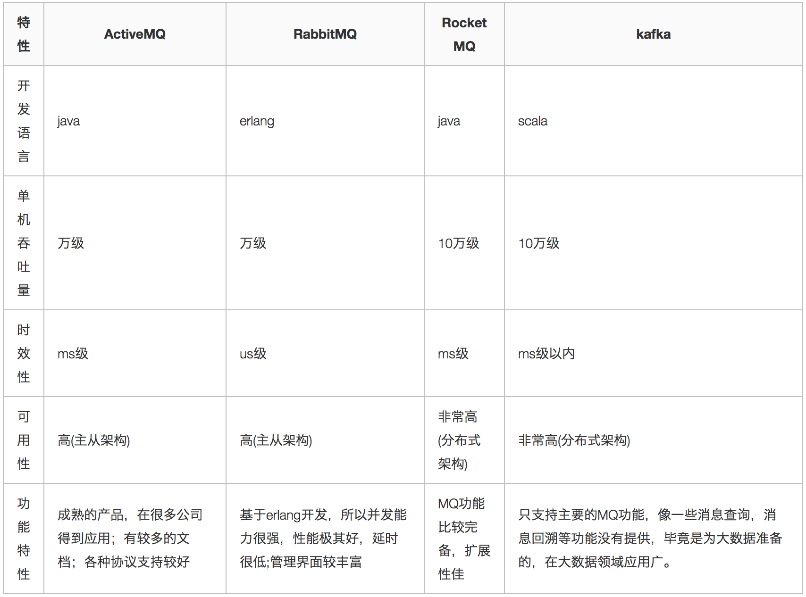

# RocketMQ

## 1.基本认识

### 1.1消息队列（MQ）

​	MQ，message queue，消息队列，是属于队列，“先进先出”的数据结构。

#### 三个应用场景

1. 应用解耦

系统的耦合性越高，容错性就越低。以电商应用为例，用户创建订单后，如果耦合调用库存系统、物流系统、支付系统，任何一个子系统出了故障或者因为升级等原因暂时不可用，都会造成下单操作异常，影响用户使用体验。

使用消息队列解耦合，系统的耦合性就会降低了。比如物流系统发生故障，需要几分钟才能来修复，在这段时间内，物流系统要处理的数据被缓存到消息队列中，用户的下单操作正常完成。当物流系统回复后，补充处理存在消息队列中的订单消息即可，终端系统感知不到物流系统发生过几分钟故障。

2. 流量削峰

应用系统如果遇到系统请求流量的瞬间猛增，有可能会将系统压垮。有了消息队列可以将大量请求缓存起来，分散到很长一段时间处理，这样可以大大提到系统的稳定性和用户体验。

一般情况，为了保证系统的稳定性，如果系统负载超过阈值，就会阻止用户请求，这会影响用户体验，而如果使用消息队列将请求缓存起来，等待系统处理完毕后通知用户下单完毕，这样总不能下单体验要好。

另一方面，从经济上考虑，业务系统正常时段的QPS如果是1000，流量最高峰是10000，为了应对流量高峰配置高性能的服务器显然不划算，这时可以使用消息队列对峰值流量削峰。

3. 数据分发

通过消息队列可以让数据在多个系统更加之间进行流通。数据的产生方不需要关心谁来使用数据，只需要将数据发送到消息队列，数据使用方直接在消息队列中直接获取数据即可。

#### 消息队列的优缺点

优点：就是三个应用场景，解耦，削峰，数据分发。

缺点：

- 系统可用性降低

系统引入的外部依赖越多，系统稳定性越差。一旦MQ宕机，就会对业务造成影响。

如何保证MQ的高可用？

- 系统复杂度提高

MQ的加入大大增加了系统的复杂度，以前系统间是同步的远程调用，现在是通过MQ进行异步调用。

如何保证消息没有被重复消费？怎么处理消息丢失情况？如何保证消息传递的顺序性？

- 一致性问题

A系统处理完业务，通过MQ给B、C、D三个系统发消息数据，如果B系统、C系统处理成功，D系统处理失败。

如何保证消息数据处理的一致性？

#### 主流MQ对比

ActiveMQ社区少维护，使用性降低；

Kafka在日志方面比较成熟，但是失败支持重试；

RabbitMQ开发语言导致不易于维护，吞吐量稍微低，学习维护成本高；

RocketMQ支持客户端不多，目前仅JAVA、C++，C++还不成熟。

> 参考链接：<https://www.jianshu.com/p/fec054f3e496>

### 1.2RocketMQ

rocketMQ是阿里巴巴开源的项目，目前交给了Apache去孵化，使用java语言开发，二次开发维护成本较低，吞吐量为10万级，并发性能好，适合金融互联网特别是订单模板使用。

#### 快速入门

