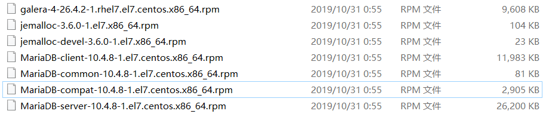

# MariaDB

#### 1.在CentOS7上安装MariaDB

1. 下载安装包



2. 按顺序安装依赖环境包

```shell
yum install rsync nmap lsof perl-DBI nc
rpm -ivh jemalloc-3.6.0-1.el7.x86_64.rpm
rpm -ivh jemalloc-devel-3.6.0-1.el7.x86_64.rpm
```

3. 卸载冲突的mariadb-libs

```shell
#搜索
rpm -qa | grep mariadb-libs
#删除
rpm -ev --nodeps mariadb-libs-5.5.60-1.el7_5.x86_64 
```

4. 安装boost-devel的依赖环境

```shell
yum install boost-devel.x86_64
```

5. 导入MariaDB的key

```shell
rpm --import http://yum.mariadb.org/RPM-GPG-KEY-MariaDB
```

6. 安装galera环境

```shell
rpm -ivh galera-4-26.4.2-1.rhel7.el7.centos.x86_64.rpm
```

7. 安装libaio（安装10.4.8时需要）

```shell
wget http://mirror.centos.org/centos/6/os/x86_64/Packages/libaio-0.3.107-10.el6.x86_64.rpm
rpm -ivh libaio-0.3.107-10.el6.x86_64.rpm
```

8. 安装MariaDB的4个核心包

```shell
rpm -ivh MariaDB-common-10.4.8-1.el7.centos.x86_64.rpm MariaDB-compat-10.4.8-1.el7.centos.x86_64.rpm MariaDB-client-10.4.8-1.el7.centos.x86_64.rpm MariaDB-server-10.4.8-1.el7.centos.x86_64.rpm
```

安装成功。

#### 2.初次配置

启动服务

```shell
service mysql start
```

进行安全配置

```shell
mysql_secure_installation
```

以下为单步操作步骤:

```shell
1.输入密码，初次安装没有密码，直接回车
2.询问是否使用‘unix_socket’进行身份验证：n
3.为root设置密码：y
4.输入密码（root）
5.确认输入密码
6.是否移除匿名用户，建议删除：y
7.拒绝用户远程登录，建议开启：n
8.删除test库，随意：n
9.重新加载权限表：y
```

配置远程连接

```shell
mysql -u root -p

grant all privileges on *.* to 'root'@'%' identified by 'root密码';
flush privileges;
```

