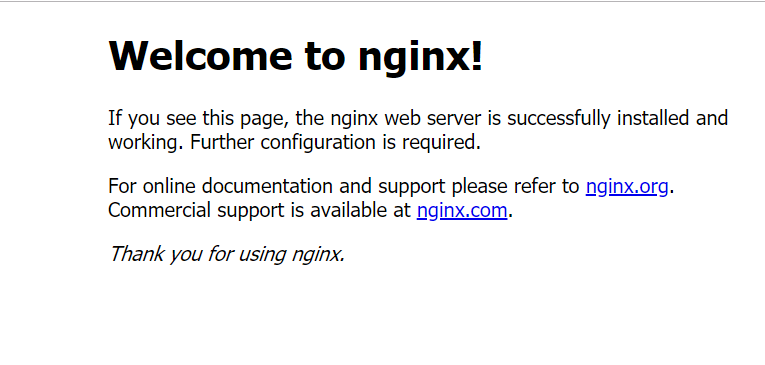
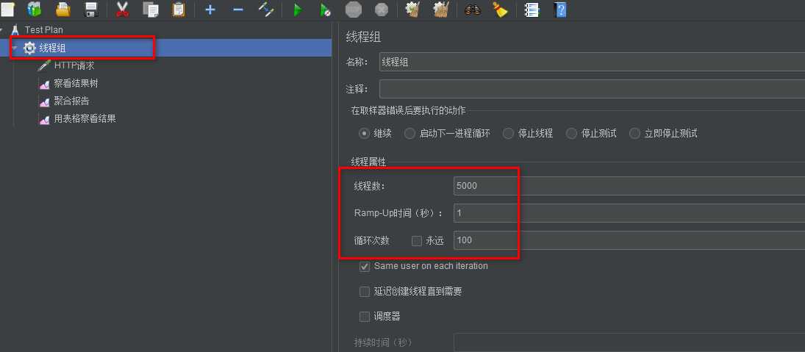
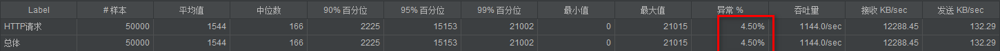

# Nginx

## 一.Nginx基础知识

### 1.在CentOS7上安装Nginx

1. 去官网http://nginx.org/下载对应的nginx包，推荐使用稳定版本 

2. 上传nginx到linux系统 

3. 安装依赖环境 

   (1)安装gcc环境 

   ```shell
   yum install gcc-c++ 
   ```

   (2)安装PCRE库，用于解析正则表达式 

   ```shell
   yum install -y pcre pcre-devel
   ```

   (3)zlib压缩和解压缩依赖， 

   ```shell
   yum install -y zlib zlib-devel 
   ```

   (4)SSL 安全的加密的套接字协议层，用于HTTP安全传输，也就是https 

   ```shell
   yum install -y openssl openssl-devel 
   ```

4. 解压，需要注意，解压后得到的是源码，源码需要编译后才能安装 

   ```shell
   tar -zxvf nginx-1.16.1.tar.gz 
   ```

5. 编译之前，先创建nginx临时目录，如果不创建，在启动nginx的过程中会报错 

   ```shell
   mkdir /var/temp/nginx -p 
   ```

6. 在nginx目录，输入如下命令进行配置，目的是为了创建makefile文件 

```shell
./configure \
--prefix=/usr/local/nginx \
--pid-path=/var/run/nginx/nginx.pid \
--lock-path=/var/lock/nginx.lock \
--error-log-path=/var/log/nginx/error.log \
--http-log-path=/var/log/nginx/access.log \
--with-http_gzip_static_module \
--http-client-body-temp-path=/var/temp/nginx/client \
--http-proxy-temp-path=/var/temp/nginx/proxy \
--http-fastcgi-temp-path=/var/temp/nginx/fastcgi \
--http-uwsgi-temp-path=/var/temp/nginx/uwsgi \
--http-scgi-temp-path=/var/temp/nginx/scgi

##  ‘\’是指换行，增加可读性
```

配置命令解释 

```shell
–prefix 指定nginx安装目录 

–pid-path 指向nginx的pid 

–lock-path 锁定安装文件，防止被恶意篡改或误操作 

–error-log 错误日志 

–http-log-path http日志 

–with-http_gzip_static_module 启用gzip模块，在线实时压缩输出数据流 

–http-client-body-temp-path 设定客户端请求的临时目录 

–http-proxy-temp-path 设定http代理临时目录 

–http-fastcgi-temp-path 设定fastcgi临时目录 

–http-uwsgi-temp-path 设定uwsgi临时目录 

–http-scgi-temp-path 设定scgi临时目录
```

7. make编译 

```shell
make
```

8. 安装 （默认安装位置为默认安装位置为/usr/local/nginx）

```shell
make install
```

9. 进入sbin目录启动nginx 

```shell
./nginx

#强制停止：
./nginx -s stop

#优雅停止：（会等请求返回后在停止）
./nginx -s quit

#重新加载：
./nginx -s reload 
```

10. 打开浏览器，访问虚拟机所处内网ip即可打开nginx默认页面，显示如下便表示安装成功： 

    

注意事项: 

1. 如果在云服务器安装，需要开启默认的nginx端口：80 

2. 如果在虚拟机安装，需要关闭防火墙 

3. 本地win或mac需要关闭防火墙


### 2.Nginx的请求机制

​	nginx的请求机制是异步非阻塞形式的，所以非常高效，且节约系统资源。

​	在nginx中有两种角色，master和worker，master负责接收请求分配给worker，worker指派给具体的Client来处理请求。master接收到一个请求分给一个worker，worker分给具体的client处理请求，master在再接收到一个请求时可以发给另一个worker，或者若第一个请求处理时间长第一个worker处于等待时也可分给第一个worker，由第一个worker分给另一个client处理，即异步非阻塞机制。


### 扩展：网络编程的一些概念：同步 异步、阻塞和非阻塞

​	同步和异步其实是从消息的通知机制方面来说的。同步调用就是指调用方发出一个同步调用，一直等待结果的返回，并依赖这个返回进行下一步处理。异步调用指的是调用方发出一个异步调用后，继续执行后续操作，不依赖于此返回，后续的结果由调用方通过循环获取状态或者被调用方通过通知、回调函数的形式返回给调用方，像通过状态这种效率低，不建议使用。作为一个任务序列来说，同步调用强调执行并得到返回结果，属于可靠的序列，但异步只需要执行并不在乎结果，属于不可靠的。

​	阻塞和非阻塞其实是从程序（线程）等待消息时的状态来说的，阻塞就是说线程执行一件事若没有执行完就不会执行下一件事，非阻塞是说程序调用时，若不能及时得到结果，就会转而执行另一件事。

​	这四个概念两两组合就是我们常见的网络编程形式，同步阻塞、同步非阻塞、异步阻塞、异步非阻塞；除第三个外一一对应BIO、NIO、AIO。

​	

### 3.nginx.conf 核心配置文件

1. 设置worker进程的用户，指的linux中的用户，会涉及到nginx操作目录或文件的一些权限，默认为 nobody

   **nobody用户没有访问静态资源权限** 

```shell
user root; 
```

2. worker进程工作数设置，一般来说CPU有几个，就设置几个，或者设置为N-1也行 

```shell
worker_processes 1; 
```

3. nginx 日志级别 debug | info | notice | warn | error | crit | alert | emerg ，错误级别从左到右越来越大 

4. 设置nginx进程 pid （就是存放nginx当前启动的进程号）

```shell
pid logs/nginx.pid; 
```

5. 设置工作模式 

```shell
events { 

# 默认使用epoll （可以根据不同的操作系统使用不同的工作模式）

use epoll; 

# 每个worker允许连接的客户端最大连接数 

worker_connections 10240; 

} 
```

6. http 是指令块，针对http网络传输的一些指令配置 

```shell
http { 
	
} 
```

7. include 引入外部配置，提高可读性，避免单个配置文件过大 

```shell
include mime.types; 
```

8. log_format设定日志格式， main 为定义的格式名称，如此 access_log 就可以直接使用这个变量了（log_format与access_log搭配使用）

       #log_format  main  '$remote_addr - $remote_user [$time_local] "$request" '
       #                  '$status $body_bytes_sent "$http_referer" '
       #                  '"$http_user_agent" "$http_x_forwarded_for"';
       
       #access_log  logs/access.log  main;

| 参数名                | 参数意义                             |
| --------------------- | ------------------------------------ |
| $remote_addr          | 客户端ip                             |
| $remote_user          | 远程客户端用户名，一般为：’-’        |
| $time_local           | 时间和时区                           |
| $request              | 请求的url以及method                  |
| $status               | 响应状态码                           |
| $body_bytes_send      | 响应客户端内容字节数                 |
| $http_referer         | 记录用户从哪个链接跳转过来的         |
| $http_user_agent      | 用户所使用的代理，一般来时都是浏览器 |
| $http_x_forwarded_for | 通过代理服务器来记录客户端的ip       |

9. sendfile 使用高效文件传输，提升传输性能。启用后才能使用 tcp_nopush ，是指当数据表累积一定大小后才发送，提高了效率。 

```shell
sendfile on; 

tcp_nopush on; 
```

10. keepalive_timeout 设置客户端与服务端请求的超时时间，保证客户端多次请求的时候不会重复建立新的连接，节约资源损耗。 

```shell
#keepalive_timeout 0; 单位为秒

keepalive_timeout 65;
```

11. gzip 进行资源压缩，

```shell
#开启gzip压缩功能，目的：提高传输效率，节约带宽
gzip on;
#限制最小压缩，小于1字节的资源不会压缩
gzip_min_length 1;
#定义压缩级别，（压缩比，文件越大，压缩越多，但是CPU使用会越多）
gzip_comp_level 3;
#定义压缩文件的类型
gzip_types text/plain/...;
```


#### tip：nginx.pid打开失败或者失效的解决方法

​	打开失败可以重新创建nginx.pid父级文件夹路径，失效可以重新配置nginx配置文件：

```shell
./nginx -c /usr/local/nginx/conf/nginx.conf
```

### 4.Nginx日志切割

​	Nginx日志切割就是把Nginx中的请求日志(access.log)和错误日志(erro.log)按照一定的规则切割为小文件，防止单个文件过大，方式有两种：手动和定时。手动就是指手动执行脚本切割，定时就是用定时任务按时切割文件。在Linux中可以用**crontabs**。

手动：

- 创建一个shell可执行文件： cut_my_log.sh 

```shell
#!/bin/bash
LOG_PATH="/var/log/nginx/"
RECORD_TIME=$(date -d "yesterday" +%Y-%m-%d+%H:%M)
PID=/var/run/nginx/nginx.pid
mv ${LOG_PATH}/access.log ${LOG_PATH}/access.${RECORD_TIME}.log
mv ${LOG_PATH}/error.log ${LOG_PATH}/error.${RECORD_TIME}.log

#向Nginx主进程发送信号，用于重新打开日志文件
kill -USR1 `cat $PID`
```

- 为 cut_my_log.sh 添加可执行的权限

```shell
chmod +x cut_my_log.sh
```

-  执行脚本测试日志切割后的结果

```shell
./cut_my_log.sh
```

定时：

- 安装定时任务： 

```shell
yum install crontabs
```

- crontab -e 编辑并且添加一行新的任务： 

```shell
*/1 * * * * /usr/local/nginx/sbin/cut_my_log.sh
```

- 重启定时任务： 

```shell
service crond restart
```

常用定时任务命令:

```shell
/bin/systemctl start crond   //启动
/bin/systemctl stop crond    //停止
/bin/systemctl restart crond //重启
/bin/systemctl reload crond  //重新加载配置
/bin/systemctl status crond  //查看状态
crontab -e // 编辑任务 
crontab -l // 查看任务列表
```

定时任务的表达式为Cron表达式，下面为常用的表达式：

```shell
#每分钟执行：
*/1 * * * *
#每日凌晨（每天晚上23:59）执行：
59 23 * * *
#每日凌晨1点执行：
0 1 * * *
```

参考文档：每天定时为数据库备份：https://www.cnblogs.com/leechenxiang/p/7110382.html


### 5.Nginx作为虚拟主机为静态资源提供服务


```conf
server {
        listen       90;
        server_name  localhost;
        
        #服务器路径为/home/foodie-shop/files/img/face.png
        
        #root 路径完全匹配访问
        #用户访问请求为url:port/files/img/face.png
        #下面表示访问ip:90后直接访问/home/foodie-shop路径下的index.html
        location / {
            root   /home/foodie-shop;
            index  index.html;
        }
        
        #下面表示访问ip:90/static后直接访问/workspaces/images/foodie/faces/191218H9SFHA66A8路径下的face-191218H9SFHA66A8.jpg，即用nginx作为虚拟主机为静态资源提供服务
        #alias表示隐藏路径
        location /static {
            alias  /workspaces/images/foodie/faces/191218H9SFHA66A8;
            index  face-191218H9SFHA66A8.jpg;
        }
        
        
        #以下配置可利用nginx实现跨域
        #允许跨域请求的域，*代表所有 
        add_header 'Access-Control-Allow-Origin' *; 
        #允许带上cookie请求 
        add_header 'Access-Control-Allow-Credentials' 'true'; 
        #允许请求的方法，比如 GET/POST/PUT/DELETE 
        add_header 'Access-Control-Allow-Methods' *; 
        #允许请求的header 
        add_header 'Access-Control-Allow-Headers' *;

    }
```

#### 扩展：SpringBoot实现跨域：

```java
package com.dreamshop.config;

import org.springframework.context.annotation.Bean;
import org.springframework.context.annotation.Configuration;
import org.springframework.web.cors.CorsConfiguration;
import org.springframework.web.cors.UrlBasedCorsConfigurationSource;
import org.springframework.web.filter.CorsFilter;

/**
 * function: 跨域设置配置类
 * @author DreamHeng
 * @date 2019/12/18
 */
@Configuration
public class CorsConfig {

    public CorsConfig() {
    }

    @Bean
    public CorsFilter corsFilter(){
        //1.添加cors配置信息
        CorsConfiguration config = new CorsConfiguration();
        //添加支持的网址
        config.addAllowedOrigin("http://localhost:8080");
        config.addAllowedOrigin("*");
        //设置是否发送cookie信息
        config.setAllowCredentials(true);
        //设置允许请求的方式
        config.addAllowedMethod("*");
        //设置允许的header
        config.addAllowedHeader("*");

        //2.为url添加映射路径
        UrlBasedCorsConfigurationSource corsConfigSource = new UrlBasedCorsConfigurationSource();
        corsConfigSource.registerCorsConfiguration("/**",config);

        //3.返回重新定义好的CorsFilter
        return new CorsFilter(corsConfigSource);
    }
}
```

##### location的匹配规则

空格 ：默认匹配，普通匹配 

```con
location / { 

	root /home; 

}
```

= ：精确匹配 

```conf
location = /imooc/img/face1.png { 

	root /home; 

}
```

~* ：匹配正则表达式，不区分大小写 

```conf
#符合图片的显示 

location ~ \.(GIF|jpg|png|jpeg) { 

	root /home; 

}
```

~ ：匹配正则表达式，区分大小写 

```conf
#GIF必须大写才能匹配到 

location ~ \.(GIF|jpg|png|jpeg) { 

	root /home; 

}
```

^~ ：以某个字符路径开头 

```conf
location ^~ /imooc/img { 

	root /home; 

}
```

##### Nginx 防盗链配置支持

​	Nginx是防止其它网站随意引用本网站下的静态资源进行的保护措施。在http-->server里面配置：

```conf
#对源站点验证，对来源不是heng.com域的进行判断 
valid_referers *.heng.com; 
#非法引入会进入下方判断，返回定义的状态，状态可自定义 
if ($invalid_referer) { 
	return 404; 
}
```


### 6.Nginx实现反向代理功能

​	反向代理就是指代理服务器接收客户端的请求，然后分发给具体处理请求的后端服务器。

​	Nginx作为反向代理的最大好处就是基于它异步非阻塞的请求机制，可以非常高效的处理和分发请求，使得后端服务器只需要负责逻辑运算，节约等待时间处理更多请求。

#### 反向代理基本配置

```shell
upstream baidunode {
	server 172.25.0.105:8081 weight=10 max_fails=3     fail_timeout=30s;
}
location / {
    add_header Cache-Control no-cache;
    proxy_set_header   Host local.baidu.com;
    proxy_set_header   X-Forwarded-For  $proxy_add_x_forwarded_for;
    proxy_set_header   X-Real-IP        $remote_addr;
    proxy_pass         http://baidunode;
    proxy_connect_timeout 30s;
 }
```

下面就代码里的配置做说明：
 	nginx配置文件通过使用`add_header`指令来设置`response header`，`response header`一般都是以key：value的形式，例如：“Content-Encoding：gzip、Cache-Control:no-store”，设置的命令为：

```shell
add_header Cache-Control no-store
add_header Content-Encoding gzip
```

nginx 为实现反向代理的需求增加了一个 [ngx_http_proxy_module 模块](https://link.jianshu.com?t=http://nginx.org/en/docs/http/ngx_http_proxy_module.html)。其中 proxy_set_header 指令就是该模块需要读取的配置。
 现在对每句配置做个说明

- `proxy_set_header Host local.baidu.com;`
   HTTP header 中的 Host 含义为所请求的目的主机名。当 nginx 作为反向代理使用，而后端真实 web 服务器设置有类似 **防盗链功能** ，或者根据 HTTP header 中的 Host 字段来进行 **路由** 或 **过滤** 功能的话，若作为反向代理的 nginx 不重写请求头中的 Host 字段，将会导致请求失败。
- `proxy_set_header X-Forwarded-For $proxy_add_x_forwarded_for;`
   HTTP header 中的  X_Forward_For  表示该条 http 请求是由谁发起的。如果反向代理服务器不重写该请求头的话，那么后端真实 web 服务器在处理时会认为所有的请求都来自反向代理服务器。如果后端 web 服务器有防攻击策略的话，那么反向代理服务器对应的 ip 地址就会被封掉。
   上述配置的意思是增加一个 `$proxy_add_x_forwarded_for` 到 `X-Forwarded-For`里去，注意是增加，而不是覆盖。当然由于默认的 `X-Forwarded-For` 值是空的，所以我们总感觉 `X-Forwarded-For` 的值就等于 `$proxy_add_x_forwarded_for` 的值。
   `X-Forwarded-For`的格式为`X-Forwarded-For:real client ip, proxy ip 1, proxy ip N`，每经过一个反向代理就在请求头X-Forwarded-For后追加反向代理IP。
- `proxy_connect_timeout`
   nginx服务器与被代理的服务器建立连接的超时时间，默认60秒

详细配置可参考：https://www.cnblogs.com/knowledgesea/p/5199046.html

### 扩展：利用JMeter简单测试多并发请求

1.首先下载JMeter，可直接在官网下载，win直接启动bin里面的jmeter.bat

2.建立测试计划，再创建一个线程组，设置好线程数、单线程请求次数和每次请求等待时间，

3.为该线程添加一个取样器-->HTTP请求，并添加监听器，聚合报告、察看结果树、用表格察看结果等多个辅助察看的监听器。测试数据量很大的情况下可以选择把察看结果树的文件写入到一个文件里。

4.点击上方绿色键开始，点击双扫把键清除全部。


5.测试结果：

单服务器情况下，5000线程，单线程请求10次，异常率为4.5%



### 7.Nginx实现负载均衡（通过upstream模块实现）

​	Nginx可以在upstream的服务器后面添加某些配置实现服务器负载均衡的目的。

​	轮询策略：默认即轮询策略，即轮流访问服务器

​	权重轮询策略：可以在服务器url后面加上weight表示权重，默认weight为1，表示权重相同。如下配置，表示nginx分发到三个服务器的请求比例为1:2:3。

```shell
    server 192.168.93.130:9000 weight=1;
    server 192.168.93.130:9100 weight=2;
    server 192.168.93.130:9200 weight=3;
```
#### upstream指令参数

##### ①.max_conns  

```shell
设置upstream中某台服务器的最大连接数,默认0,指无限制
  
  upstream tomcats {
           server 192.168.93.130:9000 max_conns=2;
  }
  
  假设现在就一个tomcat在处理用户请求,将nginx.conf中的worker数量改成1,通过Jmeter压测该服务,因为该tomcat接收连接的最大连接数就2,超过处理不过来在Nginx网关层就会返回502错误. Response Code 502, Response Message: Bad Gateway
```

##### ②.slow_start

```shell
   1) 启动服务时缓慢启动,慢慢的加入到集群,不要让流量一下子进来,便于让运维人员监控流量从小到大的一个处理过程,默认关闭
   2) 它的原理是设置slow_start=time之后,将该server的权重从0恢复到其设定值,相当于流量慢慢变大
   3) 所以它不适用于hash和随机负载均衡算法. 
   4) 如果集群中就只有一个服务节点,则即使设置了该参数也会被忽略
   5) 商业版中才支持
   
   upstream tomcats {
            server 192.168.93.130:9000 weight=6 slow_start=60s;
   }
```

##### ③.down

```shell
指定该服务器不可用
	
   upstream tomcats {
            server 192.168.93.130:9000 down;
   }
```

##### ④.backup

```shell
备份,只有在其他服务不可用时才提供服务
	
   upstream tomcats {
            server 192.168.93.130:9000 backup;
   }
```

##### ⑤.max_fails和fail_timeout

```shell
max_fails最大失败次数,当超过该次数时,认为该服务挂掉了,nginx会把它剔除掉
fail_timeout配合max_fails使用,当nginx认为某服务挂掉之后,在fail_timeout之内不会再放请求进来,之后再尝试放流量进来
max_fails=2 fail_timeout=15s
则代表在15秒内请求某一server失败达到2次后，则认为该server已经挂了或者宕机了，随后再过15秒，这15秒内不会有新的请求到达刚刚挂掉的节点上，而是会发到运作的server，15秒后会再有新请求尝试连接挂掉的server，如果还是失败，重复上一过程，直到恢复。
```

##### ⑦.keepalive提高吞吐量

​	keepalive是指保持长连接的数量，不超过就保持长连接，超过就关闭最近最少使用的连接

```shell
upstream tomcats {
            server 192.168.93.130:9000;
            
            keepalive 32;
}
```

​	对于http而言，应额外修改sever下location里的配置，[proxy_http_version](http://nginx.org/en/docs/http/ngx_http_proxy_module.html#proxy_http_version)指令设置为 `1.1`，并清除`Connection`标头字段

```shell
upstream http_backend {
    server 192.168.93.130:9000;
            
    keepalive 32;
}

server {
    ...

    location /http/ {
        proxy_pass http://http_backend;
        proxy_http_version 1.1;
        proxy_set_header Connection "";
        ...
    }
}
```

##### ⑧ip_hash

​	ip_hash机制其实就是将固定ip固定到某个固定的服务器，IPV4是以前三位ip地址为密钥，IPV6是以整个ip为密钥，进行hash计算算出请求服务器的下标。该算法也是数据库分库时的常用算法。该算法可用于一定程度的会话保存，但由于用户ip可能会变，故此会话保存并不太可靠。

```shell
upstream tomcats { 
	ip_hash; 
	
	server 192.168.1.173:8080; 
	server 192.168.1.174:8080 down; 
	server 192.168.1.175:8080; 
}
```

如果中间有一台服务器要删除，不能直接删除配置，应在后配置`down`，以保留当前服务器的hash值，不影响其它服务器的会话。

> 注意：在版本1.3.1和1.2.2之前，无法使用`ip_hash`负载平衡方法为服务器指定权重。

##### ⑨url_hash和least_conn

​	url_hash就是根据每次请求的uri地址，hash后访问到固定的服务器节点。

​	least_conn就是请求最近最少连接数的服务器。

```shell
upstream tomcats { 
	# url hash 
	hash $request_uri; 
	# 最少连接数 
	# least_conn 
	
	server 192.168.1.173:8080; 
	server 192.168.1.174:8080; 
	server 192.168.1.175:8080;
}
```

##### ⑩一致性hash

​	一致性hash就是指使用一致性hash算法进行ip或uri的hash算法。需添加nginx_upstream_hash模块

配置步骤：

1. 先下载第三方模块ngx_http_consistent_hash，https://github.com/replay/ngx_http_consistent_hash

2. ```shell
   #如果没有安装zip解压缩用以下命令解压
   yum install -y unzip zip
   #解压出来
   unzip ngx_http_consistent_hash-master.zip
   ```

3. 编译到nginx

   ```shell
   #在进行以下配置的时候，应把前面配置的都加上，不然会出问题，不知道什么原因，待详细分析TODO
   ./configure --add-module=/usr/ngx_http_consistent_hash-master
   make
   make install
   ```

4. 进行conf配置

   ```shell
   upstream tomcats { 
   	#以下为利用用户请求的uri做hash一致性算法
   	consistent_hash $request_uri;
   	#以下为利用用户请求ip
   	# consistent_hash $remote_addr;
   	
   	server 192.168.1.173:8080; 
   	server 192.168.1.174:8080; 
   	server 192.168.1.175:8080;
   }
   ```

##### 扩展：Nginx内置变量的差别

​	$uri，这个是指用户请求的完整的uri

​	$request_uri，这是指用户请求的完整uri的上级父路径，即不包括最后边的资源

```shell
案例1：
访问：http://192.168.128.137/test/
$uri：/test/test.html
$request_uri：/test/

案例2：
访问：http://192.168.128.137/
$uri：/jiade.html
$request_uri：/

案例3（真实名字服务器上不存在res目录）：
访问：http://192.168.128.137/res
$uri：/res
$request_uri：/res
```

​	$remote_addr，remote_addr代表客户端的IP，但它的值不是由客户端提供的，而是服务端根据客户端的ip指定的，当你的浏览器访问某个网站时，假设中间没有任何代理，那么网站的web服务器（Nginx，Apache等）就会把remote_addr设为你的机器IP，如果你用了某个代理，那么你的浏览器会先访问这个代理，然后再由这个代理转发到网站，这样web服务器就会把remote_addr设为这台代理机器的IP。

> 参考：https://developer.aliyun.com/article/532702

##### 扩展：一致性hash算法

​	在需要缓存的服务器中，使用一致性hash算法的比较多。

简述：

​	一致性hash算法，就是提前创建2的32次方个节点，从0到2的32次方减一，依次围成一个环，将服务器节点放在这些节点上，当有请求来时，通过hash算法算出节点的hash值，找到该hash值顺时针最近的一个节点，将请求发往此节点。这样即使有增加或删除节点，也只会对该节点周围的hash值即其你去有影响，对其他的没有影响，而且还可以根据请求散列分布图，计算出哪些节点请求多，在该节点范围相应增加节点。组成环的节点数可根据需要更改。

### 8.Nginx缓存

​	nginx缓存分为两类，分别为浏览器缓存和nginx缓存；

**①浏览器缓存：**

- 加速用户访问，提升单个用户（浏览器访问者）体验，缓存在本地

**②Nginx缓存**

- 缓存在nginx端，提升所有访问到nginx这一端的用户

- 提升访问上游（upstream）服务器的速度

- 用户访问仍然会产生请求流量

控制浏览器缓存方式：

```shell
location /files { 
	alias /home/imooc; 
	# expires 10s; 
	# expires @22h30m; #当天的晚上十点半过期
	# expires -1h;     #即过往时间，不使用缓存
	# expires epoch;   #不使用缓存
	# expires off;     #使用浏览器默认的缓存机制
	expires max;       #设置最大过期时间，永不过期
}
```

nginx反向代理缓存设置（即上方第二种）：

```shell
# proxy_cache_path 设置缓存目录 
# keys_zone 设置共享内存以及占用空间大小 
# max_size 设置缓存大小 
# inactive 超过此时间则被清理 
# use_temp_path 临时目录，使用后会影响nginx性能 
proxy_cache_path /usr/local/nginx/upstream_cache keys_zone=mycache:5m max_size=1g inactive=1m use_temp_path=off;
```

```shell
location / { 
	proxy_pass http://tomcats; 
	# 启用缓存，和keys_zone一致 
	proxy_cache mycache; 
	# 针对200和304状态码缓存时间为8小时 
	proxy_cache_valid 200 304 8h; 
}
```

### 9.配置SSL证书（https）

首先nginx要安装ssl模块，

```shell
#在重新配置一遍，加上下面一行
--with-http_ssl_module
```

然后配置

- 把ssl证书 *.crt 和 私钥 *.key 拷贝到 /usr/local/nginx/conf 目录中。
- 新增 server 监听 443 端口，并添加nginx配置，

```shell
server { 
	listen 443; 
	server_name www.imoocdsp.com; 
	
	# 开启ssl 
	ssl on; 
	# 配置ssl证书 
	ssl_certificate 1_www.imoocdsp.com_bundle.crt; 
	# 配置证书秘钥 
	ssl_certificate_key 2_www.imoocdsp.com.key; 
	# ssl会话cache 
	ssl_session_cache shared:SSL:1m; 
	# ssl会话超时时间 
	ssl_session_timeout 5m; 
	# 配置加密套件，写法遵循 openssl 标准 
	ssl_protocols TLSv1 TLSv1.1 TLSv1.2; ssl_ciphers ECDHE-RSA-AES128-GCM-SHA256:HIGH:!aNULL:!MD5:!RC4:!DHE; 
	ssl_prefer_server_ciphers on; 
	location / { 
		proxy_pass http://tomcats/;
	}
}
```

### 10.动静分离

特点：

- 分布式开发
- 前后端解耦
- 静态资源归nginx
- 接口服务化，可以给多个平台使用

动静分离的方式：

- CDN，就是把静态资源放在第三方服务器
- nginx，将静态资源放到nginx里面

动静分离存在的问题：

- 跨域，可以通过SpringBoot，Nginx，JSONP等处理
- 分布式会话，分布式缓存中间件Redis

### 11.云端部署前后端服务器

待解决TODO

​	目前使用nginx反向代理java后端项目无法保存会话，暂时以tomcat启动，


## 二.Keepalived

​	Keepalived是基于VRRP协议的一款高可用软件。Keepailived有一台主服务器和多台备份服务器，在主服务器和备份服务器上面部署相同的服务配置，使用一个虚拟IP地址对外提供服务，当主服务器出现故障时，虚拟IP地址会自动漂移到备份服务器。

概念：

- 解决单点故障
- 组件免费
- 可以实现高可用HA机制
- 基于VRRP协议

Keepalived会虚拟一个ip，指向Nginx主机，心跳检测状态，当主机挂了后会自动转指向Nginx备机。

### 配置

1.下载keepalived压缩文件，解压，进入到解压路径里面，有一个configure，和nginx类似

2.

```shell
./configure --prefix=/usr/local/keepalived --sysconf=/etc

make

make install
```

### **配置** Keepalived - 主

#### **1.** **通过命令** vim keepalived.conf **打开配置文件**

```shell
global_defs { 
	# 路由id：当前安装keepalived的节点主机标识符，保证全局唯一 
	router_id keep_171 
}
vrrp_instance VI_1 { 
	# 表示状态是MASTER主机还是备用机BACKUP 
	state MASTER 
	# 该实例绑定的网卡 
	interface ens33 
	# 保证主备节点一致即可 
	virtual_router_id 51 
	# 权重，master权重一般高于backup，如果有多个，那就是选举，谁的权重高，谁就当选 
	priority 100 
	# 主备之间同步检查时间间隔，单位秒 
	advert_int 2 
	# 认证权限密码，防止非法节点进入 
	authentication { 
		auth_type PASS 
		auth_pass 1111 
	}
	# 虚拟出来的ip，可以有多个（vip） 
	virtual_ipaddress { 
		192.168.1.161 
	} 
}
```

##### **2.** **启动** **Keepalived**

在sbin目录中进行启动（同nginx）

##### 3.重载Keepalived

```shell
kill -HUP $(cat /var/run/keepalived.pid)
```

##### 4.问题解决

1. **vip无法ping通**
   keepalived.conf中vip配置好后，通过ip addr可以看到vip已经顺利挂载，但是无法ping通，并且防火墙都已关闭，原因是keepalived.conf配置中默认vrrp_strict打开了，需要把它注释掉。重启keepalived即可ping通。
2. **映射端口无法访问**
   vip可ping通后，访问vip映射端口无法访问，直接访问real_server的ip和端口可访问。
   解决这个问题需要对lvs相关知识进行初步了解，详见《LVS手册》http://www.linuxidc.com/Linux/2016-03/129233.htm
   在keepalived.conf中对virtual_server配置有
   lb_kind可以设置为NAT、DR、TUN。这个选项直接关系到你做的 virtual_server和real_server能否进行正确映射。

### **配置** Keepalived - 备

##### **1.** 在另外一台服务器上打开配置文件keepalived.conf

```shell
global_defs { 
	router_id keep_172 

}
vrrp_instance VI_1 { 
	# 备用机设置为BACKUP 
	state BACKUP 
	interface ens33 
	virtual_router_id 51 
	# 权重低于MASTER 
	priority 80 
	advert_int 2 
	authentication { 
		auth_type PASS 
		auth_pass 1111 
	}
	virtual_ipaddress { 
		# 注意：主备两台的vip都是一样的，绑定到同一个vip 
		192.168.1.161 
	} 
}
```

##### 2.启动keepalived即可

```shell
#查看运行情况
ps -ef|grep keepalived
```

### Keepalived配置Nginx自动重启

#### **1.** 增加Nginx重启检测脚本

```shell
vi /etc/keepalived/check_nginx_alive_or_not.sh
```

```sh
#!/bin/bash 

A=`ps -C nginx --no-header |wc -l` 
# 判断nginx是否宕机，如果宕机了，尝试重启 
if [ $A -eq 0 ];then 
	/usr/local/nginx/sbin/nginx 
	# 等待一小会再次检查nginx，如果没有启动成功，则停止keepalived，使其启动备用机 
	sleep 3 
	if [ `ps -C nginx --no-header |wc -l` -eq 0 ];then 
		killall keepalived 
	fi 
fi
```

增加运行权限

```shell
chmod +x /etc/keepalived/check_nginx_alive_or_not.sh
```

#### **2.** 配置keepalived监听nginx脚本

```shell
vrrp_script check_nginx_alive { 
	script "/etc/keepalived/check_nginx_alive_or_not.sh" 
	interval 2 # 每隔两秒运行上一行脚本 
	weight 10 # 如果脚本运行成功，则升级权重+10 
}
```

#### **3.** **在** vrrp_instance **中新增监控的脚本**

```shell
track_script { 
	check_nginx_alive # 追踪 nginx 脚本 
}
```

#### **4.** 重启Keepalived使得配置文件生效

```shell
kill -HUP $(cat /var/run/keepalived.pid)
```

也可配置keepalived为系统命令，更方便

### Keepalived的双主热备（双主机）

TODO待补充

https://blog.csdn.net/u012599988/article/details/82152224

## 三.LVS

​	LVS，Linux Virtual Server，Linux虚拟服务器，是基于四层的反向代理服务器。

TODO详细待补充

## 四.LVS+Keepalived+Nginx

​	生产中一般由LVS负责接收请求，然后分发给Nginx，Nginx发给具体的服务器处理，处理完毕后Nginx通过一个统一的路由返回消息。Keepalived则负责各集群之间的管理，检测哪个机器节点有故障并转移主节点。

TODO具体的待补充