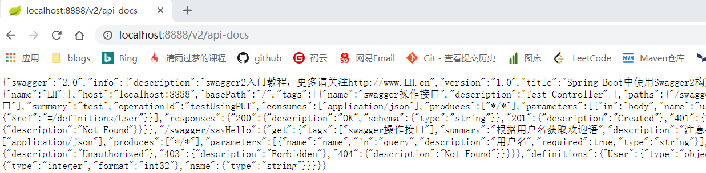
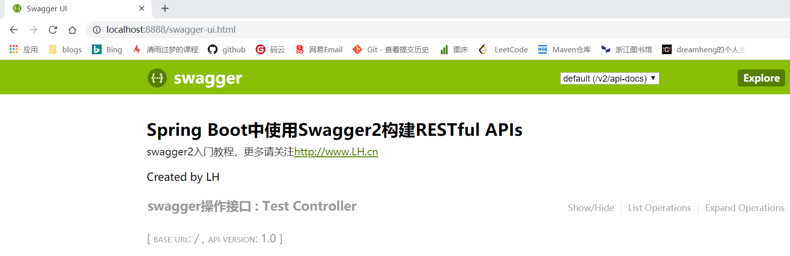

# Swagger2

## 1.概述

### 前言

​	**RESTful** 架构，是目前最流行的一种互联网软件架构。它结构清晰、符合标准、易于理解、扩展方便，所以正得到越来越多网站的采用。后端通过提供一套标准的RESTful API，让网站，移动端和第三方系统都可以基于API进行数据交互和对接，极大的提高系统的开发效率，也使得前后端分离架构成为可能。

### Swagger2

​	**Swagger**是一个功能强大的API框架，用于生成、描述、调用、测试和可视化Restful风格的WEB服务。

## 2.使用

### 2.1创建SpringBoot项目

### 2.2添加依赖

```xml
<dependencies>
	<dependency>
		<groupId>org.springframework.boot</groupId>
		<artifactId>spring-boot-starter-web</artifactId>
	</dependency>
	<dependency>
		<groupId>org.springframework.boot</groupId>
		<artifactId>spring-boot-starter-test</artifactId>
		<scope>test</scope>
	</dependency>
	<!--swagger2 依赖-->
	<dependency>
		<groupId>io.springfox</groupId>
		<artifactId>springfox-swagger2</artifactId>
		<version>2.7.0</version>
	</dependency>
	<dependency>
		<groupId>io.springfox</groupId>
		<artifactId>springfox-swagger-ui</artifactId>
		<version>2.7.0</version>
	</dependency>
</dependencies>
```

### 2.3准备配置类

```java
package com.heng.testswagger.config;

import org.springframework.context.annotation.Bean;
import org.springframework.context.annotation.Configuration;
import springfox.documentation.builders.ApiInfoBuilder;
import springfox.documentation.builders.PathSelectors;
import springfox.documentation.builders.RequestHandlerSelectors;
import springfox.documentation.spi.DocumentationType;
import springfox.documentation.spring.web.plugins.Docket;
import springfox.documentation.swagger2.annotations.EnableSwagger2;
import springfox.documentation.service.ApiInfo;

@Configuration
@EnableSwagger2
public class Swagger2Configuration {
    @Bean
    public Docket createRestApi(){
        return new Docket(DocumentationType.SWAGGER_2)
                .apiInfo(apiInfo())
                .select()
                // rest controller package
                .apis(RequestHandlerSelectors.basePackage("com.heng.testswagger.controller"))
                .paths(PathSelectors.any())
                .build();
    }

    private ApiInfo apiInfo() {
        return new ApiInfoBuilder()
                .title("Spring Boot中使用Swagger2构建RESTful APIs")
                .description("swagger2入门教程，更多请关注http://www.LH.cn")
                .termsOfServiceUrl("http://www.gaozhy.cn")
                .contact("LH")
                .version("1.0")
                .build();
    }
}

```

​	通过@Configuration注解，表明它是一个配置类，@EnableSwagger2开启Swagger2。apiInfo()配置一些基
本的信息。apis()指定扫描的包会生成文档。

### 2.4启动SpringBoot项目进行测试

http://localhost:8888/v2/api-docs




http://localhost:8888/swagger-ui.html



## 3.生成Swagger2文档的注解

Swagger通过注解表明该接口会生成文档，包括接口名、请求方法、参数、返回信息的等等。

- @Api：修饰整个类，描述Controller的作用
- @ApiOperation：描述一个类的一个方法，或者说一个接口
- @ApiParam：单个参数描述
- @ApiModel：用对象来接收参数
- @ApiModelProperty：用对象接收参数时，描述对象的一个字段
- @ApiResponse：HTTP响应其中1个描述
- @ApiResponses：HTTP响应整体描述
- @ApiIgnore：使用该注解忽略这个API
- @ApiImplicitParam：一个请求参数
- @ApiImplicitParams多个请求参数

## 4.示例

```java
package com.heng.testswagger.controller;

import com.heng.testswagger.entity.User;
import io.swagger.annotations.Api;
import io.swagger.annotations.ApiOperation;
import io.swagger.annotations.ApiParam;
import org.springframework.web.bind.annotation.*;

@Api(value = "swagger controller",tags = "swagger操作接口")
@RestController
@RequestMapping("/swagger")
public class TestController {
    @ApiOperation(value = "根据用户名获取欢迎语",notes = "注意事项")
    @GetMapping("/sayHello")
    public String sayHello(
            @ApiParam(name = "name",value = "用户名",required = true)
            @RequestParam(required = true)
            String name){
        System.out.println("hello" + name);
        return "success";
    }
    @RequestMapping(value = "/a",method = RequestMethod.PUT)
    public String test(@RequestBody User user){
        System.out.println(user);
        return "success";
    }
}

```

