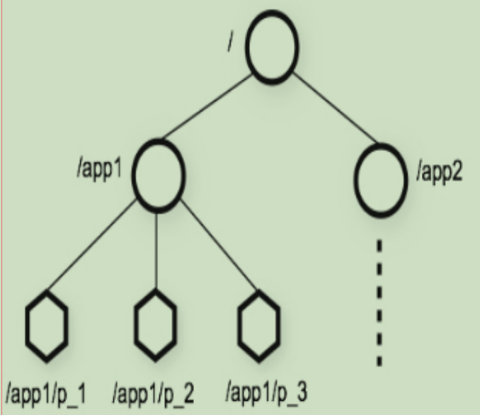
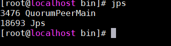
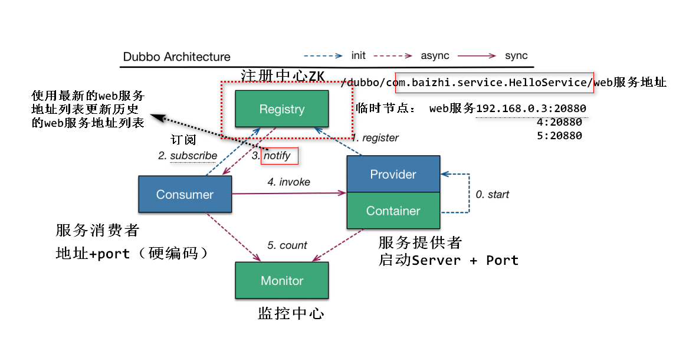
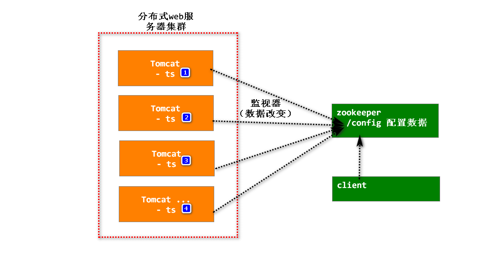
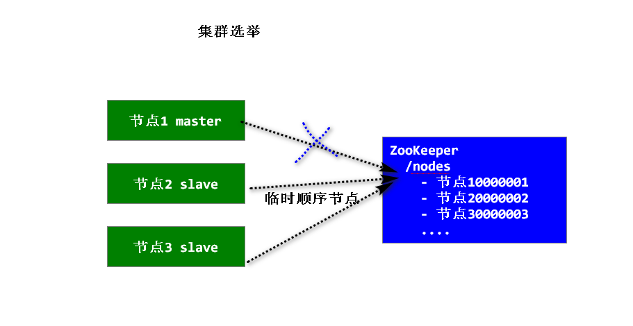
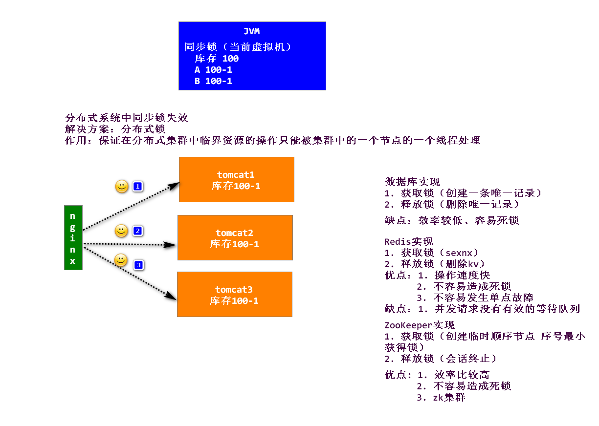

# ZooKeeper

## 1.概述

### 官网

https://zookeeper.apache.org/

### 介绍

​	ZooKeeper是⼀个开源的分布式应⽤协调服务系统，主要⽤来完成统⼀命名服务、状态同步服务、集群管理、分布式应⽤配置项的管理等⼯作。

### 特点



1. ZooKeeper有⼀个层次化的名称空间，很像⼀个分布式⽂件系统（树形层次结构）
2. ZooKeeper树中的每个节点被称为——Znode
3. Znode，兼具⽂件和⽬录两种特点。既像⽂件⼀样维护着数据、元信息、ACL、时间戳等数据结
  构，⼜像⽬录⼀样可以作为路径标识的⼀部分

### ZNode类型

​	ZooKeeper中的节点分为临时节点、永久节点和顺序节点。节点的类型在创建时即被确定，并且不能改变。

1. 临时节点（Ephemeral Node）：该节点的⽣命周期依赖于创建它们的会话。⼀旦会话
  (Session)结束，临时节点将被⾃动删除，ZooKeeper的临时节点不允许拥有⼦节点。
2. 永久节点（Persistent Node）：该节点的⽣命周期不依赖于会话，并且只有在客户端执⾏删除
  操作的时候，他们才能被删除。
3. 顺序节点（Sequential Node）：顺序节点可以是持久的或临时的。当⼀个新的Znode被创建
  为⼀个顺序节点时，ZooKeeper通过将10位的序列号附加到原始名称来设置Znode的路径。例
  如，如果将具有路径 /myapp 的znode创建为顺序节点，则ZooKeeper会将路径更改
  为 /myapp0000000001 ，并将下⼀个序列号设置为0000000002。

### Watches

​	客户端可以在节点上设置watch，我们称之为监视器。当节点状态发⽣改变时(ZNode的增、删、改)将会触发watch所对应的操作。当watch被触发时，ZooKeeper将会向客户端发送且仅发送⼀条通知。

## 2.环境搭建

#### 安装

##### 1.配置JDK

##### 2.下载

```shell
wget http://mirrors.shu.edu.cn/apache/zookeeper/zookeeper-3.4.11/zookeeper-3.4.11.tar.gz
```

##### 3.解压

```shell
tar -zxvf zookeeper-3.4.11.tar.gz -C /usr
```

##### 4.修改配置文件

```shell
修改配置⽂件
cp /usr/zookeeper-3.4.11/conf/zoo_sample.cfg /usr/zookeeper-3.4.11/conf/zoo.cfg
# 修改配置⽂件
vi /usr/zookeeper-3.4.11/conf/zoo.cfg
 tickTime=2000
 dataDir=/root/zkData
 clientPort=2181
```

#### 启动

##### 1.启动zkServer

```shell
cd /usr/zookeeper-3.4.11/bin
./zkServer.sh start ../conf/zoo.cfg
```

##### 2.启动成功



## 3.ZooKeeper指令操作

### 使用客户端脚本启动zk Server

```shell
./zkCli.sh -server ip:port
```


### 常用指令

- help 帮助
- connect host:port 连接到指定zk server
- get path [watch] 获取指定节点数据
- ls path [watch] 查看指定节点所有⼦节点
- set path data [version] 给指定节点设置数据
- rmr path 递归删除指定节点
- quit 退出客户端
- create [-s][-e\] path data acl 创建节点 -s 顺序节点 -e 临时节点
- close 关闭连接
- delete path [version] 删除节点

## 4.JAVA API操作

### maven依赖

```xml
<dependency>
	<groupId>com.101tec</groupId>
	<artifactId>zkclient</artifactId>
	<version>0.8</version>
</dependency>
```

### CURD

```java
package zktest;

import org.I0Itec.zkclient.ZkClient;
import org.I0Itec.zkclient.exception.ZkMarshallingError;
import org.I0Itec.zkclient.serialize.ZkSerializer;
import org.junit.After;
import org.junit.Before;
import org.junit.Test;

import java.io.UnsupportedEncodingException;
import java.util.List;

/**
 * @author DreamHeng
 * @date 2019/3/12
 */
public class CURDTest {
    private ZkClient client = null;
    @Before
    public void before(){
        //创建连接客户端
        client = new ZkClient("192.168.221.136:2181");
        //设置序列化规则
        client.setZkSerializer(new ZkSerializer() {
            @Override
            public byte[] serialize(Object o) throws ZkMarshallingError {
                try {
                    return String.valueOf(o).getBytes("UTF-8");
                } catch (UnsupportedEncodingException e) {
                    e.printStackTrace();
                }
                return null;
            }

            @Override
            public Object deserialize(byte[] bytes) throws ZkMarshallingError {
                try {
                    return new String(bytes, "UTF-8");
                } catch (UnsupportedEncodingException e) {
                    e.printStackTrace();
                }
                return null;
            }
        });
    }
    @Test
    public void testCURD(){
        //创建持久节点，加true代表递归创建父节点
        client.createPersistent("/test",true);
        //创建临时节点，并添加数据
        client.createEphemeral("/meng","mengmeng");
        String zookeeper = client.createEphemeralSequential("/zookeeper", "3");
        //创建永久顺序节点，并添加数据
        String zookeeper1 = client.createPersistentSequential("/zookeeper", "4");
        System.out.println("创建的临时顺序节点：" + zookeeper);
        System.out.println("创建的永久顺序节点：" + zookeeper1);
        //获取节点列表
        List<String> nodes = client.getChildren("/");
        for (String node : nodes) {
            System.out.println(node);
        }
        //往节点中数据
        client.writeData("/test","mengmeng");
        boolean b = client.deleteRecursive("/test");
        System.out.println(b);
        //读取节点数据
        Object data = client.readData("/heng/meng");
        System.out.println("/heng/meng --> " + data);
        //删除节点
        client.delete("/heng/meng");
        //递归删除节点以及下面的子节点
        client.deleteRecursive("/heng");
    }
    @After
    public void after(){
        //关闭会话
        client.close();
    }
}

```

### 注册监听

​	在ZkClient中客户端可以通过注册相关的事件监听来实现对Zookeeper服务端事件的订阅，其中ZkClient提供的常⽤监听事件接⼝有以下⼏种：

| 监听接⼝         | 订阅⽅法              | 取消订阅⽅法            |
| ---------------- | --------------------- | ----------------------- |
| IZkChildListener | subscribeChildChanges | unsubscribeChildChanges |
| IZkDataListener  | subscribeDataChanges  | unsubscribeDataChanges  |

测试代码：

```java
package zktest;

import org.I0Itec.zkclient.IZkChildListener;
import org.I0Itec.zkclient.IZkDataListener;
import org.I0Itec.zkclient.ZkClient;
import org.I0Itec.zkclient.exception.ZkMarshallingError;
import org.I0Itec.zkclient.serialize.ZkSerializer;
import org.junit.Before;
import org.junit.Test;

import java.io.IOException;
import java.io.UnsupportedEncodingException;
import java.util.List;

/**
 * @author DreamHeng
 * @date 2019/3/12
 */
public class ZKListener {
    private ZkClient client = null;
    @Before
    public void before(){
        client = new ZkClient("192.168.221.136:2181");
        //设置序列化规则
        client.setZkSerializer(new ZkSerializer() {
            @Override
            public byte[] serialize(Object o) throws ZkMarshallingError {
                try {
                    return String.valueOf(o).getBytes("UTF-8");
                } catch (UnsupportedEncodingException e) {
                    e.printStackTrace();
                }
                return null;
            }

            @Override
            public Object deserialize(byte[] bytes) throws ZkMarshallingError {
                try {
                    return new String(bytes, "UTF-8");
                } catch (UnsupportedEncodingException e) {
                    e.printStackTrace();
                }
                return null;
            }
        });
    }
    @Test
    public void testListener() throws IOException {
        //订阅子节点改变
        client.subscribeChildChanges("/heng", new IZkChildListener() {
            @Override
            public void handleChildChange(String s, List<String> list) throws Exception {
                System.out.println("父节点是：" + s);
                list.forEach(
                        node -> System.out.println("子节点：" + node)
                );
                System.out.println("--------------------------");
            }
        });
        //订阅数据改变
        client.subscribeDataChanges("/test", new IZkDataListener() {
            @Override
            public void handleDataChange(String s, Object o) throws Exception {
                System.out.println("节点 "+s+" 数据改变为: "+o);
            }

            @Override
            public void handleDataDeleted(String s) throws Exception {
                System.out.println("节点 "+s+" 被删除");
            }
        });
        System.in.read();
    }
}
```

## 5.应用

### 命名服务

​	**使用zk作为dubbo服务的注册中心，好处：服务消费者可以通过注册中心感知服务提供者调用信息的改变（临时节点+子节点数量改变的监视器）**

​	如：阿⾥巴巴集团开源的分布式服务框架Dubbo中使⽤ZooKeeper来作为其命名服务，维护全局的服务地址列表。在Dubbo实现中： 服务提供者在启动的时候，向ZK上的指定节点/dubbo/${serviceName}/providers⽬录下写⼊⾃⼰的URL地址，这个操作就完成了服务的发布。 服务消费者启动的时候，订阅/dubbo/${serviceName}/providers⽬录下的提供者URL地址， 并向/dubbo/${serviceName} /consumers⽬录下写⼊⾃⼰的URL地址。 注意，所有向ZK上注册的地址都是临时节点，这样就能够保证服务提供者和消费者能够⾃动感应资源的变化。



### 分布式配置中心

​		Spring Cloud Config（Git）
​		使用监视器（监视数据改变）配置信息一旦改变，就是用新的配置项替换原有的配置内容



### 集群管理

​			集群选举（master/slave）
​				ES集群（高可用） 

​			Hadoop集群、HBase集群、Kafka集群（集群管理）

​			元数据存储

​				HBase中通过java api 操作，需要连接zkServer获取HBase集群的信息

​				Kafka topic（主题）元数据存储在ZK

​			HA集群（高可用） ...



### 分布式锁

​	分布式锁，这个主要得益于ZooKeeper为我们保证了数据的强⼀致性。锁服务可以分为两类，⼀个是保持独占，另⼀个是控制时序。



更详细的应⽤场景，可参考：
1. http://jm.taobao.org/2011/10/08/1232/
2. https://www.ibm.com/developerworks/cn/opensource/os-cn-zookeeper/