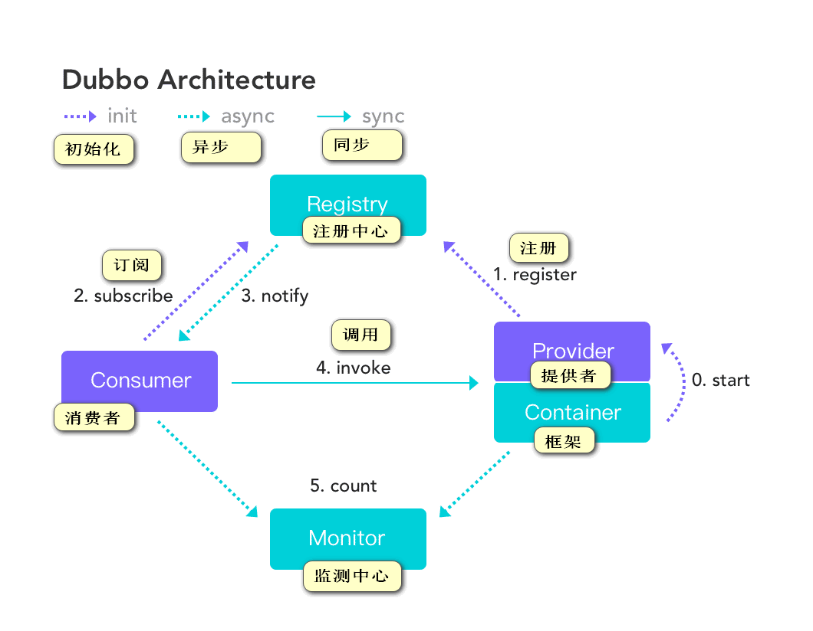
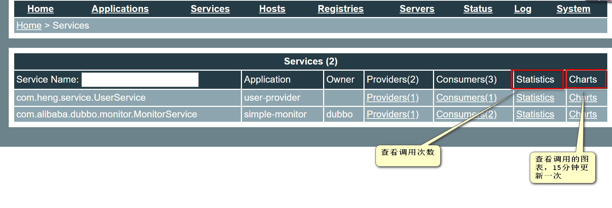
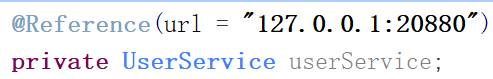

# Dubbo

## 1.分布式基础理论

##### 什么是分布式系统？

​	分布式系统是若干计算机的集合，这些计算机联合起来向用户提供服务，在用户看来这个集合就是单个的系统。

##### 什么是RPC？

​	RPC是指远程过程调用，是一种进程间通信方式，是一种技术思想，而非规范。它允许程序调用另一个地址空间（或者说另一台服务器）上的过程和函数。两个重点为通信效率、序列化/反序列化效率。

​	RPC框架有dubbo、gRPC、Thrift、HFS（High Speed Service Framework）。

##### 什么是分布式服务框架？

​	分布式服务框架是解决分布式系统中远程服务之间相互调用的问题，以及调用过程中出现的问题和系统因远程调用出现的问题。

##### 什么是流动计算架构？

​	流动式计算架构基于访问压力实时管理集群容量，提高集群利用率。最重要的点为调度、治理中心。

## 2.Dubbo简介

​	Dubbo是阿里贡献给Apache组织的一款高性能、轻量级的开源java RPC框架。

​	三个核心能力为：面向接口的远程方法调用，智能容错和负载均衡，以及服务自动注册和发现。

##### Dubbo的特性

- 面向接口代理的高性能RPC调用
  提供高性能的基于代理的远程调用能力，服务以接口为粒度，为开发者屏蔽远程过程调用底层细节。
- 智能负载均衡
  内置多种负载均衡策略，智能感知下游节点健康状态，减少调用延迟，提高系统吞吐量
- 服务自动注册与发现
  支持多种注册中心服务，服务实例上下线实时感知
- 高度可扩展能力
  遵循微内核+插件的设计原则，所有核心能力如Protocol、Transport、Serialization被设计为扩展点，平等对待内置实现和第三方实现
- 运行期流量调度
  内置条件、脚本等路由策略，通过配置不同的路由规则，轻松实现灰度发布，同机房优先等功能
- 可视化的服务治理与维护
  提供丰富服务治理、运维工具：随时查询服务元数据、服务健康状态及调用统计，实时下发路由策略、调整配置参数

##### dubbo设计架构



​	框架初始化过程中，提供者注册给注册中心，消费者订阅注册中心，注册中心以长连接的形式与消费者进行连接，整个过程被监测中心所监测。

## 3.dubbo环境搭建

### 注册中心zookeeper搭建

​	zookeeper是dubbo官方推荐的注册中心，在`技术总结`里面有zookeeper单独的学习总结。

​	本次zookeeper搭建是基于win10，使用的版本为3.4.14。

### 管理控制台搭建（dubbo-admin）

​	dubbo admin管理平台，是dubbo提供的图形化的服务管理平台，在dubbo2.6.x后的版本与dubbo rpc一分为二，单独列为一个项目，在分开前需要打成war包放在tomcat下运行，分开后集成了SpringBoot，可以通过maven命令直接打成jar包，运行jar文件即可。

​	本次使用的dubbo admin下载地址为https://github.com/apache/dubbo-admin/tree/master，在本学习总结同目录下的dubbo-admin压缩包中dubbo-admin可直接使用。

​	下载完成后解压，在该目录下运行`mvn clean package`把dubbo admin打包，找到target下的jar包运行即可，如需更改配置可在dubbo-admin下更改配置文件，初次运行时确保配置文件zookeeper地址正确。

### dubbo快速启动demo

​	在dubbo的官方文档中有详细的dubbo[快速启动demo](http://dubbo.apache.org/zh-cn/docs/user/quick-start.html)，此处只记载所遇的坑。

#### 1.创建提供者、消费者以及公共应用（服务）工程

​	首先创建提供者、消费者以及公共应用工程，将公共的接口、实体类放在公共工程上，提供者和消费者引入该工程依赖，并提供实现。

​	在三个工程中需引入dubbo依赖和zookeeper客户端maven依赖，此次使用的dubbo版本为2.6.5，使用的zookeeper客户端为curator，版本为2.12.0。zk客户端常用的有ZKClient和curator，在dubbo2.5.x以及以前的版本使用zkClient，之后的版本使用curator。curator4.x的版本对zk3.x不能有很好的应用，所以使用2.12.0.

#### 2.提供者配置（Spring配置声明暴露服务）

provider.xml

```xml
<?xml version="1.0" encoding="UTF-8"?>
<beans xmlns="http://www.springframework.org/schema/beans"
       xmlns:xsi="http://www.w3.org/2001/XMLSchema-instance"
       xmlns:dubbo="http://dubbo.apache.org/schema/dubbo"
       xsi:schemaLocation="http://www.springframework.org/schema/beans        http://www.springframework.org/schema/beans/spring-beans-4.3.xsd        http://dubbo.apache.org/schema/dubbo        http://dubbo.apache.org/schema/dubbo/dubbo.xsd">

    <!--1.指定当前服务名字-->
    <dubbo:application name="hello-world-app"  />

    <!-- 2.指定注册中心位置，暴露服务地址 -->
    <!--<dubbo:registry address="zookeeper://127.0.0.1:2181" />-->
    <dubbo:registry protocol="zookeeper" address="127.0.0.1:2181"/>

    <!-- 3.指定通信协议，用dubbo协议在20880端口暴露服务 -->
    <dubbo:protocol name="dubbo" port="20880" />

    <!-- 4.暴露服务，ref：指向服务的真正实现对象 -->
    <!-- 此处尽量写上服务的版本号，为后续不兼容升级提供可能version="1.0" -->
    <dubbo:service interface="com.heng.service.UserService" ref="userService" />

    <!-- 服务的实现 -->
    <bean id="userService" class="com.heng.service.impl.UserServiceImpl" />
</beans>
```

加载配置，provider.java

```java
package com.heng;

import org.springframework.context.support.ClassPathXmlApplicationContext;
import java.io.IOException;

/**
 *  加载配置
 */
public class App {
    public static void main( String[] args ) throws IOException {
        ClassPathXmlApplicationContext context = new ClassPathXmlApplicationContext("provider.xml");
        context.start();
        //保持程序一直运行
        System.in.read();
    }
}
```

#### 3.消费者配置

通过 Spring 配置引用远程服务

consumer.xml

```xml
<?xml version="1.0" encoding="UTF-8"?>
<beans xmlns="http://www.springframework.org/schema/beans"
       xmlns:xsi="http://www.w3.org/2001/XMLSchema-instance"
       xmlns:dubbo="http://dubbo.apache.org/schema/dubbo" xmlns:context="http://www.springframework.org/schema/context"
       xsi:schemaLocation="http://www.springframework.org/schema/beans        http://www.springframework.org/schema/beans/spring-beans-4.3.xsd        http://dubbo.apache.org/schema/dubbo        http://dubbo.apache.org/schema/dubbo/dubbo.xsd http://www.springframework.org/schema/context http://www.springframework.org/schema/context/spring-context.xsd">

    <!--扫描包，查找需要Spring工厂管理的类-->
    <context:component-scan base-package="com.heng.service.impl"/>

    <!-- 消费方应用名，用于计算依赖关系，不是匹配条件，不要与提供方一样 -->
    <dubbo:application name="order-consumer"  />

    <!-- 使用zookeeper注册中心暴露发现服务地址 -->
    <dubbo:registry address="zookeeper://127.0.0.1:2181" />

    <!-- 生成远程服务代理，可以和本地bean一样使用demoService -->
    <dubbo:reference id="userService" interface="com.heng.service.UserService" />
</beans>
```

加载配置，远程调用

```java
package com.heng;

import com.heng.service.OrderService;
import org.springframework.context.support.ClassPathXmlApplicationContext;

import java.io.IOException;

public class App {
    public static void main( String[] args ) throws IOException {
        ClassPathXmlApplicationContext context = new ClassPathXmlApplicationContext("consumer");
        //获取订单功能类
        OrderService bean = context.getBean(OrderService.class);
        bean.createOrderByUserId(1);
        System.out.println("调用结束");
        System.in.read();
    }
}
```

### dubbo监控中心搭建

​	在本次总结同目录下的dubbo-admin压缩包下的dubbo-monitor-simple即为dubbo监控中心安装包，使用`mvn clean package`打包后，取target下的.tar.7z压缩包下的程序即为监控中心，直接在bin下启动即可。

​	监控中心与管理控制台是不同的，控制台是dubbo的管理平台，监控中心主要功能就是可以查看服务提供者、消费者的数量及注册信息，服务的调用成功、失败的次数，平均响应时间、QPS（Requests per second，即每秒请求次数）等。

​	服务被监控中心监控，需要在服务配置中添加监控配置语句

```xml
<!-- 监控服务 -->
<!-- 自动发现 -->
<dubbo:monitor protocol="registry"></dubbo:monitor>
<!-- 直连监控中心 -->
<dubbo:monitor address="127.0.0.1:7001"></dubbo:monitor>
```

### dubbo整合SpringBoot

​	与Spring整合相同，此处只记录重点和遇到的坑。

#### 提供者

​	提供者在提供服务的类上添加dubbo的`@Service`注解，在启动类上添加`@EnableDubbo` 开启dubbo注解即可，在application.properties配置文件中配置。

```properties
dubbo.application.name=user-provider

dubbo.registry.protocol=zookeeper
dubbo.registry.address=127.0.0.1:2181

dubbo.protocol.name=dubbo
dubbo.protocol.port=20880

dubbo.monitor.protocol=registry
```

#### 消费者

​	消费者在需要调用远程服务的成员上添加dubbo提供的`@Reference`注解自动获取对应类型的服务，在启动类上添加`@EnableDubbo` ，在application.properties配置文件中配置。

```properties
server.port=8081

dubbo.application.name=order-consumer

dubbo.registry.address=zookeeper://127.0.0.1:2181

dubbo.monitor.protocol=registry
```

可以通过监控中心查看服务的调用次数，监控中心也有提供图表，图表15分钟更新一次。



#### dubbo与SpringBoot整合的三种方式

1. 引入dubbo-starter，在启动类上添加开启`@EnableDubbo`开启dubbo注解，

2. 引入dubbo-starter，在启动类上添加`@ImportResource(locations = "classpath:provider.xml")`，所有的配置皆可在xml配置文件中配置，此种方式保留dubbo.xml

3. 使用注解API的方式，在启动类上添加扫描配置类，`@DubboComponentScan(basePackages = "com.heng.configuration")`

   ​	将每一个组件手动创建到容器中，步骤为：创建配置类，在注解类中创建各种组件，添加属性

## 4.dubbo配置

### dubbo配置属性加载顺序

​		dubbo一共支持四种配置来源，以下按照优先级从高到低的顺序罗列：

1. JVM System Properties，形式为-D参数，eg：-Ddubbo.registry.address=zookeeper://127.0.0.1:2181

2. Externalized Configuration，外部化配置，就是各种xml配置文件，在SpringBoot中的表现形式为application.properties中，各种配置的公共配置也可以配置在dubbo.xml中

3. ServiceConfig、ReferenceConfig等编程接口采集的配置，就是在程序中以API的形式配置，

   ```java
   ConfigCenterConfig configCenter = new ConfigCenterConfig();
   configCenter.setAddress("zookeeper://127.0.0.1:2181");
   ```

4. 本地配置文件dubbo.properties

### dubbo启动检查

​	dubbo在启动时会默认检查注册中心是否存在，能否注册，消费者所需的服务是否有提供者，这些在有时候我们不需要再启动的时候检查，就可以听过配置关掉这些检查，主要通过check属性设为false关闭，配置方式有以上四种，这种关掉检查一般用在有些配置用的懒加载形式，或者有些是循环依赖。

### dubbo超时配置以及配置覆盖顺序

​	dubbo中有一种超时的配置，即超过这个时间没有调用成功则判定此次调用失败，防止大量线程阻塞，可以在服务上配置（默认1000ms），也可配置注册中心的（默认5000ms），关键字为timeout。

​	在服务配置中我们有多种配置共同存在的情况，覆盖优先级别如下：

> 方法级优先，接口级次之，全局配置再次之
>
> 如果级别一样，则消费方优先，提供方次之

其它的一些配置也遵循此覆盖级别，如 retries, loadbalance, actives

​	retries是配置服务调用超时再重试次数的，一般与timeout一块使用，默认缺省值为2，意思是第一次调用失败后在重试两次，需在超时时间内，再重试时服务会尝试调用其它相同类型的服务提供者，一般在幂等设置，比如查询操作，而在非幂等情况下不要设置，如新增。

### dubbo多版本（灰度发布）

​	dubbo支持多版本服务同时存在，只需要在服务上添加version版本号即可，在提供者提供的服务上指定多个版本的相同服务，在消费者上我们只需更改version版本号即可分别调用不同版本的服务，消费者version版本号也可设为*，意为随机调用一个版本的服务。

### dubbo本地存根

​	远程服务后，客户端通常只剩下接口，而实现全在服务器端，但提供方有些时候想在客户端也执行部分逻辑，比如：做 ThreadLocal 缓存，提前验证参数，调用失败后伪造容错数据等等，此时就需要在 API 中带上 Stub，客户端生成 Proxy 实例，会把 Proxy 通过构造函数传给 Stub ，然后把 Stub 暴露给用户，Stub 可以决定要不要去调 Proxy。

​	在Spring配置文件中加上以下

```java
<dubbo:service interface="com.foo.BarService" stub="true" />
//或者
<dubbo:service interface="com.foo.BarService" stub="com.foo.BarServiceStub" />
```

提供Stub的实现：

```java
package com.foo;
public class BarServiceStub implements BarService {
    private final BarService barService;
    
    // 构造函数传入真正的远程代理对象
    public BarServiceStub(BarService barService){
        this.barService = barService;
    }
 
    public String sayHello(String name) {
        // 此代码在客户端执行, 你可以在客户端做ThreadLocal本地缓存，或预先验证参数是否合法，等等
        try {
            return barService.sayHello(name);
        } catch (Exception e) {
            // 你可以容错，可以做任何AOP拦截事项
            return "容错数据";
        }
    }
```

## 5.dubbo高可用

> 高可用：通过设计，减少系统不能提供服务的时间。

### zookeeper宕机和dubbo直连

现象：zookeeper宕机后还可以消费dubbo暴露的服务。

原因：

- zookeeper提供了集群实现，宕掉一台，自动切换另一台；
- 集群全部宕掉后，通过本地缓存通讯；
- 没有使用注册中心， 采用的为dubbo直连的形式，具体使用为在服务消费上直接加上服务提供者的url。

dubbo健壮性的实现：

- 如果只是监控中心宕机后不影响使用，只会丢失部分采样数据；
- 数据库宕掉后，注册中心仍可以通过缓存提供服务列表查询功能，但不能提供新服务；
- 注册中心对等集群，任意一台宕掉后，自动切换另一台。
- 注册中心全部宕掉后，服务提供者和服务消费者仍能通过本地缓存通讯；
- 服务提供者无状态，服务提供者集群中任意一台宕掉后不影响使用；
- 服务提供者全部宕掉后，服务消费者应用将无法使用，会无限重连等待服务提供者恢复。

### dubbo负载均衡

​	dubbo负载均衡设计的主要目的是为了使服务提供者的调用负载均衡，防止少数提供者负载过大，导致部分请求超时。

​	dubbo提供了四种负载均衡实现，分别是基于权重随机算法的RandomLoadBalance，基于最少活跃算法的LeastActiveLoadBalance，基于hash一致性的ConsistentHashLoadBalance，基于加权轮询算法的RoundRobinLoadBalance。也可以自行拓展负载均衡策略。

​	在使用负载均衡策略时我们可以在服务端服务级别、方法级别，客户端服务级别。方法级别进行设置，对应的关键字为loadbalance，优先级别遵循dubbo超时配置顺序。也可以直接在管理控制台进行倍权半权均衡处理。


### dubbo服务降级

​	当服务器压力剧增的情况下，根据实际业务情况及流量，对一些服务和页面有策略的不处理或者换种简单的方式处理，从而释放服务器资源以保证核心交易正常运作或高效运作。

​	dubbo中可以通过服务降级功能临时屏蔽某个出错的非关键服务，并定义降级后的返回策略。

​	dubbo中实现服务降级有两种策略：

- **mock=force:return+null** 表示消费方对该服务的方法调用都直接返回 null 值，不发起远程调用。用来屏蔽不重要服务不可用时对调用方的影响。

- **mock=fail:return+null** 表示消费方对该服务的方法调用在失败后，再返回 null 值，不抛异常。用来容忍不重要服务不稳定时对调用方的影响。

  具体实现可以在管理控制台实现

### dubbo集群容错

​	在集群调用失败的时候，dubbo提供了多种容错方案，默认为failover重试。

​	容错方案有六种：

- Failover Cluster 缺省值，失败自动切换，当出现失败，重试其它服务器 。通常用于读操作，但重试会带来更长延迟。可通过 `retries="2"` 来设置重试次数(不含第一次)。
- Failfast Cluster 快速失败，只发起一次调用，失败立即报错。通常用于非幂等性的写操作，比如新增记录。
- Failsafe Cluster 失败安全，出现异常时，直接忽略。通常用于写入审计日志等操作。
- Failback Cluster 失败自动恢复，后台记录失败请求，定时重发。通常用于消息通知操作。
- Forking Cluster 并行调用多个服务器，只要一个成功即返回。通常用于实时性要求较高的读操作，但需要浪费更多服务资源。可通过 `forks="2"` 来设置最大并行数。
- Broadcast Cluster 广播调用所有提供者，逐个调用，任意一台报错则报错 [。通常用于通知所有提供者更新缓存或日志等本地资源信息。

可在服务提供方和消费方配置集群模式：

```xml
<dubbo:service cluster="failsafe" />
```

或

```xml
<dubbo:reference cluster="failsafe" />
```

### dubbo整合hystrix

​	Hystrix 旨在通过控制那些访问远程系统、服务和第三方库的节点，从而对延迟和故障提供更强大的容错能力。Hystrix具备拥有回退机制和断路器功能的线程和信号隔离，请求缓存和请求打包，以及监控和配置等功能。

#### 1.配置Hystrix

spring boot官方提供了对hystrix的集成，直接在pom.xml里加入依赖：

在引入依赖中存在依赖版本问题，1.4.4.RELEASE版本失败，2.1.0.RELEASE版本可以

```xml
<!--整合Hystrix-->
<dependency>
    <groupId>org.springframework.cloud</groupId>
    <artifactId>spring-cloud-starter-netflix-hystrix</artifactId>
    <version>2.1.0.RELEASE</version>
</dependency>
```

在启动类上添加`@EnableHystrix`开启Hystrix注解

#### 2.配置Provider端

在Dubbo的Provider上增加@HystrixCommand配置，这样子调用就会经过Hystrix代理

```java
package com.heng.service.impl;

import com.alibaba.dubbo.config.annotation.Service;
import com.heng.entity.Address;
import com.heng.service.UserService;
import com.netflix.hystrix.contrib.javanica.annotation.HystrixCommand;
import org.springframework.stereotype.Component;

import java.util.ArrayList;
import java.util.List;

/**
 * Function: 用户相关接口实现类
 * @author DreamHeng
 * @date 2019/8/4
 */
@Service
@Component
public class UserServiceImpl implements UserService {
    @HystrixCommand
    @Override
    public List<Address> getAddressByUserId(Integer userId) {
        Address address = new Address(1,1,"河南省","河南省商丘市民权县龙塘镇");
        Address address1 = new Address(2,1,"河南省","河南省商丘市民权县王桥乡");

        List list = new ArrayList();
        list.add(address);
        list.add(address1);
        return list;
    }
}
```

#### 3.配置Consumer端

对于Consumer端，则可以增加一层method调用，并在method上配置@HystrixCommand。当调用出错时，会走到fallbackMethod = "hello"的调用里。

```java
package com.heng.service.impl;

import com.alibaba.dubbo.config.annotation.Reference;
import com.heng.entity.Address;
import com.heng.service.OrderService;
import com.heng.service.UserService;
import com.netflix.hystrix.contrib.javanica.annotation.HystrixCommand;
import org.springframework.stereotype.Service;

import java.util.ArrayList;
import java.util.List;

/**
 * Function: 订单相关接口实现类
 * @author DreamHeng
 * @date 2019/8/4
 */
@Service()
public class OrderServiceImpl implements OrderService {

    @Reference
    private UserService userService;
    @Override
    @HystrixCommand(fallbackMethod = "hello")
    public List createOrderByUserId(Integer userId) throws Exception {
        List<Address> addressByUserId = userService.getAddressByUserId(userId);
        return addressByUserId;
    }
    public List hello(Integer userId){
        List objects = new ArrayList<>();
        Address address = new Address(1,1,"测试","测试");
        objects.add(address);
        System.out.println(1111);
        return objects;
    }
}
```

