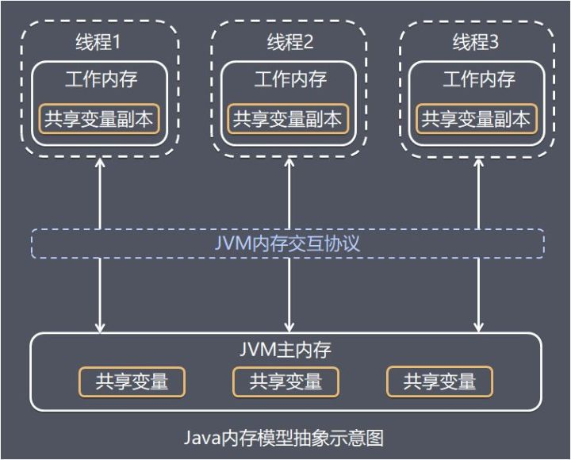
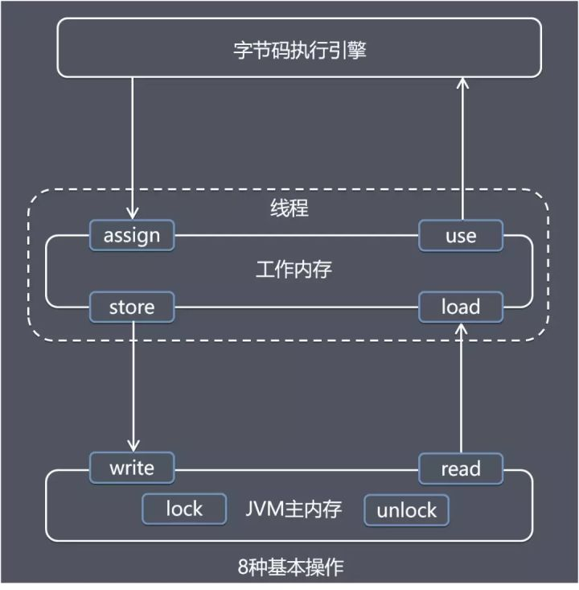

# Java并发编程

## 一.并发基础

### 1.JAVA内存模型

​	Java虚拟机规范中试图定义一中Java内存模型（Java Memory Model，简称JMM）来屏蔽掉各种硬件和操作系统的内存访问差异，使得Java程序不必关心在何种操作系统，定义程序中各个变量的访问规则（虚拟机将变量存储在内存和从内存中取出变量这样的底层细节），这里的变量与java的变量有所不同，它包括实例对象、实例字段、静态字段和构成数值字段的元素，不包括局部变量和方法参数（线程私有）。

#### 1.1.Java内存模型的组成

​	Java内存模型分为主内存和工作内存（本地内存）。

​	主内存可以理解为硬件内存（但实际并不是同一意义，只是虚拟机内存的一部分），所有线程共享，线程与主内存通讯是通过JVM内存交互协议。

​	工作内存是每个线程独有的，类似于CPU的缓存，但实际并不存在，知识JVM抽象出来的一个概念，存储线程独有的变量以及共享变量的副本。

内存模型如下所示：



#### 1.2.Java内存交互操作

​	Java内存中的交互操作有8个：

- **lock (锁定) **，作用于主内存的变量，它把一个变量标识为一条线程独占的状态。
- **unlock (解锁) **，作用于主内存的变量，它把一个处于锁定状态的变量释放出来，释放后的变量才可以被其他线程锁定。
- **read (读取) **，作用于主内存的变量，它把一个变量的值从主内存传输到线程的工作内存中，以便随后的 load 动作使用。
- **load (载入) **，作用于工作内存的变量，它把 read 操作从主内存中得到的变量值放入工作内存的变量副本中。
- **use (使用) **，作用于工作内存的变量，它把工作内存中一个变量的值传递给执行引擎，每当虚拟机遇到一个需要使用到变量的值的字节码指令时就会执行这个操作。
- **assign (赋值) **，作用于工作内存的变量，它把一个从执行引擎接收到的值赋给工作内存的变量，每当虚拟机遇到一个给变量赋值的字节码指令时执行这个操作。
- **store (存储) **，作用于工作内存的变量，它把工作内存中一个变量的值传送到主内存中，以便随后 write 操作使用。
- **write (写入) **，作用于主内存的变量，它把 Store 操作从工作内存中得到的变量的值放入主内存的变量中。

​	交互操作图如下：



##### 交互操作流程

​	并发情况下，线程对主内存的变量加锁lock，然后read并load到工作内存中，然后线程使用字节码执行use操作，执行完成后使用assign到工作内存，再store到工作内存中，然后write到主内存，在解锁unlock。

​	非并发情况下，减去lock和unlock操作。

#### 1.3.Java内存交互基本操作的三个特性

##### 原子性

​	操作为原子操作，执行中不可中断。

##### 可见性

​	可见性即一个线程修改了一个主内存的变量，另一个线程可以立即看到修改后的值。

##### 有序性

​	线程内串行方式执行代码，线程间不会发生指令重排。

### 2.volatile

​	volatile关键字在java中修饰变量，主要是保证该变量的可见性和有序性的。

#### 2.1.可见性的保证

​	volatile保证可见性主要是通过实现工作内存里的缓存失效，一个变量被volatile修饰，那么若一个线程对它执行了修改操作，那该变量会马上被写入到主内存中，并通过嗅探机制使其它线程工作内存的该缓存失效，若其它线程需要使用该变量，则不能使用缓存必须重新从主内存读取（但是若已使用过缓存，即交互操作进入到了use阶段，则不受影响，这步也可说不保证原子性）。

#### 2.2.happenes-before

​	我们写的代码，编译器、指令器可能会对代码进行重排序、乱排，这就叫做指令重排；当符合happens-before原则时，就不会进行指令重排。happens-before原则主要有以下8个规则：

- **程序次序规则**：一个线程内，按照代码顺序，书写在前面的操作先行发生于书写在后面的操作；
- **锁定规则**：一个unLock操作先行发生于后面对同一个锁的lock操作，比如说在代码里有先对一个lock.lock()，lock.unlock()，lock.lock()；
- **volatile变量规则**：对一个volatile变量的写操作先行发生于后面对这个volatile变量的读操作，volatile变量写，再是读，必须保证是先写，再读；
- **传递规则**：如果操作A先行发生于操作B，而操作B又先行发生于操作C，则可以得出操作A先行发生于操作C；
- **线程启动规则**：Thread对象的start()方法先行发生于此线程的每个一个动作，thread.start()，thread.interrupt()；
- **线程中断规则**：对线程interrupt()方法的调用先行发生于被中断线程的代码检测到中断事件的发生；
- **线程终结规则**：线程中所有的操作都先行发生于线程的终止检测，我们可以通过Thread.join()方法结束、Thread.isAlive()的返回值手段检测到线程已经终止执行；
- **对象终结规则**：一个对象的初始化完成先行发生于他的finalize()方法的开始。

#### 2.3.有序性的保证

​	volatile对于有序性的保证就是基于happens-before原则。

#### 2.4.volatile底层原理

##### 2.4.1.lock指令：保证可见性

​	我们的程序在生成汇编代码的时候，在对volatile修饰的变量执行写操作的时候会多出lock前缀指令，JVM会给CPU发送这条lock前缀指令，CPU在计算完后会立即将这个值写到主内存中；同时因为有MESI缓存一致性协议，各个CPU会对总线进行嗅探，关注自己缓存中的变量是否被修改，如果发现缓存中的数据被修改了，那么会将那条缓存失效掉，下次使用这个变量的时候会再去主内存读取。

2.4.2.内存屏障（TODO）

### 3.Synchronized

​	Synchronized是java中实现同步的一种机制，是用来保证内存可见性和操作原子性的，它的实现基础是java中的任何一个对象都可以当做锁。

​	Synchronized的使用形式有三种：

- 实现在普通同步方法，锁对象是当前实例对象；

- 实现在静态同方法，锁对象是对象的类对象，对此类的所有实例对象都生效；

- 实现在同步代码块，锁对象是小括号里面的对象。

​	Synchronized在JVM中的实现原理是基于进入和退出Monitor对象来实现的，代码块同步是通过monitorenter指令和monitorexit指令来实现的，方法同步也可以这样实现。在代码编译后monitorenter指令会插入到同步代码块的开始位置，monitorexit指令会在代码块结束和异常位置插入。

​	根据JVM规范，在执行monitorenter指令的时候，首先需要去尝试获取对象的锁，如果这个对象没有被锁定，或者被本线程获取到，那就在这个锁的计数器上加1，然后在执行，当再次遇到monitorenter时，再在计数器加1，这就是可重入性，当执行到monitorexit时，计数器减1；另一个线程在获取此对象锁时，如果计数器不为0则代表此对象已经被锁定，该线程进入阻塞状态，等待其它线程释放锁然后再获取再继续执行，中间不能干其它事。

​	Synchronized用的锁是存在Java对象头里的。

（TODO）

### 4.原子操作和CAS

​	原子(Atomic)本意是指“不能被进一步分割的最小粒子”，原子操作(Atomic operation)就是指不可被中断的一个或一系列操作。Java中可以通过锁和CAS来实现原子操作。并发编程的三要素就是原子性、可见性、有序性。

​	CAS（compare and Swap）比较并替换，是计算机科学中一种实现多线程原子操作的指令，在java并发编程中，原子性主要就是由CAS操作来保证的。CAS操作有三个操作值，一个内存值(内存位置)，一个旧值，一个新值，在进行写入操作的时候先比较旧值是否有变化，没变化则赋新值，有变化则不赋。

​	JUC包下的atomic类都是通过CAS来实现的，我们观察atomic包的任意一个类的源码，可以看到这些类在进行任意一个操作的时候，都会调用C++对象Unsafe的一个对应方法，参数分别为（对象、内存地址、新值、旧值），然后在Unsafe的方法实现里，是使用处理器的cmpxchgl指令来实现，在多核情况下还会在cmpxchgl前生成一个lock指令前缀。

#### 4.1.Java实现原子操作的方式

- **使用循环CAS实现原子操作**，就是循环进行CAS操作直到成功为止，JUC的atomic包下的一些类就是使用这种形式支持原子操作，这种方式的实现会有三个问题：
  - **ABA问题**，CAS操作的时候会比较原先的值，如果一个线程在取的时候值是A，经过另外的线程操作后变成B，又变成A，那么这个线程在放入的时候会以为没经过变化，直接置换新值，这样可能会有问题（具体有没有问题或影响需要看具体的业务）。从jdk1.5开始atomic包下有个AtomicStampedReference类解决了这个问题，它是在值的基础上加上了版本号标志，如刚才那个就变成了1A->2B->3A.
  - **循环时间长开销大**，CAS操作是在进行不停的自旋，自旋是会有可能失败的，如果一直失败，那就会给CPU很大的压力；
  - **只能保证一个共享变量的原子操作**，通过CAS的实现我们可以看出来只支持一个变量，多个变量还是需要用synchronized。从jdk1.5开始，atomic包下提供了AtomicReference类来帮助我们将多个变量放在一个对象中进行CAS操作。

- **使用锁机制实现原子操作**，锁机制保证了只有获得锁的线程才能对锁定的内存区域进行操作。JVA内部实现了很多锁，有偏向锁、轻量级锁和互斥锁，其实，除了偏向锁，JVM实现锁的方式都用了CAS操作，即一个线程进入同步块的时候使用CAS机制获取锁，当它退出同步块的时候使用CAS机制释放锁。

4.2.CAS汇编级别实现源码分析（TODO）

### 5.AQS

​	AQS(Abstract Queued Synchronizer)，抽象队列同步器，是JUC下locks包里的一个抽象类，是JUC里并发控制一个很重要的基础，它定义了一套多线程访问共享资源的同步器框架，许多同步类实现都依赖于它，如常用的ReentrantLock/Semaphore/CountDownLatch等。

​	它维护了一个volatile int state（代表共享资源状态）和一个FIFO线程等待队列（多线程争用资源被阻塞时会进入此队列）。实现基础为：多个线程通过CAS操作获取锁，最终成功的拿到锁去执行，另外没拿到的进入队列等待，队列里的线程会通过自旋CAS循环请求获取锁，直到成功。

4.1.具体源码以及深度分析（TODO）

### 6.线程池

​	线程池就是装线程的池子，通俗讲就是线程创建、销毁流程消耗大，所以根据一定的规则创建(可通过配置提前创建)出N个线程放在池子里，需要用到线程就从池子里面拿出来用，用完了再放进去，共享线程资源。

​	线程池的重要参数一共有七个，分别为corePoolSize核心线程数、maximumPoolSize最大线程数、keepAliveTime最长空闲时间、unit空闲时间单位、workQueue等待队列、threadFactory线程工厂、handler拒绝策略。通常使用线程池通过Executors工具类来创建。

#### 6.1.线程池执行流程

​	有任务进入需要创建异步线程，首先判断线程池的核心线程数是否已满，若未满则创建一个线程出来并使用这个线程执行任务，若核心线程数已满则放入等待队列中，若等待队列已满，则判断总线程数是否大于最大线程数，若小于，则创建线程执行任务（此线程在执行完任务后，空闲超过最大空闲时间后执行销毁操作），若不小于则执行拒绝策略（默认拒绝策略为抛异常，常见的拒绝策略有丢弃新任务、抛异常、丢弃最老任务、自定义策略）。

​	在创建线程池时，若放入队列为无界队列，则线程池可以无限接任务，即常用的newFixedThreadPool。

##### 6.1.1.使用无界阻塞队列，可能会有什么问题？

​	当远程服务器出现异常时，线程处理的速度远远小于接收任务的速度，那么任务就是一直存放到队列中，因队列无界，那么一直放下去就会导致队列越来越大，内存飙升，最终OOM，内存溢出。

解决方法：使用有界队列，最大线程数设定有效值，制定有效的拒绝策略（可以将后续接收到的任务写入到磁盘中，等线程池工作负载降低了，再从磁盘慢慢读取任务执行）。

##### 6.1.2.如果线上机器突然宕机，线程池的阻塞队列里的请求怎么办？

​	如果线上机器宕机，那么阻塞队列肯定会全部丢失掉。解决的思路是将任务进行持久化操作，例如放入数据库：接收任务后先在数据库插入一条信息，状态为未提交，然后在任务提交到线程池的一个线程执行后更新状态为已提交，执行完成后更新为已完成；在机器宕机重启后，开启一个后台线程，扫描未提交状态的任务（根据情形也可扫描已提交状态），继续放入线程池执行。


## 二.并发工具

### 1.ConcurrentHashMap

​	ConcurrentHashMap是jdk1.5后推出的JUC下线程安全的HashMap，与HashTable实现线程安全的方法不同，ConcurrentHashMap初始保证线程安全的手段是分段锁，即将HashMap底层的数组分为几个小数组，分段进行加锁，在jdk1.8时，保证安全的手段有了改变，是使用CAS+分段锁的方式，即HashMap数组的每个位置都是一个单独的CAS操作，每个位置执行时单独加锁，进行链表+红黑树操作。上述保证安全的手段都是加锁在put操作。

#### 1.1.jdk1.7的分段锁

​	ConcurrentHashMap是由Segment数组结构和HashEntry数组结构组成。Segment是一种可重入锁ReentrantLock，在ConcurrentHashMap里扮演锁的角色，HashEntry则用于存储键值对数据。一个ConcurrentHashMap里包含一个Segment数组，Segment的结构和HashMap类似，是一种数组和链表结构， 一个Segment里包含一个HashEntry数组，每个HashEntry是一个链表结构的元素， 每个Segment守护着一个HashEntry数组里的元素，当对HashEntry数组的数据进行修改时，必须首先获得它对应的Segment锁。

#### 1.2.jdk1.8

​	从源码中我们可以分析：

- 从第二行看出ConcurrentHashMap不允许key为null。
- 从第五行可以看出，循环利用CAS更新数组的元素，直到成功为止，
- 第九行，判断数组的index下没有元素，利用CAS机制添加元素
- 第十八行，锁住头节点，在进行链表或红黑树操作。

```java
    final V putVal(K key, V value, boolean onlyIfAbsent) {
        if (key == null || value == null) throw new NullPointerException();
        int hash = spread(key.hashCode());
        int binCount = 0;
        for (Node<K,V>[] tab = table;;) {
            Node<K,V> f; int n, i, fh;
            if (tab == null || (n = tab.length) == 0)
                tab = initTable();
            else if ((f = tabAt(tab, i = (n - 1) & hash)) == null) {
                if (casTabAt(tab, i, null,
                             new Node<K,V>(hash, key, value, null)))
                    break;                   // no lock when adding to empty bin
            }
            else if ((fh = f.hash) == MOVED)
                tab = helpTransfer(tab, f);
            else {
                V oldVal = null;
                synchronized (f) {
                    if (tabAt(tab, i) == f) {
                        if (fh >= 0) {
                            binCount = 1;
                            for (Node<K,V> e = f;; ++binCount) {
                                K ek;
                                if (e.hash == hash &&
                                    ((ek = e.key) == key ||
                                     (ek != null && key.equals(ek)))) {
                                    oldVal = e.val;
                                    if (!onlyIfAbsent)
                                        e.val = value;
                                    break;
                                }
                                Node<K,V> pred = e;
                                if ((e = e.next) == null) {
                                    pred.next = new Node<K,V>(hash, key,
                                                              value, null);
                                    break;
                                }
                            }
                        }
                        else if (f instanceof TreeBin) {
                            Node<K,V> p;
                            binCount = 2;
                            if ((p = ((TreeBin<K,V>)f).putTreeVal(hash, key,
                                                           value)) != null) {
                                oldVal = p.val;
                                if (!onlyIfAbsent)
                                    p.val = value;
                            }
                        }
                    }
                }
                if (binCount != 0) {
                    if (binCount >= TREEIFY_THRESHOLD)
                        treeifyBin(tab, i);
                    if (oldVal != null)
                        return oldVal;
                    break;
                }
            }
        }
        addCount(1L, binCount);
        return null;
    }
```

