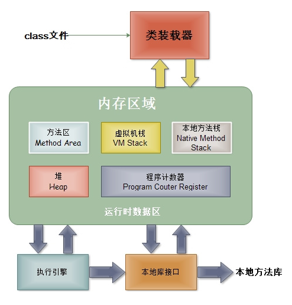
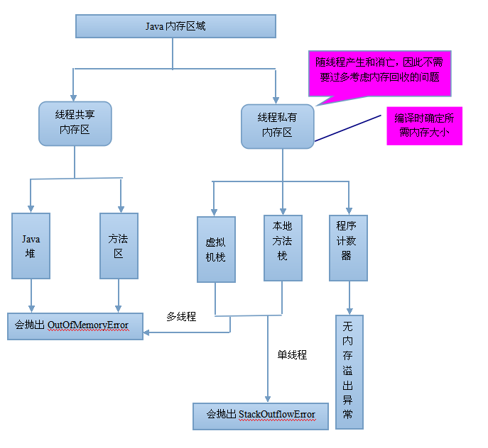
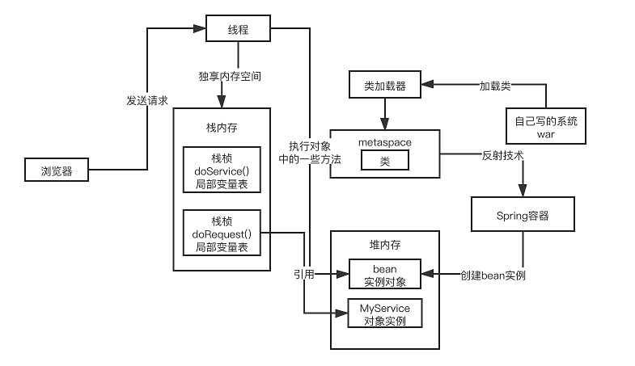

# JVM(Java Virtual Machine)

## 一.JVM的内存区域

### 1.Java程序具体执行过程

​	首先是我们写的源代码**.java**文件，经过java编译器编译成二进制字节码文件**.class**，然后由JVM的类加载器加载各个类的字节码文件，加载完毕后，交由**JVM执行引擎**执行。在整个程序执行过程中，JVM会使用一段空间来存储程序执行期间用到的数据和相关信息，这段空间一般被称为**Runtime Data Area（运行时数据区）**，也就是我们常说的JVM内存，我们常说的内存管理就是对这段空间进行管理（**如何分配和回收内存空间**）。

### 2.运行时数据区的具体划分

​	根据JVM规范，JVM的内存区域应该包括**程序计数器(Program Counter Register)、虚拟机栈(VM Stack)、本地方法栈(Native Method Stack)、方法区(Method Area)、堆(Heap)**。

#### 2.1.程序计数器

​	程序计数器是一块较小的内存空间，可以看做当前线程所执行的字节码的行号指示器，也就是存储当前执行指令的地址。因为Java多线程是通过线程轮流切换、分配处理器执行时间来实现的，所以每个线程都需要一个单独的程序计数器，保证线程切换后的正确执行。所以说，程序计数器是每个线程私有，互不干扰。

​	如果当前线程执行的是java方法，那么记录的是虚拟机字节码指令的地址；如果是本地native方法，那么记录的是undefined。

​	因为此区域存储数据大小是固定的，所以此区域也是JVM规范中唯一一个不会抛出OutOfMemoryError的内存区域。

#### 2.2.虚拟机栈

​	虚拟机栈也称为Java栈，栈结构，先入后出。

​	虚拟机栈中存的是一个个的**栈帧**，每个栈帧对应一个被调用的方法，在栈帧中包括**局部变量表(Local Variables)、操作数栈(Operand Stack)、指向当前方法所属的类的运行时常量池的引用(Reference to runtime constant pool)、方法返回地址(Return Address)和一些额外的附加信息**。当线程执行一个方法时，就会创建一个对应栈帧放入栈的顶部。方法执行完毕后，执行出栈。因每次执行一个方法都会创建一个栈帧放入栈中，所以递归操作容易造成**栈内存溢出问题**。这部分空间的分配和释放是由系统自动操作的。

​	

1. **局部变量表**，存放的是方法的局部变量（包括方法中声明的非静态变量以及函数形参）。对于基本数据类型，存储的是值；对于对象，存储的是引用地址。局部变量表的大小在编译期就可以确定大小了，所以在程序执行过程中局部变量表的大小不会改变；
2. **操作数栈**，用来执行方法的具体计算过程；
3. **指向运行时常量池的引用**，方法执行过程中可能用到类中的常量，该引用即是指向运行时常量；
4. **方法返回地址**，记录方法调用返回的地址。

每个线程执行时调用方法不同，所以每个线程都有各自的虚拟机栈。

在JVM规范中，对虚拟机栈这片区域规定了两种**异常状况**：

1. 如果线程请求的栈深度大于虚拟机锁允许的栈深度，将抛出**StackOverflowError**异常；

2. 如果java虚拟机栈容量可以动态扩展，当栈扩展时无法申请到足够的内存会抛出**OutOfMemoryError**异常。

   注意：HotSport虚拟机的栈容量不可以扩展，所以不会因为第2个原因导致OutOfMemoryError异常；有可能在申请栈空间时就失败。

#### 2.3.本地方法栈

​	本地方法栈和java栈类似，不同的是java栈执行java方法，本地方法栈执行本地方法（native）。在HotSpot虚拟机中将本地方法栈和java栈合二为一。

​	本地方法栈也会抛出java栈中说到的两种异常：**StackOverflowError**和**OutOfMemoryError**。

#### 2.4.堆

​	堆是JVM内存中最大的一块，用来存储对象实例。**所有线程共享**。”几乎“所有的对象实例都在这里被分配内存。JVM规定所有对象和数组都应在堆上分配。但是随着即时编译技术的进步，尤其是逃逸分析技术的日渐强大，栈上分配、标量替换优化手段已经导致一些微妙发生，所以此规定也不再那么绝对。

​	Java堆是垃圾收集器管理的内存区域，因为也称为“GC堆”。从回收内存角度来说，由于现代垃圾收集器大部分是基于分代收集理论设计的，所以Java堆中经常会出现“新生代”、“老生代”、“永久代”概念，但这些区域划分只是一部分垃圾收集器的设计风格，**不是**JVM的规范。

​	Java堆的大小可以通过-Xmx和-Xms设定。如果java堆中没有内存完成实例分配，并且堆也无法完成扩展时，JVM会抛出**OutOfMemoryError**异常。

java堆各个区域的划分（TODO）

#### 2.5.方法区

​	方法区也是线程共享，用来存储已被虚拟机加载的类型信息、常量、静态变量、即时编译器编译之后的代码缓存等数据。方法区经常被人叫做“永久代”，这并不准确，在JDK8之前HotSpot虚拟机的设计团队将垃圾收集器的粉黛设计扩展到方法区，或者说使用永久代来管理方法区，故称为“永久代”，但不是所有虚拟机都这样处理，其它虚拟机有的并没有“永久代”这一概念，**且在JDK7后HotSpot将字符串常量池、静态变量（事实是移到了Class对象中，Class对象如同其他对象一样在堆中）移到java堆中，JDK8后废除了“永久代”概念并将运行时常量池、类型信息移到了元空间**，所以该说法不准确。

#### 2.6.运行时常量池

​	运行时常量池是方法区的一部分，JDK8后HotSpot将此移到了元空间。

​	在Class文件中除了类的字段、方法、接口等描述信息外，还有一项信息是常量池，用来存储编译期间生成的字面量和符号引用。**运行时常量池**是每一个类或接口的常量池的运行时表示形式，在类和接口被加载到JVM后，对应的运行时常量池就被创建出来。当然并非Class文件常量池中的内容才能进入运行时常量池，在运行期间也可将新的常量放入运行时常量池中，比如String的intern方法。

​	常量池内存无法申请时会爆出**OutOfMemoryError**异常。

#### 2.7.元空间

​	元空间（Meta-space）是JRockit、J9对方法区的实现，HotSpot在JDK8后也是使用此实现设计。

​	元空间与方法区（HotSpot的“永久代”）最大区别在于，元空间是在本地内存中实现的。

#### 2.8.直接内存（TODO）

### 3.JVM的运行过程

​	把系统放入web服务器系统（如tomcat）中，会通过加载类启动类加载器，把类放入元空间，spring框架中通过反射技术创建bean实例对象放入堆中。当有客户端发起请求时，通过一个线程创建出独有的内存区域（程序计数器和两个栈空间），在栈中不断创建栈帧调用方法，操作数栈，引用堆空间的实例对象，执行类的方法，失去引用的对象会被GC回收。

