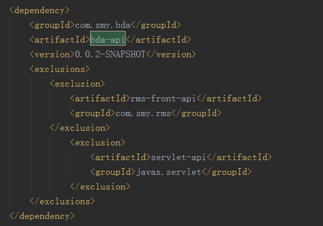

# Maven

## 1.maven概述

maven是项目构建工具，apache组织开源的基于POM(project object model)的项目，具有代码清除clean、编译compile、打包package、测试test、部署deploy等功能。

## 2.maven优势

- 可以摆脱IDE规范		maven规范
- 可以用命令行快速构建项目
- 自动管理依赖
- 节省磁盘空间
- 支持远程部署

## 3.maven的一些小点

### 3.1 maven约定规范

src/main/java

src/main/resources

src/main/webapp

src/test/java

src/test/resources

### 3.2 maven手动导入非开源的jar

mvn install:install-file -DgroupId=com.baizhi -DartifactId=ojbdc -Dversion=1.0.0 -Dpackaging=jar -
Dfile=F:\144中期项目\lib\ojdbc6.jar

### 3.3 maven删除不完整jar的脚本

```bat
@echo  off
rem create by sunhao(sunhao.java@gmail.com)
rem crazy coder
--以下修改为本地仓库地址
set REPOSITORY_PATH=F:\project\MavenRepository
rem ÕýÔÚËÑË÷...
for /f "delims=" %%i in ('dir /b /s "%REPOSITORY_PATH%\*lastUpdated*"') do (
    del /s /q %%i
)
rem ËÑË÷Íê±Ï
pause
```

### 3.4 maven的scope属性

test 只在src/test下能使用，不随项目发布而发布

compile 默认，跟随项目发布而发布

runtime 运行时可以使用，但是不随项目发布而发布

provided 由JDK或者容器提供

system 打包的时候不会打包进去。被依赖项不从maven仓库拿，而是从本地文件系统中获取。需要添加systemPath的属性来定义路径

### 3.5 maven解决依赖版本冲突的问题

​	a引用了b依赖，a用的必须是servlet-api3.0，但是b用的是servlet-api2.0，怎么解决这个问题？

解决方法：通过exclusion标签，这个标签表示排除b项目中的servlet-api2.0引入，如下图



上图表示bda-api项目中的rms-front-api和servlet-api不引入，使用本地应用的此两种版本依赖

##### 生成maven依赖树

```shell
mvn dependency:tree --> tree.txt  
```

生成图形化依赖树参考：https://www.cnblogs.com/yanghuahui/p/4632460.html

### 3.6 dependencies与dependencyManagement

- **dependencies**即使在子项目中不写该依赖项，子项目仍然会从父项目中继承该依赖项（全部继承）；

- **dependencyManagement**里只是声明依赖，并不实现引入，因此子项目需要显示的声明需要用的依赖。如果不在子项目中声明依赖，是不会从父项目中继承下来的；只有在子项目中写了该依赖项，**并且没有指定具体版本**，才会从父项目中继承该项，并且**version和scope**都读取自父pom;另外如果子项目中指定了版本号，那么会使用子项目中指定的jar版本。