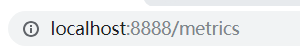

# spring boot #

#### spring boot拦截器的使用 ####

​	spring boot拦截器的使用和spring拦截器的步骤是一样的，都是先自定义一个拦截器，然后配置应用拦截器，不过spring boot是精简配置文件的，所以配置拦截器就需要自定义一个配置类。

##### 1.自定义拦截器类 #####

​	自定义拦截器类需实现HandlerInterceptor接口，然后实现其中的preHandle方法，返回值为true为通过。

添加注解@Component是为了让工厂管理自定义拦截器类


##### 2.配置拦截器使用路径 #####

​	2.1 首先需要自定义一个配置类，这个类需继承WebMvcConfigurerAdapter，添加注解@SpringBootConfiguration表明此类为配置类，覆盖addInterceptors方法，在里面添加拦截器类，以及拦截范围


​	2.2 也可以直接在启动类里配置拦截器类，与上述实现步骤相同

​		此种方法添加的注解为@SpringBootApplication，此注解为一个复合组合注解，包含以下三个注解

```java
@ComponentScan
/*这个注解是扫描本包及其子包下想让容器管理的类，即添加注解@Component，@Repository，@Service，@Controller的类，对应以前xml配置文件中的<context:component-scan>*/
@EnableAutoConfiguration
/*该注解的作用为启动自动的配置，就是根据jar包配置项目所需要的默认配置，如根据spring-boot-starter-web，会自动配置web项目所需的默认配置*/
@SpringBootConfiguration
/*该注解继承自@Configuration，功能也是相似的，即标注此类为配置类，且若此类中有添加@Bean的方法，则把返回值作为实例纳入到容器中管理，该实例名字为方法名*/
```


#### 模拟HTTP请求进行controller接口的单元测试

1.需要导入test测试依赖

```xml
<dependency>
	<groupId>org.springframework.boot</groupId>
	<artifactId>spring-boot-starter-test</artifactId>
	<scope>test</scope>
</dependency>
```

2.测试代码

```java
import com.dreamheng.AppRun;
import org.junit.Assert;
import org.junit.Before;
import org.junit.Test;
import org.junit.runner.RunWith;
import org.springframework.beans.factory.annotation.Autowired;
import org.springframework.boot.test.context.SpringBootTest;
import org.springframework.http.MediaType;
import org.springframework.test.context.junit4.SpringRunner;
import org.springframework.test.context.web.WebAppConfiguration;
import org.springframework.test.web.servlet.MockMvc;
import org.springframework.test.web.servlet.MvcResult;
import org.springframework.test.web.servlet.request.MockMvcRequestBuilders;
import org.springframework.test.web.servlet.result.MockMvcResultHandlers;
import org.springframework.test.web.servlet.setup.MockMvcBuilders;
import org.springframework.web.context.WebApplicationContext;

@RunWith(SpringRunner.class)
@SpringBootTest(classes = AppRun.class) //设置启动类名
@WebAppConfiguration
public class AdminTest {

    @Autowired
    private WebApplicationContext webApplicationContext;
    private MockMvc mockMvc;

    @Before
    public void setUp() throws Exception{
        //指定WebApplicationContext，将会从该上下文获取相应的控制器并得到相应的MockMvc
        mockMvc = MockMvcBuilders.webAppContextSetup(webApplicationContext).build();
    }
    @Test
    public void test() throws Exception{
        /**
         * 1、mockMvc.perform执行一个请求。
         * 2、MockMvcRequestBuilders.get("XXX")构造一个请求。
         * 3、ResultActions.param添加请求传值
         * 4、ResultActions.accept(MediaType.TEXT_HTML_VALUE))设置返回类型
         * 5、ResultActions.andExpect添加执行完成后的断言。
         * 6、ResultActions.andDo添加一个结果处理器，表示要对结果做点什么事情
         *   比如此处使用MockMvcResultHandlers.print()输出整个响应结果信息。
         * 7、ResultActions.andReturn表示执行完成后返回相应的结果。
         */

        MvcResult mvcResult= mockMvc.perform(MockMvcRequestBuilders.get("/test")
                .param("a","test")
                .accept(MediaType.TEXT_HTML_VALUE))
                //等同于Assert.assertEquals(200,status);
                // .andExpect(MockMvcResultMatchers.status().isOk())
                //等同于 Assert.assertEquals("success",content);
                // .andExpect(MockMvcResultMatchers.content().string("success"))
                .andDo(MockMvcResultHandlers.print())
                .andReturn();
        int status=mvcResult.getResponse().getStatus();                 //得到返回代码
        String content=mvcResult.getResponse().getContentAsString();    //得到返回结果

        Assert.assertEquals(200,status);                    //断言，判断返回代码是否正确
        Assert.assertEquals("success",content);            //断言，判断返回的值是否正确
    }

}

```

3.控制台打印结果

```cons
MockHttpServletRequest:
      HTTP Method = GET
      Request URI = /test
       Parameters = {a=[test]}
          Headers = {Accept=[text/html]}

Handler:
             Type = com.dreamheng.controller.TestController
           Method = public java.lang.String com.dreamheng.controller.TestController.test(java.lang.String,java.util.Map)

Async:
    Async started = false
     Async result = null

Resolved Exception:
             Type = null

ModelAndView:
        View name = null
             View = null
            Model = null

FlashMap:
       Attributes = null

MockHttpServletResponse:
           Status = 200
    Error message = null
          Headers = {Content-Type=[text/html;charset=UTF-8], Content-Length=[7]}
     Content type = text/html;charset=UTF-8
             Body = success
    Forwarded URL = null
   Redirected URL = null
          Cookies = []
```

#### 通过命令行修改属性值

```cmd
--等价于在配置文件中添加server.port=8888
java -jar xxx.jar--server.port=8888
```

#### spring boot多环境配置

application-dev.properties：开发环境

application-test.properties：测试环境

application-prod.properties：生产环境

在application.properties中通过spring.profiles.active属性来设置加载哪个配置文件，如spring.profiles.active=dev会加载开发环境的配置文件，在执行时可以在java -jar xxx.jar后加上spring.profiles.active属性来选择加载的配置文件。

##### 多环境的配置思路：

- 在application.properties配置通用配置，里面spring.profiles.active属性设置为dev，默认加载开发环境配置文件；
- 在application-{profile}.properties中配置各个环境不同的内容；
- 启动时通过命令行加上参数选择不同的配置文件

#### spring boot监控端点

1.添加依赖

```xml
<dependency>
	<groupId>org.springframework.boot</groupId>
	<artifactId>spring-boot-starter-actuator</artifactId>
</dependency>
```

2.访问端点




#### 获取配置文件的中文值乱码问题

默认application.properties不是UTF-8，但是在通过@Value值时默认是UTF-8格式，所以会出现乱码，

最简单解决方案，使用`@PropertySource(value = "classpath:my.yml", encoding = "UTF-8")`显式声明配置文件的字符集

[参考文档](https://blog.csdn.net/formemorywithyou/article/details/96473169?utm_medium=distribute.pc_relevant.none-task-blog-BlogCommendFromMachineLearnPai2-1.nonecase&depth_1-utm_source=distribute.pc_relevant.none-task-blog-BlogCommendFromMachineLearnPai2-1.nonecase)