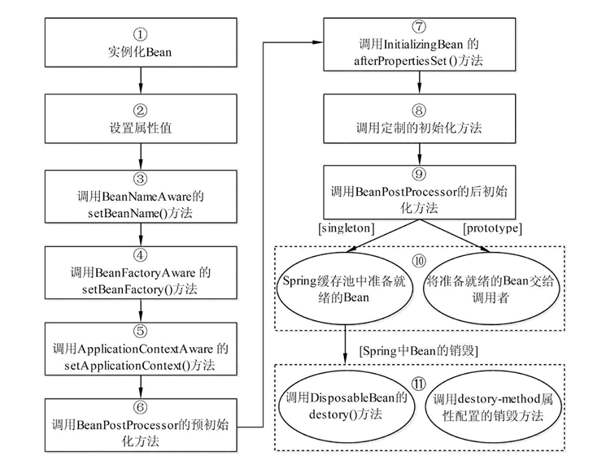

# Spring

## 一.基本概念

​	Spring是一个轻量级框架。在Spring框架中，有两个核心的机制，是IOC和AOP。

### 1.IOC

​	IOC(**Inversion of Control**)，**控制反转**，是一种设计思想，通俗讲就是控制权的反转，在spring里面，指的是java对象的生命周期（创建、销毁等）控制权的反转。

​	在以往的java设计中，一个对象A引用了外部资源对象B，那么则由A在对象内部new一个B对象，B对象的整个生命周期的控制权是在A的手中，现在，IOC的概念就是A对象不再new一个B，而是交由Sping工厂容器创建，并控制B的整个生命周期，A不关心B何时创建、如何创建，只负责使用Spring工厂容器提供的B就ok了，这也是实现了A与B的解耦合，这就是Sping里面的IOC实现。

​	DI(**Dependency Injection**)，**依赖注入**，其实DI可以当做IOC的另一种角度的阐述，IOC是思想，DI则是IOC在Spring里面的具体实现。接上段描述，DI指的是被注入对象A依赖Spring工厂容器注入依赖资源B，也是提供了资源的重复利用，在java中可以理解为代码复用。DI在java的底层实现是反射。

​	Spring里面的注入方式其实就两种，一种是构造注入，一种是属性注入。构造注入是使用对象的有参构造方法创建对象，属性注入是使用对象的无参构造方法创建对象，然后使用setter方法进行属性注入。

自动装配和接口注入详情阐述（TODO）

### 2.AOP

​	AOP(**Aspect Oriented Programming**)，**面向切面编程**，是一种编程思想，是对OOP的一种补充，宗旨是面向横面编程，即利用“横切”技术，剖开封装好的对象，将额外的功能代码织入到这个对象中。

​	AOP在功能实现上将代码分为两种，一种是业务功能，一种是增强功能，业务功能是代码核心，负责程序业务的实现，增强功能则是对业务的补充实现的额外功能，这些增强功能的主要特点就是可重用性高。在程序中，单独书写业务功能和增强功能，然后在程序运行期间，利用动态代理技术，动态的将增强功能添加到业务功能中。

​	AOP的目的是为了将于业务无关的、可重用性高的代码封装起来，减少系统的重复性代码，实现高维护和高拓展。

​	AOP中有几个重要的概念：

- **Aspect(切面)**，指增强功能的具体实现；

- **JointPoint(连接点)**，需要增强功能的代码所在的点；

- **Advice(通知)**，实现功能增强的时机，如前置、环绕等；

- **Pointcut(切入点)**，对连接点进行拦截的定义。

​	AOP的实现流程：首先书写一个增强类，实现增强功能，在这个增强功能上定义通知类型，切入点，然后在需要增强功能的具体点定义连接点。在程序运行过程中，会利用动态代理技术生成一个动态代理类，该类在业务功能代码的基础上将切面根据通知方式织入到连接点，调业务功能类实际就是调这个动态代理类。

​	实现的场景如日志记录、事务控制、权限控制、性能记录等。

#### 2.1.Spring生成动态代理的原理

​	Spring中生成动态代理的方式有两种，一种是**JDK动态代理**，由java SDK提供，基于接口，本质上是获取被代理实例对象实现的接口，自动生成一个类proxyClass实现该接口，调用被代理对象实际是先调用的该代理对象proxyClass，执行其中的invoke方法，然后根据通知规则相应的真正调用被代理对象的实现方法；一种是**CGLIB动态代理**，由第三方库cglib提供，基于ASM框架，修改class的字节码文件，生成一个该类的子类。Spring根据接口数量判断使用哪种方式生成代理类，有接口使用JDK动态代理，没有则使用CGlib，也可强制使用CGlib，需配置。

#### 2.2.AOP实现分析

​	AOP的设计：

1. 每个 Bean 都会被 JDK 或者 Cglib 代理。取决于是否有接口。
2. 每个 Bean 会有多个“方法拦截器”。注意：拦截器分为两层，外层由 Spring 内核控制流程，内层拦截器是用户设置，也就是 AOP。
3. 当代理方法被调用时，先经过外层拦截器，外层拦截器根据方法的各种信息判断该方法应该执行哪些“内层拦截器”。内层拦截器的设计就是职责连的设计。

​	AOP的实现主要分为两个步骤，一个是代理的创建，一个是代理的调用。

1. 代理的创建：
   1. 首先，创建代理工厂，需要三个重要的信息：拦截器数组，目标对象接口数组，目标对象；
   2. 创建代理工厂时，默认会在拦截器数组末尾增加一个默认拦截器--该拦截器是用来实现调用目标方法的；
   3. 当调用getProxy方法时，会根据接口接口数量大于0条件返回一个代理对象（JDK or CGlib）；
   4. 注意：创建对象时，会默认创建一个外层拦截器，即Spring内核的拦截器，用来控制整个AOP流程。
2. 代理的调用：
   1. 调用目标对象时，触发外层拦截器；
   2. 外层拦截器根据配置信息，创建内层拦截链；
   3. 拦截链执行到末尾时，会执行添加的默认拦截器，调用目标方法。

#### 2.3.AOP的典型实现--Spring事务控制

##### 1.Spring事务的实现原理

​	Spring实现事务就是利用Spring的AOP思想。在方法执行前开启事务，执行完毕后关闭事务，并根据设置的事务传播机制整体控制事务回滚方式。

##### 2.事务传播机制

- **REQUIRED**（默认）  使用当前的事务，如果没有事务，则新建一个事务，子方法必须运行在一个事务中；
  ​		  如果当前存在事务，则加入这个事务，成为一个整体。
  ​		  ex：领导没饭吃，我有钱，我买了自己吃；领导有饭吃，分给我一块吃。

- **SUPPORTS**  如果当前有事务，则使用事务；没有事务，则不使用事务。

  ​			 ex：领导有饭吃，分我一块吃；领导没饭吃，一块没饭吃。

- MANDATORY  该传播属性强制要求必须有一个事务，若没有则抛出异常。

  ​			    ex：领导必须管饭，若没饭，我就造反（抛出异常）。

- REQUIRES_NEW  如果当前有事务，则挂起事务，新建一个事务；
  ​		                 若没事务，则同REQUIRED；
    			           ex：领导有饭吃，我偏不吃，自己买着吃。

- NOT_SUPPORTED  如果有事务，则挂起事务，自己不使用事务去操作数据库。
  ​	   ex：领导有饭吃，我偏不吃，偏饿着。

- NEVER  如果当前有事务，则抛出异常。
  ​	   ex：领导有饭给你吃，我不吃，还要造反（抛出异常）。

- **NESTED**  如果有事务，则开启一个子事务（嵌套事务）。子事务独立提交或独立回滚。
  如果没事务，则同REQUIRED。
   		如果主事务提交，则带上子事务一块提交。
   		如果主事务回滚，则带着子事务一块回滚。
   		如果子事务回滚，主事务可以选择回滚或者不回滚。
   		ex：领导决策不对，老板怪罪，领导带着小弟一块受罚；小弟犯错，老板怪罪，领导可以选择推卸责任或者一块受罚。

SpringBoot自动装配中默认开启了事务管理（@EnableTransactionManagement），以aop形式插入动态代理配置中。

### 3.Spring中用到的设计模式（TODO待完善）

​	单例模式，工厂模式，动态代理

Spring创建bean默认就是单例的。

Spring的ioc的实现实际就是将Spring容器当作一个大工厂，把所有单例bean的管理都交给工厂来干。

Spring的AOP模式就是通过实现被代理的动态代理。

## 二.实际运用

## 三.深层探究

## 四.面试题目

### 1.Spring的bean是线程安全的嘛？

​	Spring的bean不是线程安全的。在默认情况下，创建出来的bean都是单例的，就是说多个请求进来使用的bean是同一个，Spring工厂只创建一个bean实例，但是Spring在使用bean的过程中，不使用线程不安全的实例变量，将请求的参数设置成方法参数的形式，使得本身线程不安全的bean却有了线程安全的目的。

### 2.Spring的bean的循环依赖问题？

​	这个问题实际上就是two nums问题，就是在一个数组中找出指定和的两个数的索引，解决思路就是一次遍历数组+HashMap：遍历这个数组，从索引0开始，计算指定和减去当前索引处的数的结果，判断这个结果是否在Map中存在，若不存在，则将索引0当value，key为数值存入map，继续下一次循环；若存在，则索引为map的value，以及当前遍历的索引。

​	Spring中解决该问题即是通过一个CacheMap，循环遍历待创建的bean数组，先判断Map中是否已存在此bean，存在则返回，不存在则通过无参构造创建实例化对象，然后放入map，再接着循环赋属性，如果碰到有对象属性，则从map中取，若没有，则进入创建过程，如此循环。

### 3.Spring的bean的生命周期

​	Spring容器对于配置了prototype作用域的bean只创建，之后就不再管，对于其他类型的bean从创建到销毁都负责。此类bean生命周期如下：

1）根据配置情况调用 Bean 构造方法或工厂方法实例化 Bean。

2）利用依赖注入完成 Bean 中所有属性值的配置注入。

3）如果 Bean 实现了 BeanNameAware 接口，则 Spring 调用 Bean 的 setBeanName() 方法传入当前 Bean 的 id 值。

4）如果 Bean 实现了 BeanFactoryAware 接口，则 Spring 调用 setBeanFactory() 方法传入当前工厂实例的引用。

5）如果 Bean 实现了 ApplicationContextAware 接口，则 Spring 调用 setApplicationContext() 方法传入当前 ApplicationContext 实例的引用。

6）如果 BeanPostProcessor 和 Bean 关联，则 Spring 将调用该接口的预初始化方法 postProcessBeforeInitialzation() 对 Bean 进行加工操作，此处非常重要，Spring 的 AOP 就是利用它实现的。

7）如果 Bean 实现了 InitializingBean 接口，则 Spring 将调用 afterPropertiesSet() 方法。

8）如果在配置文件中通过 init-method 属性指定了初始化方法，则调用该初始化方法。

9）如果 BeanPostProcessor 和 Bean 关联，则 Spring 将调用该接口的初始化方法 postProcessAfterInitialization()。此时，Bean 已经可以被应用系统使用了。

10）如果在 <bean> 中指定了该 Bean 的作用范围为 scope="singleton"，则将该 Bean 放入 Spring IoC 的缓存池中，将触发 Spring 对该 Bean 的生命周期管理；如果在 <bean> 中指定了该 Bean 的作用范围为 scope="prototype"，则将该 Bean 交给调用者，调用者管理该 Bean 的生命周期，Spring 不再管理该 Bean。

11）如果 Bean 实现了 DisposableBean 接口，则 Spring 会调用 destory() 方法将 Spring 中的 Bean 销毁；如果在配置文件中通过 destory-method 属性指定了 Bean 的销毁方法，则 Spring 将调用该方法对 Bean 进行销毁。

### 4.SpringMVC的运行流程

1. 请求进入web.xml，符合SpringMVC前端控制器的规则进入SpringMVC框架；
2. 根据uri判断要进入的controller，以及该类下的方法；
3. 执行完毕返回字符串；
4. 根据返回字符串+视图解析器的方式得到真实地址，请求转发（前后端分离情况下返回前端json字符串）。

