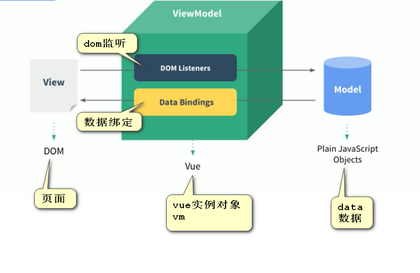

# Vue

## 1.Vue核心

### 1.1 Vue简介

- 渐进式JavaScript框架（逐渐添加）
- 尤玉溪
- 作用：动态构建用户界面

### 1.2 Vue特点

- 遵循MVVM模式（model-view-vm）
- 编码简洁，体积小，运行效率高，适合移动/PC开发
- 本身只关注UI，可轻松引入vue插件或其它第三库开发项目

### 1.3 Hello World

#### ①vue基本开发流程

1. 引入vue.js

2. 创建vue对象

   el：指定根element（选择器）

   data：初始化数据（页面可以访问）

   method：方法

3. 双向数据绑定：v-model

4. 显示数据：{{xxx}}

#### ②示例

```html
<!DOCTYPE html>
<html lang="en">
<head>
    <meta charset="UTF-8">
    <title>hello vue</title>
    <script src="../js/vue.js" type="text/javascript"></script>
</head>
<body>
    <div id="app"><!--view-->
        <input type="text" v-model="message">
        <p>hello  {{message}}</p>
    </div>
    <script type="text/javascript">
        //创建vue实例
        var vm = new Vue({ //配置对象
            el:'#app', //element，选择器
            data:{ //数据（model）
                message:"vue"
            }
        })
    </script>
</body>
</html>
```



### 1.4.插值表达式

#### （1）花括号 

格式：{{表达式}}

说明：

- 该表达式支持JS语法，可以使用JS内置函数（必须有返回值）
- 表达式必须有返回结果
- 可以直接获取VUE实例中定义的数据和函数

#### （2）插值闪烁

直接使用花括号的形式在加载网速慢的时候会出现源码形式，如{{msg}}，称为插值闪烁，使用v-XX形式取值不会有这种情况。

### 1.5.指令

#### 1.5.1.v-html和v-text

​	v-text是将数据解释为数据文本，获取文本中的真正的html语法是用的v-html。

​	v-html可能会引起xss攻击，不要再用户可以更改的内容里使用。

#### 1.5.2.v-bind

​	给html标签的属性绑定值，可以简写，去掉v-bind，直接“:href”

```vue
<a v-bind:href="link">百度</a><br />
<span v-bind:style="{color: fontColor, size: fontSize}">字体</span>

//v-bind:class="{变量名: 值, 变量名: 值}"
//v-bind:style="{变量名: 值, 变量名: 值}"
//link、fontColor、fontSize都为data中的值
```

#### 1.5.3.v-model

​	双向绑定，model值改变，页面值改变，反之亦然，比如表单使用

```vue
表单数据<br />
<input type="checkbox" v-model="language" value="java">java</input><br />
<input type="checkbox" v-model="language" value="go">go</input><br />
<input type="checkbox" v-model="language" value="vue">vue</input><br />
选中了{{language.join(",")}}

data.language: []
```

#### 1.5.4.v-on

​	用来绑定事件，事件后指定vue对象中定义的回调函数，简写`@click="num++"`，等同于`v-on=click:"num++"`

##### (1)事件修饰符

添加事件，使用形式为：`@click.stop="num++"`，支持流式调用

- ".stop"，阻止事件冒泡到父元素
- ".prevent"，阻止默认事件发生，如在a标签中写即表示不跳转
- ".capture"，使用事件捕获模式
- ".self"，只有元素自身触发事件才执行（冒泡或捕获的都不执行）
- ".once"，只执行一次

##### (2)按键修饰符

触发按键或者鼠标点击后执行，`@keyup.up="num++"`，`@click.ctrl="num++"`

#### 1.5.5.v-for

​	循环展示，使用形式为：item为每个元素，index为索引，可不写索引，只写元素，`:key="index"`代表以拿列为索引（此索引类似于数据库索引，加快速度）；若item为一个对象，在内部再次使用`v-for`，k为key，v为value，i为索引

```vue
		<li v-for="(item,index) in language" :key="index">
			{{item}}{{index}}
			<span v-for="(k,v,i) in item"></span>
		</li>
```

#### 1.5.6.v-if和v-show

​	v-if和v-show都为判断boolean值确实是否执行，区别在于v-if是false时直接注释掉，v-show是利用标签display实现，v-if还可以跟v-else-if和v-else一起使用

```vue
<h1 v-if="true">展示</h1>
<h1 v-show="false">不展示</h1>
```

```vue
<h1 v-if="num>=1">展示1</h1>
<h1 v-else-if="num>=0.5">展示2</h1>
<h1 v-else="num>=0.2">展示3</h1>
```

### 1.6.计算属性

​	插值表达式里面的表达式是非常便利的，但是设计初衷只是用来简单计算的，涉及到复杂计算逻辑的时候应该使用**计算属性**。

​	计算属性在结构上是与data、method同级的，参考如下：

```vue
data:{
	message: "test"
},
computed:{
	reversedMessage: function(){
		return this.message + "aa";
	}
}

//调用
{{testComputed}}
```

#### 1.6.1.计算属性和方法的区别

​	将一个函数定义为一个计算属性或者一个方法，他们最终的结果是一样的。

​	区别在于：**计算属性是基于它们的响应式依赖进行缓存的**，只在相关响应式依赖发生改变时它们才会重新求值。这就意味着只要 `message` 还没有发生改变，多次访问 `reversedMessage` 计算属性会立即返回之前的计算结果，而不必再次执行函数。相比之下，每当触发重新渲染时，调用方法将**总会**再次执行函数。

### 1.7.侦听器

​	侦听器就是给data数据添加侦听属性，与data、computed同级，可以监听一个数值的变化进而执行某个函数，通常用于执行异步操作的时候设置中间态。

```vue
data:{
	message: "test"
},
watch:{
	//参数为（执行后的值，执行前的值）
	message: function(newVal, oldVal){
		return "newVal" + newVal + ";oldVal" + oldVal;
	}
}
```

### 1.8.过滤器

​	Vue.js 允许你自定义过滤器，可被用于一些常见的文本格式化。过滤器可以用在两个地方：**双花括号插值和 `v-bind` 表达式** (后者从 2.1.0+ 开始支持)。过滤器应该被添加在 JavaScript 表达式的尾部，由“管道”符号指示：

```vue
<!-- 在双花括号中 -->
{{ message | capitalize }}

<!-- 在 `v-bind` 中 -->
<div v-bind:id="rawId | formatId"></div>
```

可以在一个组件的选项中定义本地的过滤器（与data、method同级）：

```vue
filters: {
  capitalize: function (value) {
    if (!value) return ''
    value = value.toString()
    return value.charAt(0).toUpperCase() + value.slice(1)
  }
}
```

或者在创建 Vue 实例之前全局定义过滤器：

```javascript
Vue.filter('capitalize', function (value) {
  if (!value) return ''
  value = value.toString()
  return value.charAt(0).toUpperCase() + value.slice(1)
})

new Vue({
  // ...
})
```

### 1.9.组件化

​	组件是可复用的 Vue 实例，且带有一个名字。因为组件是可复用的 Vue 实例，所以它们与 `new Vue` 接收相同的选项，例如 `data`、`computed`、`watch`、`methods` 以及生命周期钩子等。仅有的例外是像 `el` 这样根实例特有的选项。

​	可以将组件进行任意次数的复用，每用一次组件，就会有一个它的新**实例**被创建。**组件的 `data` 选项必须是一个函数**，因此每个实例可以维护一份被返回对象的独立的拷贝。

​	为了能在模板中使用，这些组件必须先注册以便 Vue 能够识别。这里有两种组件的注册类型：**全局注册**和**局部注册**。

#### 1.9.1.全局注册

```vue
//Vue.component
// 定义一个名为 button-counter 的新组件
Vue.component('button-counter', {
  data: function () {
    return {
      count: 0
    }
  },
  template: '<button v-on:click="count++">You clicked me {{ count }} times.</button>'
})

//使用方式：
<button-counter></button-counter>
```

#### 1.9.2.局部注册

```vue
var testTemplates = {
	data: function () {
    	return {
     		count: 0
   	 	}
  	},
  	template: '<button v-on:click="count++">You clicked me {{ count }} times.</button>'
};
new Vue{
	el: "#app",
	components: {
		testss : testTemplates
	}
}

//使用
<testss></testss>
```

### 1.10.生命周期和钩子函数

​	每个 Vue 实例在被创建时都要经过一系列的初始化过程——例如，需要设置数据监听、编译模板、将实例挂载到 DOM 并在数据变化时更新 DOM 等。同时在这个过程中也会运行一些叫做**生命周期钩子**的函数，我们可以在不同阶段添加自己的代码。（钩子函数与data、method同级）


## 2.VUE模块化开发

```shell
//全局安装webpack
npm install webpack -g

//全局安装vue脚手架
npm install -g @vue/cli-init

//初始化vue项目，项目名为appname
vue init webpack appname

//启动vue项目，项目中package.json中有scripts，代表我们能运行的命令
npm start
//or
npm run dev


//使用Element Ui
npm i element-ui

//引入Element Ui（完整引入）
//在 main.js 中写入以下内容：
import ElementUI from 'element-ui'
import 'element-ui/lib/theme-chalk/index.css'

Vue.use(ElementUI)

```

