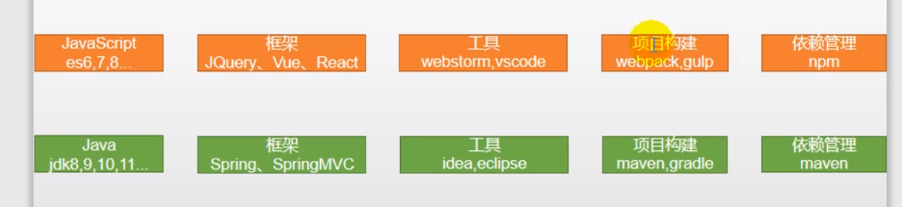

# 前后端技术栈对比



# 一.ES6

​	ES（ECMAScript）是JavaScript语言的下一代标准，ES6在2015年6月发布，以后基本每年一个版本，2016年（ES7）、2017年（ES8）。

​	**ECMAScript是浏览器脚本语言的规范，js是规范的具体实现。**

### 1.ES6的一些新特性

#### 1.1.let声明变量

​	var声明的变量会越域，let声明的变量有严格的作用域；

​	var可以声明多次，let只能声明一次；

​	var定义的可以变量提升（在var定义前使用变量变量为undefined），let定义不会，在let定义前使用会报错。

#### 1.2.const声明常量（只读变量）

- 声明之后不允许改变；
- 一旦声明必须初始化，否则报错。

#### 1.3.解构表达式

1. ##### 数组解构：

```javascript
const arr = [1,2,3];
let [a,b,c] = arr;
//上面那行等同于下方
let a = arr[0];
let b = arr[1];
let c = arr[2];
console.log(a,b,c);
```

2. ###### 对象解构：

```javascript
const person = {
            name:"小明",
            age:18,
            language:"java"
};
const {name,age,language} = person;
console.log(name,age,language);
//或者
const {name:nn,age,language} = person;
console.log(nn,age,language);
```

#### 1.4.字符串扩展

##### 1.4.1.新的api

```javascript
let str = "hello.vue";
//是否以XX开头
console.log(str.startsWith("hello"));//true
//是否以XX结尾
console.log(str.endsWith(".vue"));//true
//是否包含XX
console.log(str.includes(".v"));//true
```

##### 1.4.2.字符串模板

```javascript
let str = `<head>
    <meta charset="UTF-8">
    <title>Title</title>
</head>`;//反引号
console.log(str);
//输出为以下
<head>
    <meta charset="UTF-8">
    <title>Title</title>
</head>
```

字符串插入变量、表达式和函数（反引号）

```javascript
let name = "小明";
let age = 18;
function fun(){
    return "我是一个函数";
}
console.log(`我是${name}，今年${age + 10}岁，我想说：${fun()}`);
```

#### 1.5.函数优化

##### 1.5.1.给函数的参数设置默认值

```javascript
//以前
function last(a, b) {
   b = b || 1; //b没传值就为1
   return a + b;
}
console.log(last(10,));//11

//现在
function now(a, b = 1) {
   return a + b;
}
console.log(now(10,));//11
```

##### 1.5.2.不定数量参数

```javascript
function fun(...value) {
   console.log(value.length);
}
fun(1,2);//2
fun(10);//1
```

##### 1.5.3.箭头函数

```javascript
//过去
var print = function (obj) {
    console.log(obj);
}
print("hello");//hello
//现在
var printNew = obj => console.log(obj);
printNew("hello");//hello
//多个参数一行方法
var sum = (a, b) => a + b;
console.log(sum(1, 2));//3
//多个参数多行方法
var sum2 = (a, b, c) => {
	a = a + b;
	return a + c;
}
console.log(sum2(1, 2, 3));//6
```

箭头函数+解构

```javascript
const person = {
	name : "小明",
	age : 18
};
var hello = ({name}) => console.log("hello," + name);
hello(person);//hello,小明

//或者
const person = {
	name : "小明",
	age : 18
};
var hello = ({name}) => console.log(`hello,${name}`);
hello(person);//hello,小明
```

#### 1.6.对象优化

##### 1.6.1.新增的API

```javascript
//Object的新方法
const person = {
	name : "小明",
    age : 18,
    insteresting : ["reading", "running"]
};
console.log(Object.keys(person));//["name", "age", "insteresting"]
console.log(Object.values(person));//["小明", 18, ["reading", "running"]]
//获取到的为数组，不是对象
console.log(Object.entries(person));//[["name", "小明"], ["age", 18], ["insteresting", ["reading", "running"]]]

//将源对象（source1，source2）的数据复制到目标对象（target）中，
const target = {a : 1};
const source1 = {b : 2};
const source2 = {c : 3};
Object.assign(target, source1, source2);
console.log(target);//{a: 1, b: 2, c: 3}
```

##### 1.6.2.声明对象简写

```javascript
const name = "jack";
const age = 18;
//当对象的key与上面定义的value值变量名字一致时，可以省略key，直接写value变量名
const person = {name, age};
console.log(person);//{name: "jack", age: 18}
```

##### 1.6.3.对象函数属性简写

```javascript
//箭头函数简写对象函数属性
const person = {
	name : "ming",
	play : function (game) {
		console.log(this.name + " play " + game);
	},
    //以下两种为新增
    //箭头函数获取对象的属性不能用this，要用对象名
    play1 : (game) => {
    	console.log(person.name + " play " + game);
    },
    play2(game){
		console.log(this.name + " play " + game);
	}
};
person.play("lol");//ming play lol
person.play1("cf");//ming play cf
person.play2("csgo");//ming play csgo
```

##### 1.6.4.对象扩展运算符

```javascript
let name = {name : "jack"};
let age = {age : 128};
let person = {name : "ming", inster : "lol"};
//通过这种形式拷贝会将原对象的值完全顶掉，只有新拷贝的对象的属性
person = {...name, ...age};
console.log(person);//{name: "jack", age: 128}
```

#### 1.7.map和reduce

数组中新增了map和reduce方法

##### map()

```javascript
//参数为一个函数，将原数组中的所有元素经过这个函数处理后放入新数组
let arr = ["10", "11", "12"];
arr = arr.map(item => item * 2);
console.log(arr);// [20, 22, 24]
```

##### reduce()

```javascript
//将数组中的元素依次执行回调函数，不包括数组中被删除或从未被赋值的元素
//arr.reduce(callback, [initialValue])
//previousValue:上一次调用返回的值，或者是初始值，initialValue
//currentValue:数组中当前正在处理的元素
//index:当前元素在数组中的索引
//array:调用reduce的数组
let result = ["e", "s", "u", "l", "t"];
result = result.reduce((previousValue, currentValue, index, array) => {
	console.log("上一次处理后：" + previousValue);
	console.log("当前正在处理：" + currentValue);
	console.log("当前元素在数组中的索引：" + index);
	console.log("调用reduce的数组：" + array);
	return previousValue + currentValue;
},"r");
 console.log(result);//result
```

#### 1.8.Promise异步编排

​	Promise是用来传递异步消息的对象，它代表了某个未来才会知道结果的事件（通常是一个异步操作），并且这个事件提供统一的 API，可供进一步处理。

```javascript
let promise = new Promise((resolve, reject) => {
	if(1 == 1){
		resolve("value");
	}else {
		reject("error");
	}
});
promise.then(value => {
	console.log(value);
	console.log("success");
}).catch(error => {
	console.log(error);
	console.log("fail");
});
//value
//success
```

```javascript
let promise = new Promise((resolve, reject) => {
	if(1 == 2){
		resolve("value");
	}else {
		reject("error");
	}
});
promise.then(value => {
	console.log(value);
	console.log("success");
}).catch(error => {
	console.log(error);
	console.log("fail");
});
//error
//fail
```

#### 1.9.模块化

​	类似于java的导包，import

​	在前端中，首先在被导出js函数使用export导出变量、函数等，然后在目标js函数中使用import导入

```javascript
test.js
const aa = 'a1';
export aa

test1.js
import aa from './test.js' 
```

