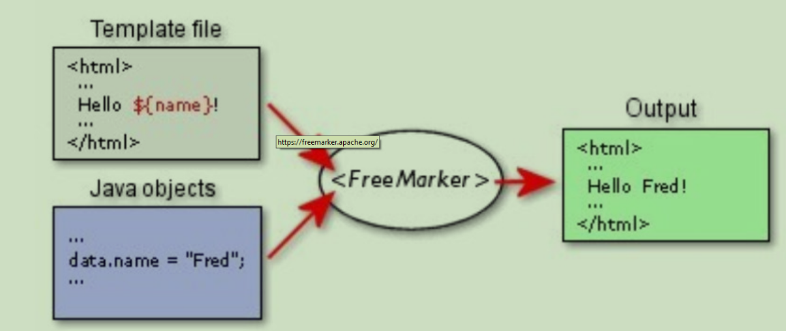
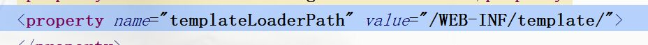

# FreeMarker

## 1.概述

FreeMarker(https://freemarker.apache.org/) 是一款模版引擎；

即一种基于模版和改变的数据并用来生成输出文件（HTML网页、电子邮件、配置文件、源代码）等通用工具。

它不是面向最终用户的，而是一个Java类库，是一款程序员可以嵌入他们所开发产品的组件。

模版编写为FTL（FreeMarker Template Language）。

设计思想：模版+ 数据---->文本输出



## 2.第一个FreeMarker程序

### 添加依赖

```xml
<dependency>
	<groupId>org.freemarker</groupId>
	<artifactId>freemarker</artifactId>
	<version>2.3.23</version>
</dependency>
```

### 创建模板index.ftl

```ftl
<html>
    <body>
        hello,${name}
    </body>
</html>
```

### 获取数据，利用模板生成静态文件

```java
package com.heng;

import freemarker.template.Configuration;
import freemarker.template.Template;
import freemarker.template.TemplateException;
import org.junit.Test;

import java.io.File;
import java.io.FileWriter;
import java.io.IOException;
import java.util.HashMap;
import java.util.Map;

public class AppTest {
    @Test
    public void testFtl() throws IOException, TemplateException {
        //设置freemarker版本
        Configuration conf = new Configuration(Configuration.VERSION_2_3_23);
        //设置模版目录
        conf.setDirectoryForTemplateLoading(
                new File("F:\\project\\bigdata\\testfastdfs\\src\\test\\resources")
        );
        conf.setDefaultEncoding("utf-8");
        Template template = conf.getTemplate("index.ftl");
        Map<String, Object> datas = new HashMap<>();
        datas.put("name", "梦梦");
        template.process(datas, new FileWriter("F:\\project\\bigdata\\testfastdfs\\src\\test\\resources\\index.html"));
    }
}

```

## 3.ftl语法

### 语法

- Interpolation 插值${ key名}
- FTL tags 标签<# 标签名></#标签名>
- Comments 注释<$--注释内容-->
- <@>:宏（略），自定义标签

### 具体示例

#### 取值

```ftl
# ------ 普通和对象类型 -------
<h1>您好：${user.name}</h1>
// 对象类型 数据封装
User user = new User();
user.setId(1);
user.setName("小红");
datas.put("user",user);

# ------ 数字类型 ------
# assign 用以声明当前模板临时变量
<#assign answer=42>
${answer?string} <#-- the same as ${answer} -->
${answer?string.number} <#--数字 -->
${answer?string.currency} <#--货币 -->
${answer?string.percent} <#--百分比 -->

# ------ 日期类型 ------
${date?date}
${date?time}
${date?datetime}
# 自定义日期格式
${date?string("yyyy年MM月dd日")}

# ------ 布尔值处理 ------
# 获取实际值 true | false
${b?c}

# 根据boolean值获取值
${b?string('yes', 'no')}

```

#### list|set|数组

```ftl
<#list 集合名 as 别名>
${别名}
</#list>
// 集合类型
ArrayList<String> list = new ArrayList<String>();
list.add("apple");
list.add("banana");
list.add("orange");
datas.put("fruit",list);
```

#### map

```ftl
<#list map?keys as city>
${city} ---> ${map[city]} <br>
</#list>
// map集合
//key必须是String
Map<String,Object> map = new HashMap<String,Object>();
map.put("beijing","北京");
map.put("天津","天津");
datas.put("map",map);
```

#### 分支语句

```ftl
<#if 条件>
// true内容
<#else>
// false内容
</#if>
```

#### 空值处理

```
${ (people.id.name)!"id或name为空"}
${(people.id)!"id为空"}
//若people的id属性为null则输出后面的
<#if (a)??>
//若a不存在则输出else后的
值存在
<#else>
不存在
</#if>
```

#### 导入ftl或者html页面

```ftl
<#include“TemplateFiles/example.ftl”>
# 如
<#include "test.html">

```

## 4.集成SpringMVC

### maven坐标

```xml
<dependency>
	<groupId>org.freemarker</groupId>
	<artifactId>freemarker</artifactId>
	<version>2.3.23</version>
</dependency>
```

### mvc配置文件

```xml
<?xml version="1.0" encoding="UTF-8"?>
<beans xmlns="http://www.springframework.org/schema/beans"
       xmlns:xsi="http://www.w3.org/2001/XMLSchema-instance"
       xmlns:context="http://www.springframework.org/schema/context"
       xmlns:mvc="http://www.springframework.org/schema/mvc"
       xsi:schemaLocation="http://www.springframework.org/schema/beans
http://www.springframework.org/schema/beans/spring-beans.xsd
http://www.springframework.org/schema/context
http://www.springframework.org/schema/context/spring-context.xsd
http://www.springframework.org/schema/mvc
http://www.springframework.org/schema/mvc/spring-mvc.xsd">
    <context:component-scan base-package="com.heng.controller">
    </context:component-scan>
    <mvc:annotation-driven/>
    <bean id="freeMarkerConfigurer"
          class="org.springframework.web.servlet.view.freemarker.FreeMarkerConfigurer">
        <property name="defaultEncoding" value="utf-8"></property>
        <property name="templateLoaderPath" value="/WEB-INF/template/">
        </property>
    </bean>
    <bean id="freeMarkerViewResolver"
          class="org.springframework.web.servlet.view.freemarker.FreeMarkerViewResolver">
        <property name="prefix" value="/"/>
        <property name="suffix" value=".ftl"/>
        <property name="contentType" value="text/html;charset=utf-8">
        </property>
    </bean>
</beans>

```


### 架构控制器

```java
package com.heng.controller;

import org.springframework.stereotype.Controller;
import org.springframework.web.bind.annotation.RequestMapping;
import org.springframework.web.servlet.ModelAndView;

/**
 * create by DreamHeng on 2019/2/28
 */
@Controller
@RequestMapping("testController")
public class TestController {

    @RequestMapping("f")
    public ModelAndView test(ModelAndView modelAndView){
        modelAndView.setViewName("test");
        modelAndView.addObject("a","梦");
        return modelAndView;
    }
}

```

### 模板代码

```ftl
<html>
<body>
<h2>Hello ${a}</h2>
</body>
</html>
```

模板放在mvc.xml配置的templateLoaderPath路径属性后边




## 5.集成SpringBoot

创建SpringBoot项目

### maven坐标

```xml
<!-- https://mvnrepository.com/artifact/org.springframework.boot/spring-boot-starter-freemarker -->
<dependency>
    <groupId>org.springframework.boot</groupId>
    <artifactId>spring-boot-starter-freemarker</artifactId>
    <version>2.1.3.RELEASE</version>
</dependency>

```

### 配置文件

application.properties

```properties
spring.freemarker.prefix=/
spring.freemarker.suffix=.ftl
spring.freemarker.template-loader-path=classpath:template/
spring.freemarker.check-template-location=true
```

### 构建模板

放在resources下的template下

### 构建控制器

和集成SpringMVC的一样


## 6.应用

视图展示、页面静态化、电子邮件、代码生成等