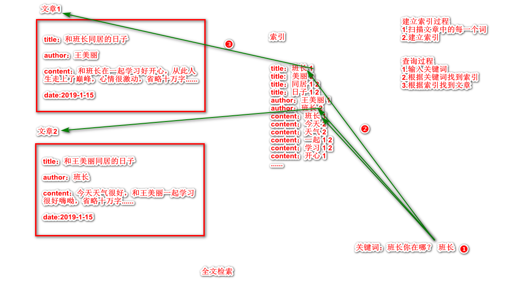
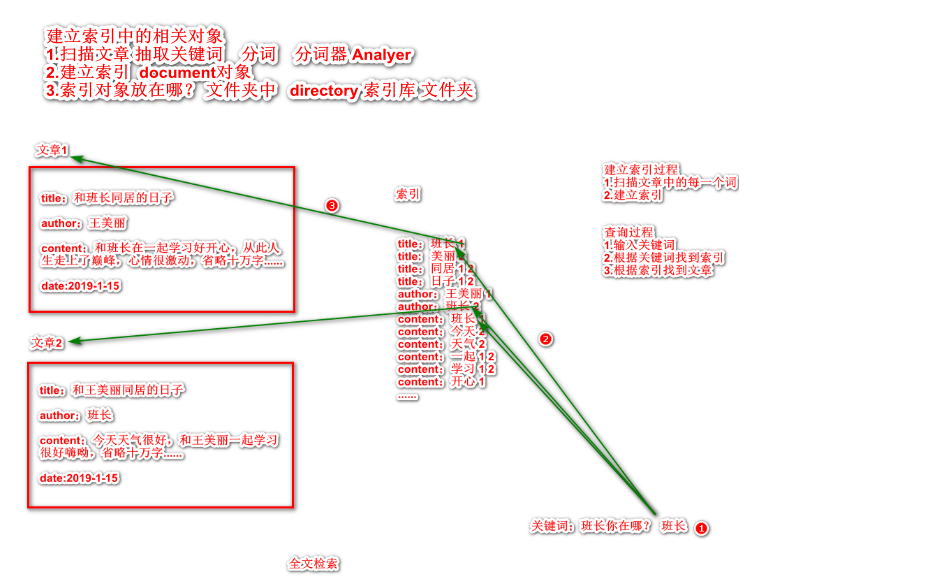

# Lucene #

### Lucene是什么？ ###

#### 简介 ####

Lucene是apache软件基金会的一个项目，开源的全文检索工具（搜索引擎）。

#### 什么是全文检索？ ####

全文检索是计算机程序通过扫描文章中的每一个词，对每一个词建立一个索引，指明该词在文章中出现的次数和位置。当用户查询时根据建立的索引查找，类似于通过字典的检索字表查字的过程。

**查字典**


**全文检索原理**




**注意**：

1. 只处理文本数据
2. 不处理语义，做的是匹配
3. 搜索时英文不区分大小写
4. 结果列表有相关度排序

##### 全文检索与数据库检索区别 #####

**数据库检索缺点**

1. 从用户角度看搜索结果不够精确全面；
2. 不能做相关度排序；
3. 模糊匹配速度慢（数据库的like是一页一页翻）。

**全面检索优点**

1. 全面准确；
2. 快速；
3. 可以做相关度排序。

##### Lucene的使用场景 #####

​	Lucene主要做的是站内搜索，即对一个系统内的资源进行搜索，如BBS、博客以及网上商城搜索等。

##### 为什么使用Lucene？ #####

​	原有的模糊搜索对用户来说搜索结果不够精准全面，且速度慢，也不能根据搜索出来的相关度进行排序，而对于全面检索来说，搜索结果全面准确、且快速，又可以做相关度排序。

# 此处Lucene优点待补充 #

### Lucene基本使用 ###

#### Lucene基本原理与关键对象 ####



#### 编码步骤 ####

**1.添加依赖**

```xml
<!--核心依赖-->
<dependency>
    <groupId>org.apache.lucene</groupId>
    <artifactId>lucene-core</artifactId>
    <version>4.4.0</version>
</dependency>
<!--分词器-->
<dependency>
    <groupId>org.apache.lucene</groupId>
    <artifactId>lucene-analyzers-common</artifactId>
    <version>4.4.0</version>
</dependency>
<!--智能分词器-->
<dependency>
    <groupId>org.apache.lucene</groupId>
    <artifactId>lucene-analyzers-smartcn</artifactId>
    <version>4.4.0</version>
</dependency>
<!--查询-->
<dependency>
    <groupId>org.apache.lucene</groupId>
    <artifactId>lucene-queryparser</artifactId>
    <version>4.4.0</version>
</dependency>
```

**2.创建索引步骤**

1. 确定索引库的位置
2. 创建文档对象（索引对象）  把被建立索引的文章数据包装成document对象
3. 创建分词器
4. 创建索引写出对象
5. 把文档对象（索引对象）给索引写出对象
6. 索引写出对象 把 文档对象（索引对象）写出到索引库中（提交）
7. 关闭资源

```java
  @Test
    public void testCreateIndex2() throws IOException {
//        1. 确定索引库的位置 FileSystem
        FSDirectory directory = FSDirectory.open(new File("E://lucentest"));
//        2. 创建文档对象（索引对象）  把被建立索引的文章数据包装成document对象
        Document document = new Document();
        //八种类型和String不会分词  TextField会分词
        document.add(new IntField("id",2, Field.Store.YES));
        document.add(new TextField("title","和王美丽同居的日子", Field.Store.YES));
        document.add(new StringField("author","班长", Field.Store.YES));
        document.add(new TextField("content","今天天气很好，和王美丽一起学习好嗨呦", Field.Store.YES));
//        3. 创建分词器
        StandardAnalyzer analyzer = new StandardAnalyzer(Version.LUCENE_44);
//        4. 创建索引写出对象
        IndexWriterConfig indexWriterConfig = new IndexWriterConfig(Version.LUCENE_44,analyzer);
        IndexWriter indexWriter = new IndexWriter(directory,indexWriterConfig);
//        5. 把文档对象（索引对象）给索引写出对象
        indexWriter.addDocument(document);
//        6. 索引写出对象 把 文档对象（索引对象）写出到索引库中（提交）
        indexWriter.commit();
//        7. 关闭资源
        indexWriter.close();
    }
```

**3.查询**

  ```java
   @Test
    public void testIndexSeacher() throws IOException {
//        1.创建一个关键词对象 单项检索 TermQuery 参数1 关键词对象
        Query query=new TermQuery(new Term("title","美"));
//        2.读取索引库中索引
        FSDirectory directory = FSDirectory.open(new File("E://lucentest"));
        DirectoryReader open = DirectoryReader.open(directory);
//        3.创建一个查询对象
        IndexSearcher indexSearcher = new IndexSearcher(open);
//        4.通过关键词查询 得到TopDocs对象
        TopDocs topDocs = indexSearcher.search(query, 2);
//        5.获取ScoreDoc对象 包含 doc对象的编号 和 分数
        ScoreDoc[] scoreDocs = topDocs.scoreDocs;
        for (int i = 0; i < scoreDocs.length; i++) {
            ScoreDoc scoreDoc = scoreDocs[i];
//            获取doc对象在索引库中的编号
            int doc = scoreDoc.doc;
//            通过编号得到doc对象
            Document document = indexSearcher.doc(doc);
//            获取对象中的值
            String id = document.get("id");
            String title = document.get("title");
            String author = document.get("author");
            String content = document.get("content");
            System.out.println(id+title+author+content);
        }
    }
  ```

**4.单项查询改为多项查询**

```java
    /**
     * 多列查询 换分词器
     * @throws IOException
     */
    @Test
    public void testIndexSeacher2() throws IOException, ParseException {
//        1.创建一个关键词对象
        StandardAnalyzer analyzer = new StandardAnalyzer(Version.LUCENE_44);
        String[] filds = {"title","content","author"};
        MultiFieldQueryParser queryParser = new MultiFieldQueryParser(Version.LUCENE_44,filds,analyzer);
        //把关键词放在query对象中
        Query query = queryParser.parse("王美丽");


//        2.读取索引库中索引
        FSDirectory directory = FSDirectory.open(new File("E://lucentest"));
        DirectoryReader open = DirectoryReader.open(directory);
//        3.创建一个查询对象
        IndexSearcher indexSearcher = new IndexSearcher(open);
//        4.通过关键词查询 得到TopDocs对象
        TopDocs topDocs = indexSearcher.search(query, 100);
//        5.获取ScoreDoc对象 包含 doc对象的编号 和 分数
        ScoreDoc[] scoreDocs = topDocs.scoreDocs;

        for (int i = 0; i < scoreDocs.length; i++) {
            ScoreDoc scoreDoc = scoreDocs[i];
//            获取doc对象在索引库中的编号
            int doc = scoreDoc.doc;
//            通过编号得到doc对象
            Document document = indexSearcher.doc(doc);
//            获取对象中的值
            String id = document.get("id");
            String title = document.get("title");
            String author = document.get("author");
            String content = document.get("content");
            System.out.println(id+title+"author"+author+"content"+content);
        }
    }
```

多列查询对象的创建 **注意：分词器必须和创建索引时候的分词器一样**  

```java
//        1.创建一个关键词对象

        StandardAnalyzer analyzer = new StandardAnalyzer(Version.LUCENE_44);
        
        String[] filds = {"title","content","author"};
        //参数1 版本  参数2 要查询的属性名 数组  参数3 分词器
        MultiFieldQueryParser queryParser = new MultiFieldQueryParser(Version.LUCENE_44,filds,analyzer);
        //把关键词放在query对象中
        Query query = queryParser.parse("王美丽");
```

**5.分词器**

1. 默认分词器  单个分词  王美丽 会被分成  王   美   丽
2. 智能中文分词器  按照常规中文的词语进行分词    王美丽 会被分成 王  美丽

```java
//        智能中文分词器
        SmartChineseAnalyzer smartChineseAnalyzer = new SmartChineseAnalyzer(Version.LUCENE_44);
```

**注意：**

1. **如果更换分词器  必须删掉索引库文件中的所有文件**
2. **如果查询的时候没有数据  查看索引库  索引库中有一个文件名以.lock结尾 或者 带有lock的  这时候把所有文件全部删除  重新创建索引**

