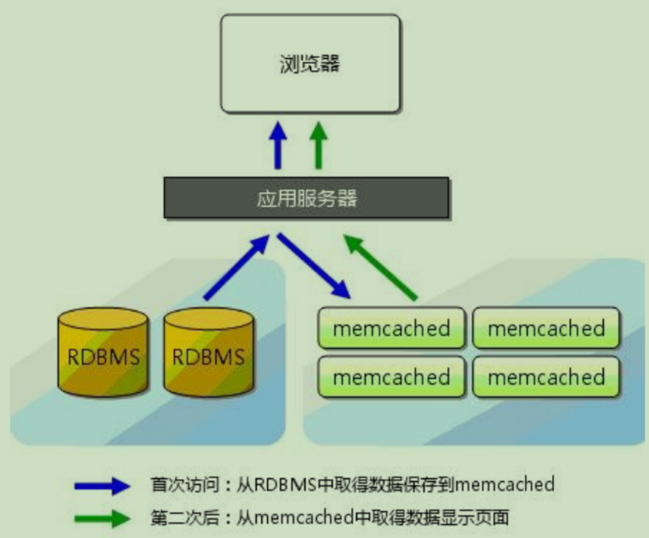
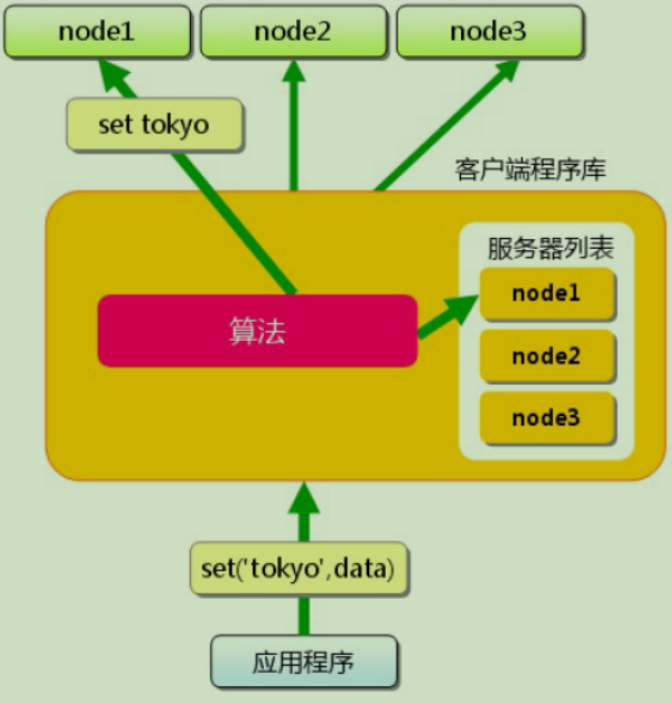
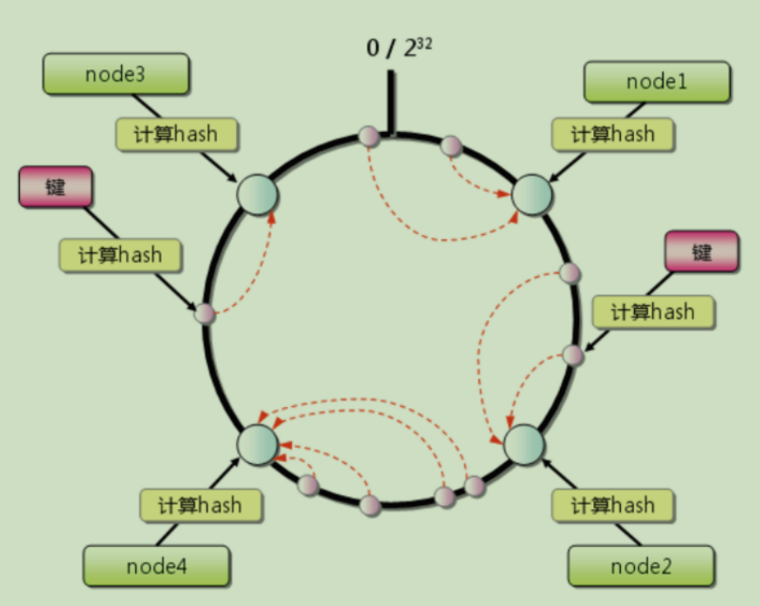
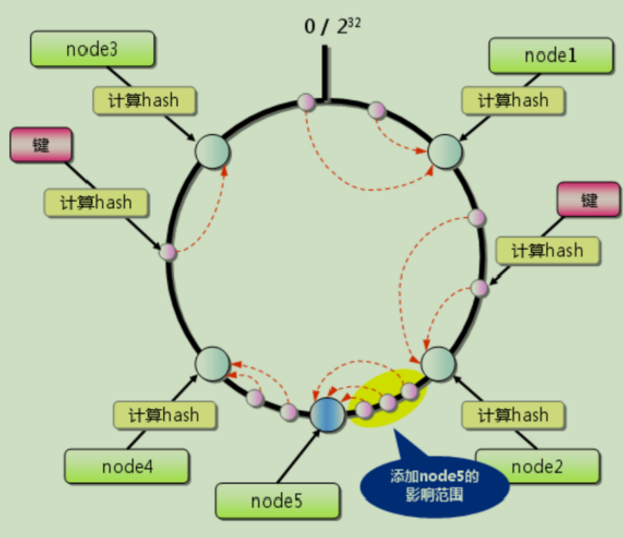
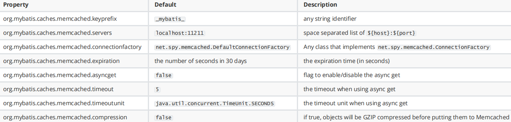
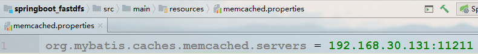

# Memcached

## 1.概述

传统关系型数据的指标：

- 容量 2000W条
- tps 1500个
- 响应时间 10ms

缓存类型：

- 本地缓存
- 分布式缓存
- 客户端缓存

缓存设计指标：

- 容量
- tps
- 成本
- 响应时间

常用的缓存技术：

​	ehcache、oscache、memcached、redis、tair

## 2.Memcached基本介绍

​	Memcached是一款高性能的开源免费、分布式内存对象缓存系统。

​	Memcached是一种基于内存的key-value存储，用来存储小块的任意数据（字符串、对象）。

​	Memcached简洁且强大。它的简洁设计便于快捷开发，减轻开发难度，解决了大数据缓存的很多问题。它的api兼容大部分流行的开发语言。



### 认知

​	老牌的、轻量级的、高性能的、key-value类型的分布式缓存系统，主要用于分布式的Web应用中去减轻数据库
的负载（压力），提高数据访问速度。

### 特点

- key-value
- 不支持持久化
- 不支持服务集群
- 255字符 1MB
- 最大存储时长30 day

## 3.使用场景

### 3.1分布式缓存

​	将缓存的功能剥离出去，存在于其他的服务器中存在于分布式缓存。

​	与分布式缓存对应的就是本地缓存，缓存本身就存在于本地中，类似于之前的mybatis的二级缓存。

​	Memcached是作为分布式缓存。

优点：

- 减少缓存给应用服务器带来的压力；
- 本地缓存不适用于分布式服务，命中率低，内存浪费

缺点：

- 服务集中化通病（单点故障）--需要满足高可用、主从等需求，成本将会提高
- 带来额外的网络IO开销--缓存服务器需要和应用服务器在同一局域网内

### 3.2会话Session管理

tomcat集群对session的管理方式：

（1）tomcat之间进行session复制（缺陷是内存告急）

（2）通过nginx锁定用户，用户所有访问集中于同一台机器（如果一台tomcat出现故障，其中的session将会丢失）

这个时候就可以将session交给缓存服务器管理，宏观上来看就是对应用服务器进行无状态化处理。


## 4.环境搭建

##### 安装

- 本地上传安装

```
http://memcached.org/downloads
在此下载页面中下载tar包解压即可

yum install libevent-devel

tar -zxvf memcached-1.4.31.tar.gz

cd memcached-1.4.31
# 指定memcached安装⽬目录
./configure --prefix=/usr/local/memcached
 make && make install
```

- 云端下载安装

```shell、
// 注意 以下  latest  memcached-1.x.x.tar.gz  都是模糊链接（想要下载需要输入正确版本号）

wget http://memcached.org/latest
tar -zxvf memcached-1.x.x.tar.gz
cd memcached-1.x.x
./configure && make && make test && sudo make install
```

##### 参数说明

```shell
cd /usr/local/memcached/bin  （这里指的是memcached的安装路径下载bin目录）
# 帮助命令
./memcached -h
# ---------------------参数说明----------------------
-p <num> TCP端⼝口，默认为11211，可以不不设置
-l <addr> 监听的 IP 地址，本机可以不不设置此参数
-d 以守护程序（daemon）⽅方式运⾏行行
-u 指定⽤用户，如果当前为 root ，需要使⽤用此参数指定⽤用户
-m <num> 最⼤大内存使⽤用，单位MB。默认64MB
-M 禁⽌止LRU策略略，内存耗尽时返回错误，⽽而不不是删除项
-c <num> 最⼤大同时连接数，默认是1024
-t <num> 线程数，默认4。由于memcached采⽤用NIO，所以更更多线程没有太多作⽤用
-v ⽇日志(错误和警告)
-vv ⽇日志(错误、警告、客户端命令和响应)
-vvv ⾮非常详细的⽇日志
```

##### 启动

```shell
./memcached -m 128mb -vv -u root
```

##### 命令

```
Memcached可以通过 telnet 命令并指定主机ip和端⼝口来连接 Memcached 服务
```

例如：`telnet HOST PORT`  启动`telnet localhost 11211`

```shell
# 存值语法
set key flags exptime bytes
value
key：键值 key-value 结构中的 key，⽤用于查找缓存值。
flags：可以包括键值对的整型参数，客户机使⽤用它存储关于键值对的额外信息 。
exptime：在缓存中保存键值对的时间⻓长度（以秒为单位，0 表示永远）
bytes：在缓存中存储的字节数
# 取值语法
get key
# stats 命令⽤用于返回统计信息例例如 PID(进程号)、版本号、连接数等
stats
```

## 5.java客户端

​	XMemcached是基于java NIO的Memcached客户端，NIO相对于传统的阻塞IO模型来说，效率高（高并发下尤其明显），资源耗费相对较少。

### 特性

- 高性能
- 支持完整协议
- 支持客户端分布
- 动态增删节点
- 允许设置节点权重

### maven坐标

```xml
<dependency>
	<groupId>com.googlecode.xmemcached</groupId>
	<artifactId>xmemcached</artifactId>
	<version>2.0.0</version>
</dependency>
<dependency>
	<groupId>org.slf4j</groupId>
	<artifactId>slf4j-api</artifactId>
	<version>1.7.2</version>
</dependency>
```

### 简单实例

```java
package com.heng.test;

import net.rubyeye.xmemcached.MemcachedClient;
import net.rubyeye.xmemcached.MemcachedClientBuilder;
import net.rubyeye.xmemcached.XMemcachedClientBuilder;
import net.rubyeye.xmemcached.exception.MemcachedException;
import net.rubyeye.xmemcached.utils.AddrUtil;
import org.junit.Test;
import org.junit.runner.RunWith;
import org.springframework.boot.test.context.SpringBootTest;
import org.springframework.test.context.junit4.SpringRunner;

import java.io.*;
import java.util.concurrent.TimeoutException;

@RunWith(SpringRunner.class)
@SpringBootTest
public class TestApplicationTests {
    
    @Test
    public void testMemcached() throws IOException {
        MemcachedClientBuilder builder = new XMemcachedClientBuilder(
        // 多个Memcached Server：host1:port1
        // host2:port2
                AddrUtil.getAddresses("192.168.221.135:11211")
        );
        MemcachedClient memcachedClient = builder.build();
        try {
        // 存储数据 参数⼀一：key名 参数二：expire时间（单位秒）表示永久存储（默认是⼀一个月）
        //参数三：value值
            memcachedClient.set("hello", 0, "Hello,xmemcached");
        // 获取数据
            String value = memcachedClient.get("hello");
            System.out.println("hello=" + value);
        // 删除数据
            memcachedClient.delete("hello");
            value = memcachedClient.get("hello");
            System.out.println("hello=" + value);
        } catch (MemcachedException e) {
            System.err.println("MemcachedClient operation fail");
            e.printStackTrace();
        } catch (TimeoutException e) {
            //客户端分布
            //Memcached的分布是通过客户端实现的，客户端根据key的哈希值得到将要存储的memcached节点，并将对应的
            //value存储到相应的节点。
            System.err.println("MemcachedClient operation timeout");
            e.printStackTrace();
        } catch (InterruptedException e) {
        // ignore
        }
        try {
        //close memcached client
            memcachedClient.shutdown();
        } catch (IOException e) {
            System.err.println("Shutdown MemcachedClient fail");
            e.printStackTrace();
        }
    }
}

```

### 客户端分布

​	Memcached的分布是通过客户端实现的，客户端根据key的哈希值得到将要存储的memcached节点，并将对应的value存储到相应的节点。



#### 1.余数算法（默认）

​	按照key的hash值模以节点数得到的余数，就是将要存储的节点

> ​	key.hashCode() % nodeCount = nodeIndex

缺点：如果服务器数量发生变化，会导致所有服务器缓存在同一时间都失效，会导致所有压力在同一时间集中到数据服务器上。

#### 2.一致性哈希

原理可以参考：https://www.cnblogs.com/lpfuture/p/5796398.html

- 首先求出memcached服务器（节点）的哈希值，并将其配置到0-2的32次方的圆（continuum）上。

- 然后采用同样的方法求出存储数据的键的哈希值，并映射到相同的圆上。

- 然后从数据映射到位置开始顺时针查找，将数据保存到找到的第一个服务器上。如果超过232仍然找不到服务器码，就会保存到第一台memcached服务器上

- 添加一台memcached服务器。余数分布式算法由于保存键的服务器会发生巨大变化而影响缓存的命中率，但Consistent Hashing 中，只有在圆（continuum）上增加服务器的地点逆时针方向的第一台服务器上键会受到影响，如下图所示

  



### CAS操作

参考资料：https://blog.csdn.net/qq_34337272/article/details/81072874

​	Memcached是通过CAS协议实现原子更新，所谓原子更新就是compare and set，原理类似乐观锁，每次请求存储某个数据同时要附带一个CAS值，memcached比对这个CAS值与当前存储数据的CAS值是否相等，如果相等就让新的数据覆盖老的数据，如果不相等就认为更新失败，这在并发环境下特别有用。

​	CAS操作分为两步：获取CAS值和尝试更新

```java
public class MemcachedTest {
    private final XMemcachedClientBuilder builder = 
        new XMemcachedClientBuilder(AddrUtil.getAddresses("192.168.30.131:11211"));

    @Test
    public void testCAS() throws IOException {
        final MemcachedClient memcachedClient = builder.build();
        try {
            // memcachedClient.set("aa", 0, "bb");

            final GetsResponse<Object> result = memcachedClient.gets("aa");

            final long cas = result.getCas();

            if (!memcachedClient.cas("aa", 0, "cc", cas)) {
                System.out.println("cas error");
            }

        } catch (Exception e) {
            e.printStackTrace();
        }

        try {
            memcachedClient.shutdown();
        } catch (IOException e) {
            e.printStackTrace();
        }
    }

}
```

### 命名空间

​	从1.4.2开始xmemcached提供了memcached命名空间的封装使用，你可以将一组缓存项放到同一个命名空间下，可以让整个命名空间所有的缓存项同时失效

```java
public class MemcachedTest {
    private final XMemcachedClientBuilder builder = 
        new XMemcachedClientBuilder(AddrUtil.getAddresses("192.168.30.131:11211"));

    @Test
    public void testNameSpace() throws Exception {
        final MemcachedClient memcachedClient = builder.build();

        //像namespace1命名空间中写数据
        /*memcachedClient.withNamespace("namespace1", new MemcachedClientCallable<Object>() {

            public Object call(MemcachedClient memcachedClient) throws Exception {
                memcachedClient.set("a", 0, 1);
                memcachedClient.set("b", 0, 1);
                memcachedClient.set("c", 0, 1);
                return null;
            }
        });*/

        //获取命名空间中的值
        final Integer result = memcachedClient.withNamespace("namespace1", (client) -> client.get("a"));
        System.out.println(result);

        //使命名空间失效
        // memcachedClient.invalidateNamespace("namespace1");

    }
}
```


## 6.应用

### 6.1分布式集群

​	Memcached的分布式通过客户端实现的

### 6.2数据库缓存

使用Memcached管理MyBatis二级缓存，构建分布式缓存

#### maven坐标

```xml
<dependency>
	<groupId>org.mybatis.caches</groupId>
	<artifactId>mybatis-memcached</artifactId>
	<version>1.0.0</version>
</dependency>
```

#### 配置文件

准备配置文件memcached.properties，如未配置使用以下默认配置





##### 配置mapper文件

```xml
<mapper namespace="org.acme.FooMapper">
<cache type="org.mybatis.caches.memcached.MemcachedCache" />
...
</mapper>
```

#### 测试

### 6.3服务器间数据共享

服务器session集中管理

参考资料：https://github.com/magro/memcached-session-manager/wiki/SetupAndConfiguration

#### 导入jar包到服务器tomcat\lib目录

- memcached-session-manager-${version}.jar
- memcached-session-manager-tc7-1.9.7.jar
- spymemcached-2.11.1.jar
- 选择序列化方案所有相关的jar包（这里使用kyro）

#### 修改配置文件

```xml
vi ~/tomcat1/conf/context.xml
<Manager
className="de.javakaffee.web.msm.MemcachedBackupSessionManager"
memcachedNodes="n1:192.168.128.137:11211,n2:192.168.128.137:11311"
sticky="false"
sessionBackupAsync="false"
lockingMode="uriPattern:/path1|/path2"
requestUriIgnorePattern=".*\.(ico|png|gif|jpg|css|js)$"
transcoderFactoryClass="de.javakaffee.web.msm.serializer.kryo.KryoTrans
coderFactory"
/>
----------------------------------------------------------------------
vi ~/tomcat2/conf/context.xml
<Manager
className="de.javakaffee.web.msm.MemcachedBackupSessionManager"
memcachedNodes="n1:192.168.128.137:11211,n2:192.168.128.137:11311"
sticky="false"
sessionBackupAsync="false"
lockingMode="uriPattern:/path1|/path2"
requestUriIgnorePattern=".*\.(ico|png|gif|jpg|css|js)$"
transcoderFactoryClass="de.javakaffee.web.msm.serializer.kryo.KryoTrans
coderFactory"
/>
```

#### 测试

​	启动两个memcached，启动两个tomcat测试