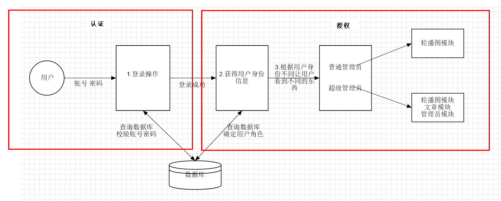

# Shiro

### 简介

>  **Apache Shiro™** is a powerful and easy-to-use Java security framework that performs authentication, authorization, cryptography, and session management. With Shiro’s easy-to-understand API, you can quickly and easily secure any application – from the smallest mobile applications to the largest web and enterprise applications.

​	Apache Shiro 是一个功能强大易于使用的Java权限管理框架，能够完成身份认证，授权，加密和session管理等功能。

### 权限管理

> 基本上涉及到用户参与的系统都要进行权限管理，权限管理属于系统安全的范畴，**权限管理实现对用户访问系统的控制**，按照安全规则或者安全策略控制用户可以访问而且只能访问自己被授权的资源。

#### 身份认证

​	**身份认证**，就是登录  验证当前用户是不是合法用户  保证登录后的用户都是在数据库中存在的  实际上也保证了使用该账户登录的人是本人，认证是权限管理的一部分。

#### 授权

​	系统根据不同用户的不同身份，让不同用户看到不同的内容  这个过程就是授权

​	不同身份等级  在系统中有不同的权限（在系统中看到不同的内容）

> **权限管理实现对用户访问系统的控制**：登录（认证）。验证当前用户是不是合法用户
>
> **按照安全规则或者安全策略控制用户可以访问而且只能访问自己被授权的资源**: 腾讯视频中普通用户只能够看免费视频，会员可以看所有视频（免费+付费），这样的一个规则就是安全策略。安全策略是人为设计的。

#### 权限管理过程



### 认证

#### 基本概念

> **身份认证，就是判断一个用户是否为合法用户的处理过程。**
>
> **最常用的简单身份认证方式是系统通过核对用户输入的用户名和密码，看其是否与系统中存储的该用户的用户名和密码一致，来判断用户身份是否正确。**
>
> 对于采用指纹等系统，则出示指纹；对于硬件Key等刷卡系统，则需要刷卡

#### 关键对象 API

> Subject：主体
> 访问系统的用户，主体可以是用户、程序等，进行认证的都称为主体
>
> Principal：身份信息
> 是主体（subject）进行身份认证的标识，标识必须具有唯一性，如用户名、手机号、邮箱地址等
>
> credential：凭证信息
> 是只有主体自己知道的安全信息，如密码、证书等

##### subject

毫无疑问，shiro中最重要的概念就是subject（主体）。视图，数据库视图view，虚拟的表。subject是一个安全"视图"，就是说subject是一个虚拟的用户对象（就是User Admin对象）。**可以认为Subject就是之前我们定义的User Admin，在其中有账号密码等和登录操作相关的数据。不同的是：在Subject类中定义了一些自定义方法，可以帮助我们完成一些常见操作**

##### **Principal：身份信息**

用户身份的标识，就是账号。

##### **credential：凭证信息**

就是密码

#### 登录步骤


#### 认证代码

**Subject 主体  User**

**token 令牌  封装账号密码**

**SecurityManager  安全管理器  用来管理Subject** 

Realm 相当于数据源  

Authenticator 认证器

##### 登录流程

1. 从前台接受用户输入的登录参数
   1. 接受参数  形参
   2. 创建token  封装账号密码
2. 数据库查询原有数据 用来和用户输入的数据做比较 （现在是模拟）
   1. 通过ini文件模拟数据
   2. 通过安全管理器工厂读取文件获取数据 
3. 把数据库查询的数据（目前是模拟ini数据） 和 用户输入的数据建立联系
   1. 通过工厂获取安全管理器
   2. 把管理器给SecurityUtils （建立联系）
   3. 通过SecurityUtils 得到一个Subject
4. 登录
   1. 把token交给Subject
   2. 调用Subject登录方法

##### 代码

**1.添加依赖**

```xml
<dependency>
    <groupId>org.apache.shiro</groupId>
    <artifactId>shiro-core</artifactId>
    <version>1.3.2</version>
</dependency>
<dependency>
    <groupId>org.apache.shiro</groupId>
    <artifactId>shiro-web</artifactId>
    <version>1.3.2</version>
</dependency>
<dependency>
    <groupId>org.apache.shiro</groupId>
    <artifactId>shiro-spring</artifactId>
    <version>1.3.2</version>
</dependency>
```

**2.使用配置文件模拟数据**

> ini 文件  shiro使用的解析文件  
>
> ini文件编写
>
> [users] 用户相关信息
>
> key=value  key账号  value密码

```ini
[users]
zhangsan=123456
```

**3.第一个demo**

```java
	//读取配置文件
	IniSecurityManagerFactory factory =
        	new IniSecurityManagerFactory("classpath:shirotest.ini");
	//获取安全管理器对象
	SecurityManager securityManager = factory.getInstance();
	//使用安全管理区
	SecurityUtils.setSecurityManager(securityManager);
	//账号密码封装成一个token
	UsernamePasswordToken token = new UsernamePasswordToken(username, password);
	//通过SecurityUtils获得一个subject
	Subject subject = SecurityUtils.getSubject();

	//把token给subject
	try {
    	subject.login(token);
    	logger.info("登录成功");
	}catch (UnknownAccountException e){
    	logger.info("账号不存在" + "---" + e.toString());
	} catch (IncorrectCredentialsException e1) {
    	logger.info("密码错误" + "---" + e1.toString());
	}
```

shiro通过抛异常的方式告诉程序员有没有校检成功

1. 如果没有异常就是成功
2. 如果异常为**UnknownAccountException** 就是账号不存在
3. 如果异常为**IncorrectCredentialsException** 就是密码不正确


##### 修改认证数据源为数据库

shiro是在什么地方做了账号密码的比对  在什么方法获取了ini配置文件的数据？


1. 默认使用iniRealm和token进行比对  （如果把iniRealm替换掉 替换为查询数据库  就能够达到我们的目的）
2. 需要返回一个认证信息对象

**问题：不能够直接修改为调用dao  因为源码需要realm对象**

**所以只能够修改Realm  现在iniRealm  改成获取数据库 DataSourceRealm（源码没有给）**

**解决：自定义一个DataSourceRealm**


##### 自定义Realm DataSourceRealm

**创建了一个realm**

1. 继承AuthenticatingRealm  （认证realm）
2. 实现其中的方法

```java
public class DataSourceRealm extends AuthenticatingRealm {
    private static final Logger logger = LoggerFactory.getLogger(DataSourceRealm.class);

    @Override
    protected AuthenticationInfo doGetAuthenticationInfo(AuthenticationToken token) throws AuthenticationException {
        logger.info("调用了自己的realm"+this.getName());
//        1.token中有输入的账号密码  能够获取到账号  可以通过账号查数据库中的信息
        String username = (String) token.getPrincipal();
        logger.info("获取到用户输入的账号信息：{}",username);
//        2.模拟获取数据库数据  以后是调用dao
        CmfzUser cmfzUser = new CmfzUser();
        cmfzUser.setName("zhangsan");
        cmfzUser.setPassword("123456");

        if(username.equals(cmfzUser.getName())){
            logger.info("获取到数据库查询出来的账号密码：账号{},密码{}",cmfzUser.getName(),cmfzUser.getPassword());
//        3.把数据库查出来的账号密码封装在info中  三个参数：账号  密码  当前类的名字
            SimpleAuthenticationInfo info = new SimpleAuthenticationInfo(cmfzUser.getName(),cmfzUser.getPassword(),this.getName());
            logger.info("获取了info"+info.toString());
            return info;
        }
        
        return null;
    }
}
```

**告诉shiro使用自定义的realm**

```ini
[main]
;指定自定义的realm
myrealm=com.baizhi.realm.DataSourceRealm
;告诉shiro要使用自己的realm
securityManager.realms=$myrealm
```


**token和info的区别**

1. **token中封装用户输入的账号密码**
2. **info中封装数据库查出来的账号密码**


##### 和项目集成认证（SpringBoot）

**shiro集成Web Shiro和web集成底层使用的是过滤器  Shiro实现了web中的过滤器** 

**SpringBoot使用过滤器的时候不需要xml配置 使用配置类**


要和SpringBoot集成 首先需要确定哪些类需要交给工厂管理  （通过配置类创建）

1. 修改DataSourceRealm 为通过数据库获取数据

2. 创建配置类

   1. filter 过滤器

   2. SecurityManager

   3. DataSourceRealm 

      ```java
      package com.baizhi.config;
      
      import com.baizhi.realm.DataSourceRealm;
      import org.apache.shiro.spring.web.ShiroFilterFactoryBean;
      import org.apache.shiro.web.mgt.DefaultWebSecurityManager;
      import org.apache.shiro.mgt.SecurityManager;
      import org.springframework.context.annotation.Bean;
      import org.springframework.context.annotation.Configuration;
      
      import java.util.HashMap;
      import java.util.Map;
      
      @Configuration
      public class ShiroConfigAuthentication {
          /**
           * 1. filter 过滤器
           * @return
           */
          @Bean
          public ShiroFilterFactoryBean getShiroFilterFactoryBean(SecurityManager securityManager){
              ShiroFilterFactoryBean filterFactoryBean = new ShiroFilterFactoryBean();
      //        过滤链  书写过滤规则 哪些要拦截  哪些不拦截
              Map map = new HashMap();
      ////        设置过滤规则
      //        anon  匿名可访问  不用登录就可以访问
      //        authc 认证后可访问  登录后可以访问
              map.put("/login.jsp", "anon");
              map.put("/admin/adminLogin","anon");
              map.put("/**", "authc");
              filterFactoryBean.setFilterChainDefinitionMap(map);
      //        设置安全管理器
              filterFactoryBean.setSecurityManager(securityManager);
              filterFactoryBean.setSuccessUrl("/main/main.jsp");
              filterFactoryBean.setUnauthorizedUrl("/login.jsp");
              return filterFactoryBean;
          }
          /**
           * 2. SecurityManager
           */
          @Bean
          public SecurityManager getSecurityManager(DataSourceRealm dataSourceRealm){
              DefaultWebSecurityManager securityManager = new DefaultWebSecurityManager();
              securityManager.setRealm(dataSourceRealm);
              return securityManager;
          }
          /**
           * 创建Realm
           * @return
           */
          @Bean
          public DataSourceRealm getDataSourceRealm(){
              return new DataSourceRealm();
          }
      }
      ```

3. 修改service中的登录方法

   ```java
   //认证
   Subject subject = SecurityUtils.getSubject();
   try {
       subject.login(new UsernamePasswordToken(username, password));
   } catch (UnknownAccountException e) {
       logger.info("账户异常");
       return "redirect:/login.jsp";
   }catch (IncorrectCredentialsException e){
       logger.info("密码异常");
       return "redirect:/login.jsp";
   }
   return "redirect:/main/main.jsp";
   ```


#### 加密

##### 加密的基本概念

什么加密？  天王盖地虎 宝塔镇河妖  就是最古老的加密手段


明文  看的明白  一看就知道是啥的密码  没有经过任何的加密处理    123456

密文  更加复杂  看到的时候猜不到原来的明文到底是什么    e10adc3949ba59abbe56e057f20f883e


MD5算法特点

1. 单向加密 加密结果不可逆   明文到密文  不能密文到明文
2. 相同字符串的加密结果相同
3. 加密结果都是32位的十六进制字符串

缺点：

容易被破解  穷举法  


**密码加密流程**


MD5演示

```xml
<!-- https://mvnrepository.com/artifact/commons-codec/commons-codec -->
<dependency>
    <groupId>commons-codec</groupId>
    <artifactId>commons-codec</artifactId>
    <version>1.10</version>
</dependency>

```

```java
    @Test
    public void test1(){
        //散列算法
//        1.加密 如果只是简单的MD5加密不安全 容易被破解 字符串过于简单
        String s = DigestUtils.md5Hex("123456");
        System.out.println(s);

//        2.加盐 salt 盐值（随机字符串 ahds） 为了进一步提高密码的安全性  即便是密码一样 因为盐值不一样  所以加密后的结果不一样
//          二奇注册 123456 + 随机字符串 ahds  123456ahds
//          李智注册 123456 + 随机字符串 dfsg  123456dfsg
        String s1 = DigestUtils.md5Hex("123456e10adc3949ba59abbe56e057f20f883e");
        System.out.println(s1);

//        3.增加加密次数（散列次数）
        String s2 = MD5(s1);
        System.out.println(s2);
    }
```

加密  

加盐  盐值

散列次数 （加密的次数）


##### shiro加密

不需要导入commons-codec 因为shiro本身是有加密相关的类的

Shiro中的MD5和commons-codec 不一样  不要两个jar包混着用


```java
    @Test
    public void test1(){
//        参数source元数据 要加密的数据   salt 盐值  hashIterrations 散列次数
        Md5Hash md5Hash = new Md5Hash("123456","asdf",1);
        System.out.println(md5Hash.toHex());
    }
```


##### 项目中集成加密

**没有集成Spring**

1.修改表

增加一个新的字段 salt  **在注册的时候随机生成添加在数据库中**

密码改成对应的密文


2.修改Realm  使用盐值

修改info 创建时候的参数  增加盐值

```java
SimpleAuthenticationInfo info = new SimpleAuthenticationInfo(cmfzUser.getName(),cmfzUser.getPassword(), ByteSource.Util.bytes(salt),this.getName());
```

3.告诉shiro使用加密凭证匹配器

```ini
[main]
#声明使用的凭证匹配器
hashedCredentialsMatcher=org.apache.shiro.authc.credential.HashedCredentialsMatcher
hashedCredentialsMatcher.hashAlgorithmName=md5
hashedCredentialsMatcher.hashIterations=1024

;声明自己realm
myRealm=com.baizhi.realm.DataSourceRealm

#告知Realm使用当前的凭证匹配器
myRealm.credentialsMatcher=$hashedCredentialsMatcher

;告诉安全管理器使用自己的realm
securityManager.realms=$myRealm
```


**集成SpringBoot**

1. 修改admin表

2. 修改realm

   ```java
   public class DataSourceRealm extends AuthenticatingRealm {
       private static final Logger logger = LoggerFactory.getLogger(DataSourceRealm.class);
       @Autowired
       private CmfzAdminDao cmfzAdminDao;
   
       @Override
       protected AuthenticationInfo doGetAuthenticationInfo(AuthenticationToken token) throws AuthenticationException {
           logger.info("调用了自己的realm"+this.getName());
   //        1.token中有输入的账号密码  能够获取到账号  可以通过账号查数据库中的信息
           String username = (String) token.getPrincipal();
   
           logger.info("获取到用户输入的账号信息：{}",username);
   //        2.模拟获取数据库数据  以后是调用dao
   
           QueryWrapper<CmfzAdmin> wrapper = new QueryWrapper<>();
           wrapper.eq("username",username);
           CmfzAdmin cmfzAdmin = cmfzAdminDao.selectOne(wrapper);
   
   
           if(cmfzAdmin!=null){
               logger.info("获取到数据库查询出来的账号密码：账号{},密码{},盐值{}",cmfzAdmin.getUsername(),cmfzAdmin.getPassword(),cmfzAdmin.getSalt());
   //        3.把数据库查出来的账号密码封装在info中  三个参数：账号  密码  当前类的名字
               SimpleAuthenticationInfo info = new SimpleAuthenticationInfo(cmfzAdmin.getUsername(),cmfzAdmin.getPassword(), ByteSource.Util.bytes(cmfzAdmin.getSalt()),this.getName());
               logger.info("获取了info"+info.toString());
               return info;
           }
   
           return null;
       }
   }
   ```

3. 配置类

   ```java
   package com.baizhi.config;
   
   import com.baizhi.realm.DataSourcePermissionRealm;
   import com.baizhi.realm.DataSourceRealm;
   import org.apache.shiro.authc.credential.HashedCredentialsMatcher;
   import org.apache.shiro.spring.web.ShiroFilterFactoryBean;
   import org.apache.shiro.web.mgt.DefaultWebSecurityManager;
   import org.apache.shiro.mgt.SecurityManager;
   import org.springframework.context.annotation.Bean;
   import org.springframework.context.annotation.Configuration;
   
   import java.util.HashMap;
   import java.util.Map;
   
   @Configuration
   public class ShiroConfigAuthentication {
       /**
        * 1. filter 过滤器
        * @return
        */
       @Bean
       public ShiroFilterFactoryBean getShiroFilterFactoryBean(SecurityManager securityManager){
           ShiroFilterFactoryBean filterFactoryBean = new ShiroFilterFactoryBean();
   //        过滤链  书写过滤规则 哪些要拦截  哪些不拦截
           Map map = new HashMap();
   ////        设置过滤规则
   //        anon  匿名可访问  不用登录就可以访问
   //        authc 认证后可访问  登录后可以访问
           map.put("/login.jsp", "anon");
           map.put("/admin/adminLogin","anon");
           map.put("/**", "authc");
           filterFactoryBean.setFilterChainDefinitionMap(map);
   //        设置安全管理器
           filterFactoryBean.setSecurityManager(securityManager);
   
           filterFactoryBean.setSuccessUrl("/main/main.jsp");
           filterFactoryBean.setUnauthorizedUrl("/login.jsp");
           return filterFactoryBean;
       }
   
       /**
        * 2. SecurityManager
        */
       @Bean
       public SecurityManager getSecurityManager(DataSourceRealm dataSourceRealm){
           DefaultWebSecurityManager securityManager = new DefaultWebSecurityManager();
           securityManager.setRealm(dataSourceRealm);
           return securityManager;
       }
       /**
        * 3.创建Realm
        * @return
        */
       @Bean
       public DataSourceRealm getDataSourceRealm(HashedCredentialsMatcher hashedCredentialsMatcher){
           DataSourceRealm dataSourceRealm = new DataSourceRealm();
           dataSourceRealm.setCredentialsMatcher(hashedCredentialsMatcher);
           return dataSourceRealm;
       }
   
       /**
        * 4.创建凭证匹配器
        * @return
        */
       @Bean
       public HashedCredentialsMatcher getHashedCredentialsMatcher(){
           HashedCredentialsMatcher hashedCredentialsMatcher = new HashedCredentialsMatcher();
           hashedCredentialsMatcher.setHashAlgorithmName("md5");
           hashedCredentialsMatcher.setHashIterations(1024);
           return hashedCredentialsMatcher;
       }
   }
   ```


**注意：我们只需要提供 token 和 info   shiro自己进行比对！！！！！！！！！！！！！！！！** 


### 授权

#### 授权基本概念

> Authorization, also known as *access control*, is the process of managing access to resources. In other words, controlling *who* has access to *what* in an application.
>
> Examples of authorization checks are: Is the user allowed to look at this webpage, edit this data, view this button, or print to this printer? Those are all decisions determining what a user has access to.

授权，也称为访问控制，是管理对资源的访问的过程。换句话说，控制谁有权利访问应用程序中的哪些内容。**控制不同的人能够看到不同的东西，做不同的事儿**

例如：用户是否允许查看此网页、编辑此数据、查看此按钮

控制谁能访问哪些资源。主体进行身份认证后需要分配权限方可访问系统的资源，对于某些资源没有权限是无法访问的


#### 相关概念

授权可简单理解为who对what(which)进行How操作  **谁**对**什么东西**进行了**什么样的操作** 

**who 谁** 

实际上就是subject   主体

**what 资源**  对资源做操作

**项目任何的东西都是资源  一个类  一个方法  一个图片等等  一切皆资源** 

**主要指的是 方法  和 页面**


类和方法

静态资源  页面  图片  js  等


**how 权限/许可 **

对资源的操作常见的有：查看（访问） 修改  删除

例如：Banner  查看轮播图  删除轮播图  修改 等


**permission** 用来定义权限的 **权限字符串**  一个标识


> Permissions in Apache Shiro represent the most atomic element of a security policy. They are fundamentally statements about behavior and represent explicitly what can be done in an application. A well-formed permission statement essentially describes resources and what actions are possible when a `Subject` interacts with those resources. 

Shiro中的权限许可表示安全规则中最小的元素。它们是用户行为（能够做什么）最基本的声明，说明了用户在应用程序中可以做什么。一个格式良好的许可语句本质上描述了资源，说明了主体在操作资源的时候可以采取哪些操作。

shiro中的permission 说明了用户在应用程序中可以做什么（例如可不可以删除轮播图等）

通过权限字符串，自定义字符串代表资源。如果一个用户拥有banner是不是就可以代表他可以操作轮播图模块？拥有admin代表着可以操作管理员模块，只有admin：add代表着只能够添加，不能够做其他的操作。（说明了主体在操作资源的时候可以采取哪些操作）


权限字符串的规则是：“资源标识符：操作：资源实例标识符”，意思是对哪个资源的哪个实例具有什么操作，“:”是资源/操作/实例 的分割符，权限字符串也可以使用*通配符。

```
可以删除id为100的轮播图
banner:delete:100
可以添加轮播图
banner:add
可以删除用户
user:delete

```

实例 具体的某一条数据  例如 id为100的轮播图数据 就是一个实例

例子：

用户创建权限：user:create，或user:create:*

用户修改实例001的权限：user:update:001

用户实例001的所有权限：user：*：001


#### 授权总结

**授权实际上就是定义谁可以操作系统中哪些资源的过程**，这个过程在数据模型中完成，不同的模型之间有差异。

例如：定义小明可以操作轮播图模块  就是授权

数据模型：表  表关系


**授权分为两个阶段：**

1. **定义谁有什么权利**  **定义库表结构**  在用户注册的时候 在数据库添加用户的权限信息  该用户拥有哪些权限字符串  
2. **识别当前用户有什么权利**  **查询数据库的过程**  用户登录后根据用户身份的不同 让用户看到不同的内容  这个过程只是在识别用户的身份信息   识别用户具有哪些权限字符串 就可以知道用户有哪些权限  可以看到哪些内容


#### 权限数据模型（通用授权模型）

权限

1. banner:*  可以操作轮播图模块
2. admin:* 可以操作管理模块
3. user:* 可以操作用户模块


角色就是一组权限字符串  权限字符串的集合就是角色


普通管理员   admin  

1. banner:*

编辑

1. article:*

超级管理员 superadmin

1. banner:* 
2. admin:*
3. user:* 


为什么要定义角色？  方便管理


用户 对 角色 多对多  一个用户可以具有多个角色  一个角色可以被多个用户拥有

**处理多对多  通过中间表**  

用户角色表   

角色  对  权限  多对多  一个角色可以拥有多个权限  一个权限可以被多个角色拥有


用户表

用户角色表

角色表

角色权限表

权限资源表  


**如果给用户增加新的权限**

1. **创建新的角色**
2. **在角色资源表给角色分配资源**
3. **在用户角色表中给用户分配角色**


**总结：**

1. **模型是什么？ 五张表**
   1. **用户表**
   2. **用户角色表**
   3. **角色表**
   4. **角色权限表**
   5. **权限资源表**  
2. **表关系**
   1. **用户 对 角色 多对多  一个用户可以具有多个角色  一个角色可以被多个用户拥有**
   2. **角色  对  权限  多对多  一个角色可以拥有多个权限  一个权限可以被多个角色拥有**
3. **如何解决多对多关系  通过中间表**


#### 库表创建

1. 用户表   cmfz_admin
2. 用户角色表
3. 角色表 
4. 角色权限表  
5. 权限资源表  
   1. resource_name 名字
   2. resource_url 对应的url
   3. resource_type  类型 两种类型  menu 菜单选项  function 方法（controller中的方法）
   4. resource_permission 权限字符串
   5. resource_parent_id 如果是menu会有父级