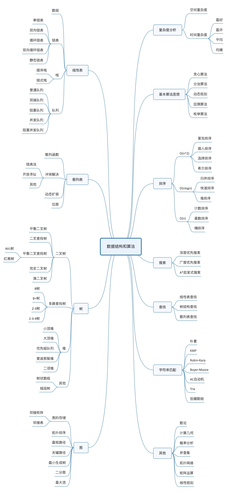

## 什么是数据结构？

数据结构就是一组数据的存储结构！

## 什么是算法？

算法就是操作数据的一组方法！

## 数据结构与算法的关系？

数据结构和算法是相辅相成的，数据结构是为算法服务的，算法作用于特定的数据结构之上。

## 什么是复杂度分析方法？

是一个考量效率和资源消耗的方法！

## 时间复杂度

​	全称为渐进时间复杂度，表示算法的执行时间与数据规模之间的增长关系。

### 大O时间复杂度表示法

$$
T(n) = O(f(n))
$$

​	其中T(n)表示代码执行时间，n表示数据规模的大小，f(n)表示每行代码执行的次数总和，O代表执行时间与次数总和成正比。

​	大O时间复杂度表示代码执行时间随数据规模增长的变化趋势。

### 分析的方法

1. 只关注循环执行次数最多的一段代码
2. 加法原则：总复杂度等于量级最大的那段代码的复杂度
3. 乘法原则：嵌套代码的复杂度等于嵌套内外代码复杂度的乘积

### 常见的时间复杂度量级（按数量级递增）

1. 常量阶
   $$
   O(1)
   $$

2. 对数阶

$$
O(logn)
$$

3. 线性阶

$$
O(n)
$$

4. 线性对数阶

$$
O(nlogn)
$$

5. 平方阶、立方阶、k次方阶

$$
O(n^2)、O(n^3)、O(n^k)
$$

6. 指数阶

$$
O(2^n)
$$

7. 阶乘阶

$$
O(n!)
$$

### 多个数据规模

当代码时间复杂度由多个数据的规模来决定时，原先的加法法则不行，即需要将多个数据的时间复杂度加起来，不可忽略，乘法法则可以。

### 几种时间复杂度分析

1. 最好情况时间复杂度；

2. 最坏情况时间复杂度；

3. 平均情况时间复杂度（需引入概率论知识计算平均概率）；

4. 均摊时间复杂度，均摊其实可以理解为特殊的平均，就是出现概率大的复杂度就可以理解为均摊时间复杂度。

## 空间复杂度

​	全称为渐进空间复杂度，表示算法的存储空间与数据规模之间的增长关系。

​	常见的空间复杂度有O(1)，O(n)，O(n2)...

